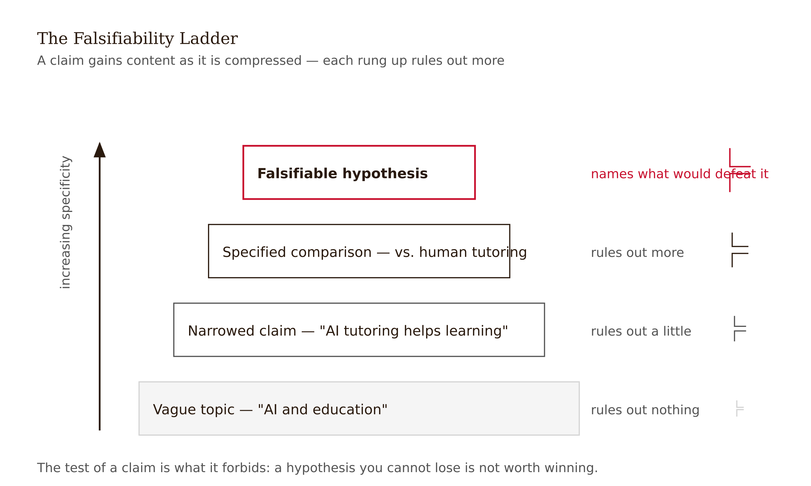
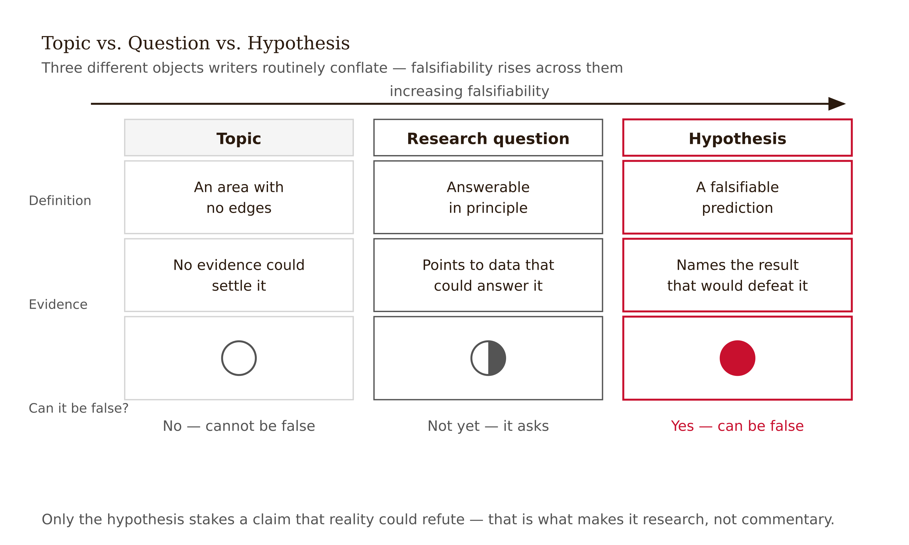
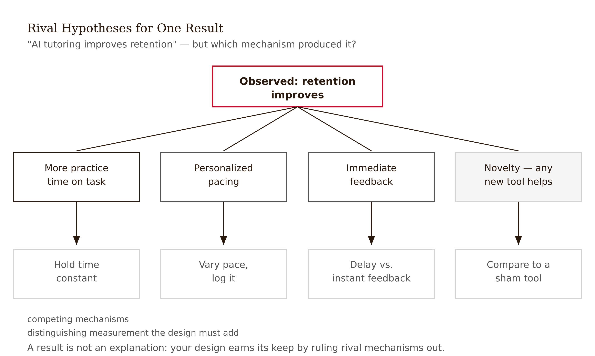
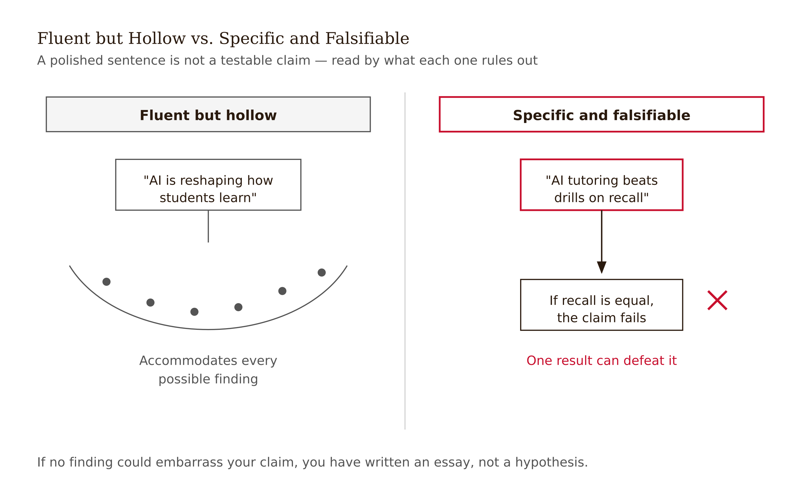

# Chapter 1 — Before You Write Anything
*The claim has to be able to die before the paper deserves to live.*

There is a particular kind of productivity that feels like progress and isn't. You open a blank document, you type a title, you ask an AI to help you get started, and ten minutes later you have three polished paragraphs about the broad importance of your topic. The sentences flow. The transitions are clean. There are phrases like "a growing body of evidence suggests" and "scholars have increasingly recognized." It reads like a paper. It has the rhythm of a paper, the weight of a paper. And it is not yet a paper at all.

What you have is momentum without a destination. The danger is that this momentum is real — it feels like you've begun, which makes it harder to stop and ask whether you actually know what you're trying to show.

I want to slow you down before you write a single sentence of prose. Not forever. Just long enough to ask one question that most writers skip, or ask too late, or answer wrong.

The question is: what would have to be true for your paper to be wrong?

---

If you cannot answer that question — if you can only describe what your paper will show, not what it would take for it to fail — then you don't have a research paper yet. You have a direction. Directions are fine for beginning, but you cannot build an argument on one. An argument has a specific claim, and a specific claim has edges: conditions under which it holds and conditions under which it doesn't.

This is Karl Popper's insight, and it is one of the genuinely clarifying ideas in the philosophy of science. Popper noticed that many statements can survive any evidence you throw at them — not because they are true, but because they are too vague to be false. "AI tutoring improves learning" is an example. It is almost certainly true in some cases. It is almost certainly false in others. But as a research claim it tells you nothing, because it doesn't say *which* students, *which* kind of AI tutoring, *which* outcome measure, *compared to what*, over *what time period*. A claim that flexible can accommodate any finding. And a claim that can accommodate any finding cannot be tested.

What Popper argued — and what every working researcher knows from experience, even if they didn't learn it from Popper — is that the intellectual content of a claim comes precisely from what it rules out. A claim that says "students who receive Socratic AI feedback will retain programming skills better two weeks later than students who receive direct-answer feedback, because retrieval effort consolidates memory" is specific enough to be wrong. The experimental group might not outperform the control. The retention effect might appear immediately but not at two weeks. The mechanism might be entirely different from what you predicted. Each of those outcomes would damage the claim. That damage is the point. It's the cost of saying something real.



---

Let me draw a distinction that will run through everything in this book, because writers confuse these three things constantly: a **topic**, a **research question**, and a **hypothesis**.

A topic is a region of inquiry. "AI tutoring in education" is a topic. It tells you what you're interested in, which matters — interest is where research begins. But a topic cannot be true or false. You cannot be right or wrong about it. It has no edges.

A research question is a question that could, in principle, be answered. "Does feedback specificity in AI tutoring affect undergraduate programming retention?" is a research question. It has a variable (feedback specificity), a population (undergraduates), and an outcome (retention). It could be answered by evidence. But it still doesn't tell you what you expect the answer to be, or why. It is a question, not a prediction.

A hypothesis is a prediction with a mechanism. "Socratic AI feedback improves two-week unassisted programming retention more than direct-answer feedback because students must retrieve and repair their own reasoning." That's a hypothesis. It makes a specific claim, names the comparison, specifies the outcome and timeframe, and offers a causal explanation that could be confirmed or disconfirmed separately from the result itself.

The paper doesn't begin until you have the hypothesis. Not the topic. Not the question. The hypothesis.



---

Here is where I want to be honest about something that textbooks often skip.

Getting from topic to hypothesis is hard. It takes time, and the first attempts are almost always wrong — not wrong in the sense that they lead somewhere bad, but wrong in the sense that they are not yet specific enough to be false. You will write "AI tutoring improves learning" and have to push yourself to ask: *which students?* You will write "Socratic feedback is more effective" and have to ask: *more effective than what? for what outcome? on what timeline?* Each push is a compression: you are narrowing the claim until it has edges.

The compression hurts. It means giving up the territory where you haven't taken a position. When your claim was "AI tutoring affects learning outcomes," you could write about all of it. When your claim becomes "Socratic AI feedback improves two-week retention for novice programmers," you have committed. You can no longer write around the edges. The paper now has a specific bet, and the experiment either pays out or it doesn't.

This is precisely why some writers resist making the claim specific. A vague hypothesis is comfortable. It can survive any result. Specificity is what makes the thing interesting.

---

What goes into the compression? How do you actually get from a broad topic to a hypothesis with real edges?

In my experience, the reliable path is through rival hypotheses — not just asking "what do I expect to find?" but "what else could explain the observation I care about?"

Take Maya's situation from the start of this chapter. She wants to study AI tutoring in programming courses. She has a hunch that AI tutoring helps students. Fine. But: *why might it help?* And crucially: *what alternative explanations might produce the same surface result?*

Maybe Socratic feedback helps because it forces retrieval. Or maybe it helps because it feels more personal, and engagement goes up. Or maybe direct-answer feedback is actually faster and lets students attempt more problems in the same time, which is what drives retention. Or maybe the type of feedback doesn't matter much at all — maybe what matters is whether students have any feedback at all, compared to nothing.

If you run an experiment with only two conditions — Socratic feedback vs. direct-answer feedback — you can distinguish the first explanation from the second and third only indirectly, by measuring retention at a delayed unassisted test (which would rule out the "engagement" explanation if Socratic feedback shows no short-term advantage). The rival hypotheses tell you what the experiment has to measure, how long it has to run, and what the comparison group needs to look like.

This is not a preliminary step before "real" research. This is the research. The intellectual work of a paper is not the writing. It is the thinking that happens here — before a word of prose is drafted — when you are forcing the claim to have edges.



---

I want to say something specific about AI tools in this stage, because there is a version of this work that goes wrong in a particular way.

AI tools are genuinely useful for interrogating a hypothesis. You can describe your tentative claim to an AI and ask: what would defeat this? What rival hypotheses could explain the same observation? What measurements would distinguish them? The AI will generate options. Some of those options will be ones you hadn't considered, and that is valuable — not because the AI is right, but because it forces you to think about why you are dismissing something.

What AI tools should not do — what you should not let them do — is decide the hypothesis for you.

This is a subtle distinction, and it matters. The AI can generate a list of plausible research questions from your topic. The list might be good. One of the questions on the list might be the question you end up asking. But there is a difference between choosing from a list the AI generated and arriving at the question yourself. The difference is that you, the researcher, have domain knowledge, access to specific data, a sense of what gap exists in the literature, and — crucially — accountability for the claim. The AI has none of those things. It has pattern-matched on research it has seen before and produced something that looks like a research question. Looking like a research question and being the right research question for this dataset, this literature gap, this researcher, at this moment, are not the same.

When you choose the hypothesis, you are making an intellectual claim. The paper is yours. When you let the AI choose the hypothesis and you execute on it, the paper is something else — a production, not an argument. The distinction will show up in the paper itself, in ways that are hard to locate but easy to feel: the claim will be slightly off-center, slightly disconnected from the evidence, as if written by someone who believed the words but didn't fully understand why those words rather than others.

The test is simple: can you explain, in your own words, why this hypothesis and not a related alternative? If you need the AI to explain it, the AI did the work that should have been yours.

---

There is one more thing I want to address before we move forward, and it is a misconception that is easy to carry through an entire graduate training without anyone pointing it out: the idea that a well-written introduction is evidence of a good research claim.

It isn't.

A polished paragraph can imitate rigor. AI tools are extraordinarily good at producing sentences that feel like they have content — that have the weight of a claim, the tone of precision, the rhythm of an argument. This is not a criticism of AI tools. It is a fact about language. The surface features of rigorous writing can be reproduced without the underlying structure. And when you are reading your own introduction, you want it to be good — which means you are primed to find it rigorous whether or not it is.

The test is not "does this read like a real paper?" The test is: can I state the hypothesis in one declarative sentence with a subject, verb, scope, and failure condition? If I can't, the introduction is prose without a claim, regardless of how professional it sounds.

Write that sentence first. Everything else is downstream of it.



---

Before you write anything, you need three things in order.

First, you need a topic — just the region of inquiry you care about. Write it in a phrase. Don't draft with it yet.

Second, you need a research question — a question that could, in principle, be answered by evidence. Write it as a question. Note what it would take to answer it: what you would have to measure, what comparison you would have to make.

Third, you need a hypothesis — a single declarative sentence naming your specific claim, the comparison, the outcome, the timeframe if relevant, and the mechanism. Test it against Popper's criterion: what observation would count against it? If you can't answer that, the hypothesis is not yet specific enough.

The paper starts when you have the third thing. Not before.

---

## Exercises

### Warm-up

**1.** Take a topic from your field and write three versions — topic, research question, hypothesis — following the definitions in this chapter. For each version, write one sentence describing what would count as evidence against it. Note what changed at each step.

**2.** Find a published abstract and identify its central claim. Write out: (a) the hypothesis as the authors state it, (b) what the authors say would defeat it, and (c) what you think would defeat it if the paper found nothing. If the abstract doesn't state a falsifiable claim, rewrite one that fits the study design.

### Application

**3.** Take a hypothesis you wrote in Exercise 1 and generate three rival hypotheses — alternative explanations that could produce the same main result. For each rival, describe one measurement or experimental condition that would distinguish it from your original claim. Explain why your current study design would or wouldn't detect the distinction.

**4.** Ask an AI tool for five possible research questions from your topic. Select the one closest to your interest and convert it to a hypothesis following this chapter's definition. Write two sentences explaining why you chose that one over the others — and why the choice required your judgment rather than the AI's.

### Synthesis

**5.** Maya's hypothesis is: "Socratic AI feedback improves two-week unassisted programming retention more than direct-answer feedback because students must retrieve and repair their own reasoning." Identify (a) the claim, (b) the comparison, (c) the outcome and timeframe, (d) the mechanism, and (e) at least two findings that would seriously damage the hypothesis without fully refuting it. Explain the difference between damaging a hypothesis and disproving it.

**6.** A classmate says: "My introduction sounds really rigorous, so I think my claim is solid." Using this chapter's argument, explain specifically why the quality of the prose does not validate the quality of the claim. Give one example of a sentence that could appear in a polished introduction and still fail Popper's criterion.

### Challenge

**7.** Find a published paper in your field that you think has a vague or untestable central claim. Write a revised hypothesis that would make the same research more falsifiable. Explain what you would have to change in the study design — not just the wording — to test the revised hypothesis. Consider: does the original paper's contribution survive the revision, or does the revision change what the paper is fundamentally about?

---

## LLM Exercises

### Exercise 1 — When to Use AI

**The judgment:** In this chapter's work, AI assistance is appropriate for the following tasks:

- Generate rival framings for a vague observation — *Why AI works here:* This is a bounded support task: AI can generate options, detect patterns, or reformat material while you retain the chapter's judgment criteria.
- Suggest what evidence would make a claim testable — *Why AI works here:* This is a bounded support task: AI can generate options, detect patterns, or reformat material while you retain the chapter's judgment criteria.
- Create search terms and adjacent-field leads — *Why AI works here:* This is a bounded support task: AI can generate options, detect patterns, or reformat material while you retain the chapter's judgment criteria.

**The tell:** You know you are using AI appropriately when you can evaluate the output — when you have independent criteria to judge whether it is correct, complete, and fit for purpose.

---

### Exercise 2 — When NOT to Use AI

**The judgment:** In this chapter's work, the following tasks require human judgment. Delegating them to AI is not appropriate — not because AI cannot produce output, but because AI output in these cases cannot be trusted without verification that requires the same expertise as doing the task yourself.

- Choosing the final hypothesis — *Why AI fails here:* This requires human calibration, domain context, or accountability that the model cannot supply as ground truth.
- Deciding what question is worth asking — *Why AI fails here:* This requires human calibration, domain context, or accountability that the model cannot supply as ground truth.
- Treating generated novelty claims as evidence — *Why AI fails here:* This requires human calibration, domain context, or accountability that the model cannot supply as ground truth.

**The tell:** You know you have crossed the line when you are using AI output as your reason for a conclusion rather than as a tool for reaching one. If you could not explain the conclusion without the AI, the AI did the work that should have been yours.

**Series connection:** This exercise trains Tier 4 Metacognitive and Tier 7 Wisdom: the capacity to supervise machine output at the point where the project depends on topic, research question, hypothesis, falsifiability.

---

### Exercise 3 — LLM Exercise

**What you're building this chapter:** a one-page hypothesis pressure-test memo.
**Tool:** Claude chat. It is the best fit here because the task is conceptual drafting and critique, not direct file manipulation.

**The Prompt:**

```
I am building a Research Paper Submission Dossier for a research paper I may write. The dossier is a working folder of decisions, audits, and evidence checks that should make the final paper harder to overclaim.

Current chapter: Before You Write Anything. Core vocabulary for this chapter: topic, research question, hypothesis, falsifiability.

My working research topic is: AI tutoring and student learning in undergraduate programming courses. My current tentative claim is: Socratic AI feedback may improve delayed unassisted retention more than direct-answer AI feedback because it preserves retrieval effort.

Create a one-page hypothesis pressure-test memo. Use the chapter concepts explicitly. Do not decide the final research claim for me. Do not invent citations, data, or results. Where a decision requires domain judgment, write "AUTHOR DECISION REQUIRED" and explain what judgment is needed. End with three questions I should answer before moving to the next chapter.
```

**What this produces:** A draft artifact for the running dossier, suitable to save as project-dossier/01-hypothesis-brief.md.

**How to adapt this prompt:**
- *For your own project:* Replace the research topic and tentative claim with your own domain, data source, and intended contribution.
- *For ChatGPT / Gemini:* Keep the same constraints, and add "show your reasoning as bullet points, not hidden chain-of-thought."
- *For a Claude Project:* Put the project description and standing rule "do not decide my research claim for me" in the project instructions; paste the chapter-specific task as the message.

**Connection to previous chapters:** This adds the next decision layer to the same dossier rather than starting a new artifact.
**Preview of next chapter:** Next you will test whether sources and designs can support the claim.

---

### Exercise 4 — CLI Exercise

**What you're building this chapter:** The file `project-dossier/01-hypothesis-brief.md`.
**Tool:** Codex CLI or Cowork. Use a file-aware agent because the task reads prior dossier files and writes a new markdown artifact.
**Skill level:** Beginner. Comfort with a project folder helps, but no programming is required.

**Setup:**

Before running this exercise, confirm:
- [ ] A folder named `project-dossier/` exists in your workspace.
- [ ] Any earlier chapter dossier files are saved in that folder.
- [ ] Your `AGENTS.md` or `CLAUDE.md` says: "For this project, AI may draft and audit artifacts, but the human author owns the research question, evidence standard, interpretation, and disclosure."

**The Task:**

```
Read the existing files in project-dossier/. Then create or update project-dossier/01-hypothesis-brief.md.

This file should apply Chapter 1, "Before You Write Anything," to the running Research Paper Submission Dossier. Use these chapter concepts: topic, research question, hypothesis, falsifiability.

Write the file with these sections:
1. Purpose of this dossier artifact
2. Inputs read from earlier dossier files
3. Chapter 1 analysis
4. Decisions the human author must make
5. Checks to run before moving on

Do not invent sources, data, results, or final conclusions. If information is missing, write "MISSING — author must supply" rather than filling the gap. After writing the file, report what changed and list any unresolved author decisions. Stop after writing this one file.
```

**Expected output:** `project-dossier/01-hypothesis-brief.md` exists and connects this chapter's concept to the cumulative dossier.

**What to inspect in the output:** Check whether the file uses topic, research question, hypothesis, falsifiability correctly, preserves human decision points, and avoids unsupported conclusions.

**If it goes wrong:** If the agent invents facts or overwrites prior work, stop and inspect the diff. Restore the previous file version if needed, then rerun with the added instruction: "Use only facts already present in the dossier or explicitly mark them missing."

**CLAUDE.md / AGENTS.md note:** Add or keep this standing rule: "Never convert AI-generated suggestions into research conclusions without a human-authored rationale and source check."

---

### Exercise 5 — AI Validation Exercise

**What you're validating:** The AI-generated artifact from Exercise 3 or 4.
**Validation type:** Reasoning chain / Agentic output.
**Risk level:** Medium. The output is useful if it structures your thinking, but dangerous if it silently makes the judgment the chapter says must remain human.

**Setup:**

Use the output from Exercise 3 or the file produced in Exercise 4 as the artifact to validate.

**The Validation Task:**

Evaluate the AI output above using the following checklist. For each item, record: Pass / Fail / Cannot determine — and explain your reasoning.

```
Validation Checklist — Before You Write Anything

□ Correctness: Does the output accurately reflect the chapter's core concept?
  Does it use topic, research question, hypothesis, falsifiability in a way this chapter would endorse?

□ Completeness: Is anything important missing?
  Would a domain expert need an additional source, measure, comparison, or limitation before trusting this artifact?

□ Scope: Did the AI stay within the task boundaries?
  Did it add claims, sources, data, results, or conclusions that were not provided?

□ Chapter-specific criterion 1: Does the output distinguish topic, question, and hypothesis?

□ Chapter-specific criterion 2: Does it name what would make the hypothesis false?

□ Failure mode check: Does this output exhibit any of the following?
  - Fluent but wrong
  - Schema-valid but semantically wrong
  - Missing ground truth
  - Automation bias trigger: a confident recommendation without evidence you can independently inspect
```

**What to do with your findings:**

- If the output passes all checks: proceed to use it in your project. Note what made it trustworthy.
- If the output fails one check: revise the prompt and re-run Exercise 3 or 4. Document what changed.
- If the output fails multiple checks or you cannot determine pass/fail: this is a "When NOT to Use AI" moment. Do this part of the task yourself.

**AI Use Disclosure prompt:**

After completing this validation, write a two-sentence AI Use Disclosure:

> *Sentence 1:* What AI produced in this exercise and how you used it.
> *Sentence 2:* One specific thing the AI could not determine that required your judgment.

**Series connection:** This exercise trains Tier 4 Metacognitive and Tier 7 Wisdom: the capacity to catch when machine output is fluent, useful, and still not sufficient for the human conclusion.
