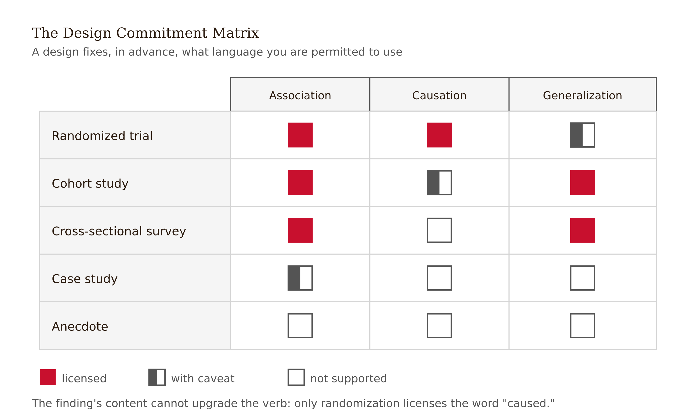
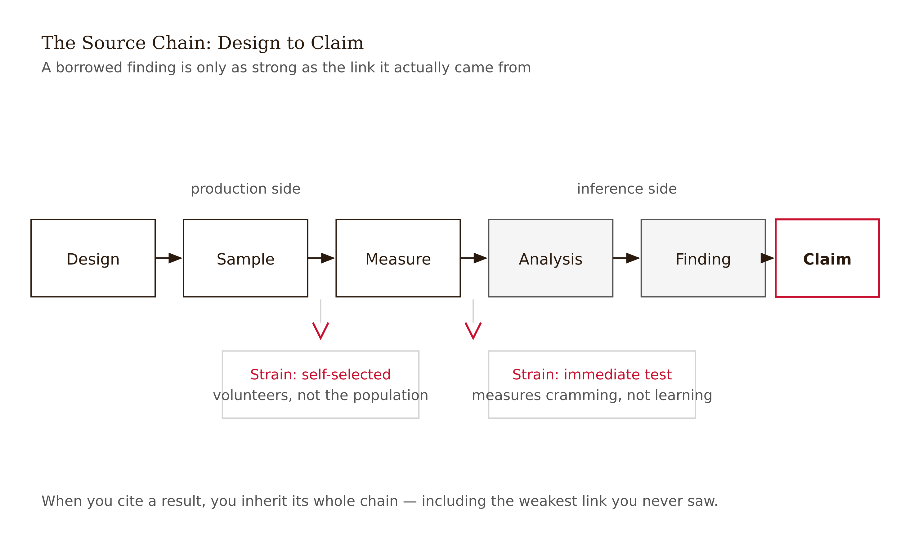
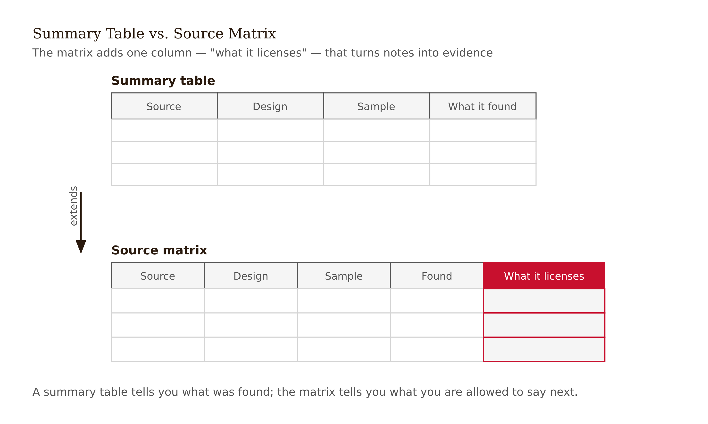
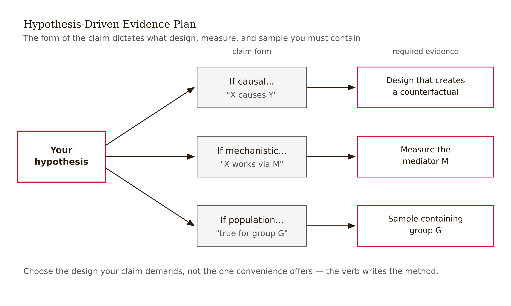

# Chapter 2 — Foundation
*What a source can carry is not the same as what it says.*

Noah has five papers. Every one of them reports positive effects for the intervention he wants to study. He lines them up like witnesses for the defense and starts writing his literature review — "prior work consistently demonstrates," "research has shown," "studies confirm." It feels like the field has spoken. It feels like building on solid ground.

Then he looks at the details.

One study measured satisfaction, not learning. Another ran a post-test immediately after the intervention with no control group. A third used a self-selected sample of students who signed up voluntarily — which is fine, but it means the result may say as much about motivation as it does about the intervention. Two papers report only p-values, with no effect sizes, which means Noah has no way to judge whether a statistically significant result was large enough to matter. The fifth paper is the strongest: a randomized trial with a delayed unassisted test. But its sample is a single institution, which limits how far the finding can travel.

None of these papers are useless. But none of them say what Noah was about to claim they said.

The problem isn't that the sources are weak. The problem is that Noah hasn't yet asked the question that should precede every literature review: *What does this source license me to say?*

---

That question sounds simple. It is not. Answering it requires understanding the relationship between a study's design and the claims its design can support — and that relationship is more specific, and more limiting, than most writers realize before they've been caught getting it wrong.

Here is the core idea: a study design is not just a method. It is a commitment. When a researcher chooses to run a randomized controlled trial, they are committing to a specific set of things they can and cannot claim. A randomized design, when executed properly, licenses causal language: you can say the intervention *caused* the outcome, not merely that the two were associated. But it comes with constraints on generalization — you can speak to the population you randomized, and extrapolation beyond that population requires argument, not just citation.

An observational study makes a different commitment. You can describe what happened in the world without intervening in it, which gives you ecological validity — your sample is from the real population, not from whoever agreed to be randomized. But you cannot say "caused." You can say "associated with," "predicted," "was related to." Causal language, in an observational study, is overreach.

This is not a technicality. It is not the kind of precision that only methodologists care about. It is the difference between a paper that makes a defensible argument and a paper that will be correctly challenged in peer review for overstating what the evidence supports.



---

Let me put the same idea differently, because there is a version of it that takes longer to internalize.

When you read a source, you are not just extracting findings. You are evaluating the chain from design to claim. A source makes a claim. Behind that claim is an analysis. Behind the analysis is a measurement. Behind the measurement is a sample. Behind the sample is a design. At every link in that chain, something can go wrong — not fraudulently, not carelessly, just by making choices that trade one thing for another.

Every design choice is a trade-off. Random assignment gives you causal leverage but removes you from naturalistic conditions. A narrow sample gives you tight internal validity but weak generalizability. Immediate post-tests tell you about short-term performance but say nothing about retention. Self-report measures are scalable but susceptible to social desirability. None of these choices are mistakes. They are decisions about what the study is optimized to detect.

Your job, when you read a source, is to reconstruct the trade-offs and ask whether the finding you want to borrow came from the part of the design that was strong, or from a part that was constrained.

Noah's satisfaction paper is a good example. Satisfaction is a real outcome. It matters that students have positive experiences. But if Noah wants to claim that the intervention *improves durable learning*, then a satisfaction measure is evidence for a different claim. The paper didn't fail to measure learning because the authors were careless. They may have measured exactly what they intended to measure. Noah is the one proposing to use it for something it wasn't designed to support.



---

There is a practical tool for doing this systematically, and I want to introduce it now because you will use it every time you conduct a literature review: the source matrix.

A source matrix is not a summary table. A summary table tells you what each source found. A source matrix tells you what each source *can support* — which is a different question that requires more work to answer.

The columns I use are: citation, hypothesis or claim the source makes, study design, sample characteristics, outcome measure, effect size or magnitude, primary limitation, and what this source licenses me to say in my own paper. That last column is the one that matters. It forces a translation from "what the paper reported" to "what I am justified in borrowing."

Building the matrix before writing the literature review changes the literature review. Noah's review, once he builds the matrix, stops saying "research has shown" and starts saying something more precise: "randomized evidence supports short-term performance gains; evidence for durable retention is currently limited to one institution and one delivery format." That sentence is narrower. It is also more honest. And it sets up a genuine contribution — because if the evidence for durable retention is thin, that is a gap worth filling.



---

The second lock — alongside the source matrix — is the evidence plan for your own study.

An evidence plan asks: given my hypothesis, what design, sample, measure, and analysis would make the claim defensible? This is not the same as choosing a design because it is convenient or because it is what your field typically uses. It is asking, from first principles, what the claim actually requires.

If your hypothesis is causal — "X causes Y" — your evidence plan needs an experimental or quasi-experimental design, or a very explicit argument for why an observational design is sufficient given the alternatives. If your hypothesis is about a mechanism — "X causes Y *because* Z" — your evidence plan needs a measure of Z, not just a measure of Y. If your hypothesis specifies a population — "among novice programmers" — your evidence plan needs a sample that actually contains novice programmers, not a convenience sample that happens to include some.



This sounds obvious. It is less obvious in practice, because many research projects begin from available resources: a dataset that already exists, a classroom you have access to, a survey instrument someone else validated. Working from available resources is fine — most research does this — but the evidence plan forces an honest accounting of what those resources can and cannot support. A dataset of self-selected participants can support some claims and not others. An instrument validated in one population may or may not transfer to yours.

Reporting standards exist precisely because the relationship between design and claim is easy to obscure in a polished paper. JARS, the Journal Article Reporting Standards, specifies what methodological details readers need in order to evaluate a psychology study. CONSORT does the same for clinical trials. STROBE for observational epidemiology. The details vary by field, but the underlying logic is the same: a reader cannot evaluate a finding without knowing how it was produced.

<!-- → [TABLE: Reporting standards reference — JARS / CONSORT / STROBE — columns: field, what it requires, what absence of those details prevents readers from evaluating] -->

---

There is a version of this chapter that would take a very different approach. It would say: read a lot of sources, take notes, trust your instincts about what's relevant, and let the argument emerge from immersion in the literature. I have seen writers work this way. Some of them produce excellent papers.

But the papers they produce are excellent despite the method, not because of it. When the immersion approach works, it works because the writer has accumulated, over years of reading, a tacit sense of design quality that they apply without naming it. They have internalized the source-matrix logic without building a matrix. They have learned to distinguish "associated with" from "caused by" without consciously applying that rule at every turn.

That tacit knowledge is not available to a first-time writer. And even experienced writers, when working in an adjacent field or under deadline pressure, make the same mistakes as beginners — borrowing causal language from observational studies, overgeneralizing from narrow samples — because the tacit sense is domain-specific and not always active when you're tired at midnight trying to finish a literature review.

The source matrix makes the tacit explicit. It is not a constraint on sophisticated thinking. It is a scaffold that forces the thinking to happen even when you would rather skip it.

---

What changes when you do this work before drafting?

The literature review changes. Instead of reporting findings as if they were facts, you report them as claims licensed by specific designs with specific limits. That's more honest, but it is also more useful — because the places where the evidence is thin are where your contribution fits.

The hypothesis changes too, sometimes. When you build the matrix and realize that existing studies have tested X but not Y, you may find that your hypothesis is already answered, or that it is unanswerable with the resources you have, or that a slight reframe makes it both more tractable and more original. This is not failure. This is the foundation doing its job.

And the paper changes. A paper built on a honest source matrix is harder to overclaim. The writer has already named the limits. The claims are scoped to the evidence. The contribution is legible because the gap it fills is real.

The writing, when you finally begin it, goes faster. Not because you have more material, but because you know what the material can bear.

---

## Exercises

### Warm-up

**1.** Choose three papers relevant to your research area. For each, identify: (a) the study design, (b) the primary outcome measure, (c) one thing the design licenses the authors to claim, and (d) one thing the design does not support, even if the authors imply it. Note where your reading and the authors' own language diverge.

**2.** Take one sentence from a paper's abstract that uses causal language ("improves," "causes," "leads to," "produces"). Look at the methods section and decide whether the design supports that language. If it does not, rewrite the sentence in language the design actually supports.

### Application

**3.** Build a source matrix for four papers relevant to your hypothesis. Use these columns: citation, study design, sample characteristics, outcome measure, effect size or magnitude, primary limitation, what this source licenses you to say. In the final column, be precise: "licenses me to say X" is not the same as "is relevant to my topic."

**4.** Write an evidence plan for your own study using three design options. For each option, state: what the design can rule out, what it cannot, what sample and measure it requires, and what you would have to give up to use it. Identify which option best fits your hypothesis and explain the trade-off you accepted.

### Synthesis

**5.** Noah's literature review originally said "prior work consistently demonstrates that feedback tools improve learning." Rewrite that claim using the source matrix logic from this chapter, scoping it to what Noah's five sources can actually support. Then write a second sentence explaining what gap remains — and why that gap is where a new study could contribute.

**6.** A classmate says: "All my sources are peer-reviewed, so my literature review is solid." Using this chapter's argument, explain why peer review does not resolve the source-evaluation problem. Give one example of a methodological limitation that peer review would not catch and that a source matrix would surface.

### Challenge

**7.** Find a published literature review in your field that you suspect over-relies on weak evidence — causal language from observational studies, generalized claims from narrow samples, or confidence without effect sizes. Build a source matrix for three of the papers it cites. Write a one-paragraph revision of the review's central claim that accurately represents what the cited evidence can bear. Consider: does the revised claim still support the paper's contribution, or does the contribution depend on the overclaim?

---

## LLM Exercises

### Exercise 1 — When to Use AI

**The judgment:** In this chapter's work, AI assistance is appropriate for the following tasks:

- Create a source-evaluation table — *Why AI works here:* This is a bounded support task: AI can generate options, detect patterns, or reformat material while you retain the chapter's judgment criteria.
- List design tradeoffs for a proposed hypothesis — *Why AI works here:* This is a bounded support task: AI can generate options, detect patterns, or reformat material while you retain the chapter's judgment criteria.
- Flag method details a reader must inspect — *Why AI works here:* This is a bounded support task: AI can generate options, detect patterns, or reformat material while you retain the chapter's judgment criteria.

**The tell:** You know you are using AI appropriately when you can evaluate the output — when you have independent criteria to judge whether it is correct, complete, and fit for purpose.

---

### Exercise 2 — When NOT to Use AI

**The judgment:** In this chapter's work, the following tasks require human judgment. Delegating them to AI is not appropriate — not because AI cannot produce output, but because AI output in these cases cannot be trusted without verification that requires the same expertise as doing the task yourself.

- Declaring a source credible without reading it — *Why AI fails here:* This requires human calibration, domain context, or accountability that the model cannot supply as ground truth.
- Choosing the design solely from AI advice — *Why AI fails here:* This requires human calibration, domain context, or accountability that the model cannot supply as ground truth.
- Collapsing weak and strong evidence into one confidence level — *Why AI fails here:* This requires human calibration, domain context, or accountability that the model cannot supply as ground truth.

**The tell:** You know you have crossed the line when you are using AI output as your reason for a conclusion rather than as a tool for reaching one. If you could not explain the conclusion without the AI, the AI did the work that should have been yours.

**Series connection:** This exercise trains Tier 4 Metacognitive: the capacity to supervise machine output at the point where the project depends on source evaluation, design fit, evidence plan, source matrix.

---

### Exercise 3 — LLM Exercise

**What you're building this chapter:** a design-options and source-matrix plan.
**Tool:** Claude chat. It is the best fit here because the task is conceptual drafting and critique, not direct file manipulation.

**The Prompt:**

```
I am building a Research Paper Submission Dossier for a research paper I may write. The dossier is a working folder of decisions, audits, and evidence checks that should make the final paper harder to overclaim.

Current chapter: Foundation. Core vocabulary for this chapter: source evaluation, design fit, evidence plan, source matrix.

My working research topic is: AI tutoring and student learning in undergraduate programming courses. My current tentative claim is: Socratic AI feedback may improve delayed unassisted retention more than direct-answer AI feedback because it preserves retrieval effort.

Create a design-options and source-matrix plan. Use the chapter concepts explicitly. Do not decide the final research claim for me. Do not invent citations, data, or results. Where a decision requires domain judgment, write "AUTHOR DECISION REQUIRED" and explain what judgment is needed. End with three questions I should answer before moving to the next chapter.
```

**What this produces:** A draft artifact for the running dossier, suitable to save as project-dossier/02-source-design-matrix.md.

**How to adapt this prompt:**
- *For your own project:* Replace the research topic and tentative claim with your own domain, data source, and intended contribution.
- *For ChatGPT / Gemini:* Keep the same constraints, and add "show your reasoning as bullet points, not hidden chain-of-thought."
- *For a Claude Project:* Put the project description and standing rule "do not decide my research claim for me" in the project instructions; paste the chapter-specific task as the message.

**Connection to previous chapters:** This adds the next decision layer to the same dossier rather than starting a new artifact.
**Preview of next chapter:** Next you will classify the claim itself before choosing methods.

---

### Exercise 4 — CLI Exercise

**What you're building this chapter:** The file `project-dossier/02-source-design-matrix.md`.
**Tool:** Codex CLI or Cowork. Use a file-aware agent because the task reads prior dossier files and writes a new markdown artifact.
**Skill level:** Beginner. Comfort with a project folder helps, but no programming is required.

**Setup:**

Before running this exercise, confirm:
- [ ] A folder named `project-dossier/` exists in your workspace.
- [ ] Any earlier chapter dossier files are saved in that folder.
- [ ] Your `AGENTS.md` or `CLAUDE.md` says: "For this project, AI may draft and audit artifacts, but the human author owns the research question, evidence standard, interpretation, and disclosure."

**The Task:**

```
Read the existing files in project-dossier/. Then create or update project-dossier/02-source-design-matrix.md.

This file should apply Chapter 2, "Foundation," to the running Research Paper Submission Dossier. Use these chapter concepts: source evaluation, design fit, evidence plan, source matrix.

Write the file with these sections:
1. Purpose of this dossier artifact
2. Inputs read from earlier dossier files
3. Chapter 2 analysis
4. Decisions the human author must make
5. Checks to run before moving on

Do not invent sources, data, results, or final conclusions. If information is missing, write "MISSING — author must supply" rather than filling the gap. After writing the file, report what changed and list any unresolved author decisions. Stop after writing this one file.
```

**Expected output:** `project-dossier/02-source-design-matrix.md` exists and connects this chapter's concept to the cumulative dossier.

**What to inspect in the output:** Check whether the file uses source evaluation, design fit, evidence plan, source matrix correctly, preserves human decision points, and avoids unsupported conclusions.

**If it goes wrong:** If the agent invents facts or overwrites prior work, stop and inspect the diff. Restore the previous file version if needed, then rerun with the added instruction: "Use only facts already present in the dossier or explicitly mark them missing."

**CLAUDE.md / AGENTS.md note:** Add or keep this standing rule: "Never convert AI-generated suggestions into research conclusions without a human-authored rationale and source check."

---

### Exercise 5 — AI Validation Exercise

**What you're validating:** The AI-generated artifact from Exercise 3 or 4.
**Validation type:** Reasoning chain / Agentic output.
**Risk level:** Medium. The output is useful if it structures your thinking, but dangerous if it silently makes the judgment the chapter says must remain human.

**Setup:**

Use the output from Exercise 3 or the file produced in Exercise 4 as the artifact to validate.

**The Validation Task:**

Evaluate the AI output above using the following checklist. For each item, record: Pass / Fail / Cannot determine — and explain your reasoning.

```
Validation Checklist — Foundation

□ Correctness: Does the output accurately reflect the chapter's core concept?
  Does it use source evaluation, design fit, evidence plan, source matrix in a way this chapter would endorse?

□ Completeness: Is anything important missing?
  Would a domain expert need an additional source, measure, comparison, or limitation before trusting this artifact?

□ Scope: Did the AI stay within the task boundaries?
  Did it add claims, sources, data, results, or conclusions that were not provided?

□ Chapter-specific criterion 1: Does the output separate source relevance from source strength?

□ Chapter-specific criterion 2: Does it name what each design cannot support?

□ Failure mode check: Does this output exhibit any of the following?
  - Fluent but wrong
  - Schema-valid but semantically wrong
  - Missing ground truth
  - Automation bias trigger: a confident recommendation without evidence you can independently inspect
```

**What to do with your findings:**

- If the output passes all checks: proceed to use it in your project. Note what made it trustworthy.
- If the output fails one check: revise the prompt and re-run Exercise 3 or 4. Document what changed.
- If the output fails multiple checks or you cannot determine pass/fail: this is a "When NOT to Use AI" moment. Do this part of the task yourself.

**AI Use Disclosure prompt:**

After completing this validation, write a two-sentence AI Use Disclosure:

> *Sentence 1:* What AI produced in this exercise and how you used it.
> *Sentence 2:* One specific thing the AI could not determine that required your judgment.

**Series connection:** This exercise trains Tier 4 Metacognitive: the capacity to catch when machine output is fluent, useful, and still not sufficient for the human conclusion.
