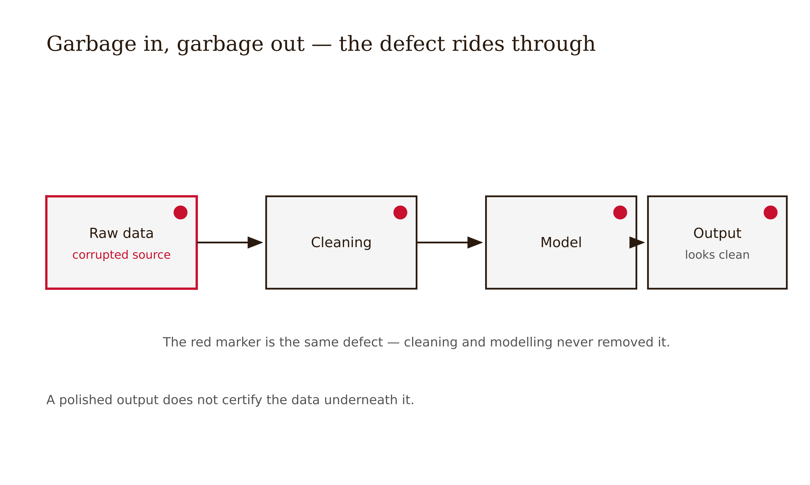
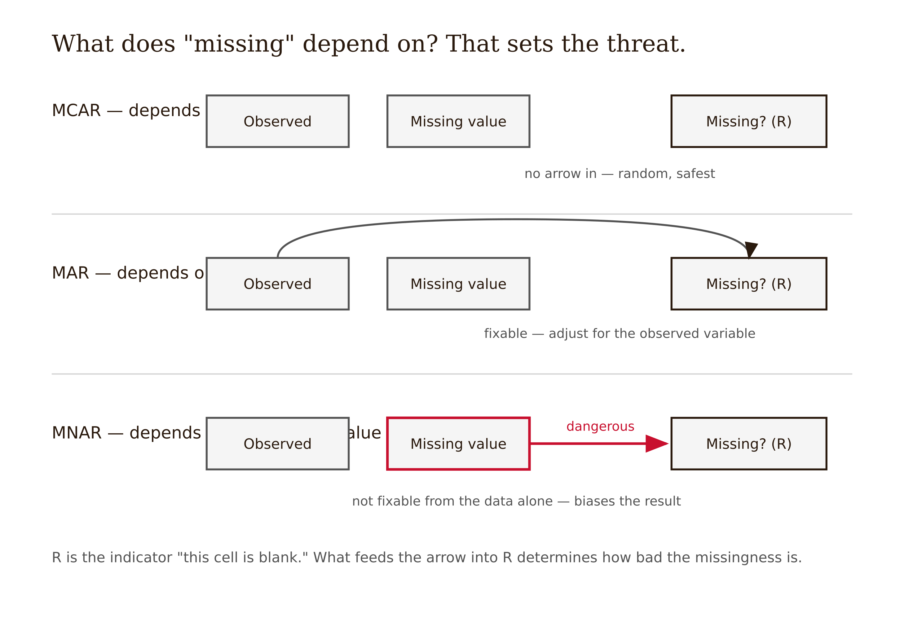
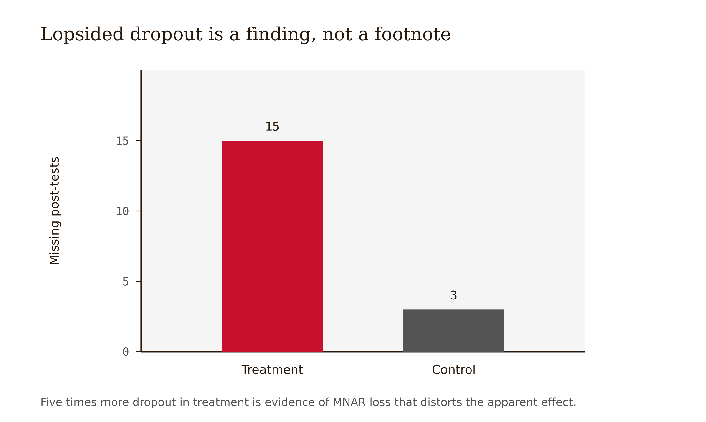
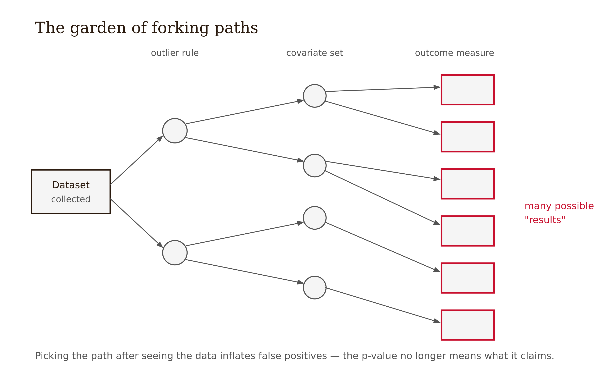

# Chapter 6 — GIGO: Garbage In, Garbage Out
*The analysis cannot rescue data that was broken before it arrived.*

The analysis runs. The output is clean. The p-value is small. Everything looks like a result.

Then someone opens the raw file.

There are two response times recorded as negative numbers — physically impossible. There are eighteen missing post-tests, fifteen of them from the treatment group. There is a six-item motivation scale whose items don't correlate with each other, which means the composite score is averaging things that are not measuring the same construct. The statistical output was not the beginning of knowledge. It was the end of a pipeline that had already failed.

This is the problem the acronym names: garbage in, garbage out. It is not a slogan about computers. It is an epistemic rule. Statistical analysis inherits the quality of the data that enters it. Better methods, fancier models, more sophisticated software — none of these repair a dataset whose problems entered before the first line of code ran. The confidence intervals are precise. The standard errors are correct. They are precisely and correctly describing a dataset that does not describe what you think it describes.



The chapter is about finding the garbage before you report the results.

---

Let me start with the thing that is most dangerous, because it is the easiest to rationalize away: missing data.

A blank cell in a spreadsheet does not mean "this person had no value." It means "we do not know this person's value." Those are different epistemic states, and the difference matters enormously for what you can claim.

Roderick Little and Donald Rubin introduced a taxonomy of missingness mechanisms that has become standard because it captures the three structurally distinct ways data can be absent. Understanding which mechanism is operating determines whether your missing data is a minor annoyance or a fundamental threat to your conclusions.



**Missing completely at random** (MCAR) means the probability that an observation is missing has nothing to do with the values of any variables in your study — observed or unobserved. A server glitch that randomly dropped one in twenty responses would produce MCAR data. Under MCAR, the complete cases — the people you have data on — are a random subset of your intended sample, and your results will still generalize, just with reduced sample size and power. MCAR is the most benign mechanism, and the least common in real research.

**Missing at random** (MAR) means the probability of missingness depends on other *observed* variables in your dataset, but not on the missing value itself once you've accounted for those variables. Suppose students who scored lower on the pre-test were more likely to miss the post-test session — but among students with the same pre-test score, whether someone missed the post-test was random. Under MAR, you can potentially address the missing data using observed information: multiple imputation, for instance, can use the pre-test scores to model what the missing post-test scores might have been. The assumption is not verifiable — you cannot directly test whether missingness depends on unobserved variables — but it is at least defensible if you've collected the right covariates.

**Missing not at random** (MNAR) means the probability of missingness depends on the value that's missing, even after accounting for observed variables. The students most likely to skip the post-test are the ones who struggled most — and their poor performance is exactly the thing you didn't measure. In an intervention study, MNAR concentrated in the treatment group is a quiet catastrophe: the students for whom the intervention didn't work are systematically absent from the outcome data, making the intervention look more effective than it was.

MNAR is not fixable by imputation. Imputation is a model of what the missing values would have been, based on the structure of what you observed. But if the reason data is missing is directly connected to the values that are absent — if the struggling students are absent precisely because they're struggling — then any model that predicts their missing values from the observed data will be systematically optimistic. You will impute scores that are too high for the students who are missing, because the information that would tell you they should score low is the same information that isn't there.

The practical implication: before any analysis, examine the pattern of missing data. Where is it concentrated? Is it evenly distributed across conditions, or is it heavier in one group? Is it related to observable predictors like pre-test scores? The answers determine whether you're dealing with MCAR, MAR, or MNAR — and that determination has to be reported, not hidden, because it directly affects how much you can trust the results.

<!-- → [TABLE: MCAR / MAR / MNAR — three rows — columns: mechanism definition, what determines missingness, example in a tutoring study, threat to validity, possible remedy] -->

---

The missing post-tests concentrated in the treatment group are not a clerical inconvenience. They are information about the study. They are telling you something about what happened — most likely, that the students who dropped out of the treatment condition were not a random subset of treatment students, and that their outcomes, if you had them, would change your conclusions. A study that reports results for the students who remained is not a study of the intervention. It is a study of the students who persisted through the intervention, which is a different and systematically biased sample.



Reporting this honestly means saying so: "Post-test data were missing for 18 participants (15 in the treatment condition and 3 in the control condition). This differential dropout pattern is consistent with MNAR missingness, which limits our ability to estimate the treatment effect for the full enrolled sample. Analyses were conducted on complete cases, and results should be interpreted as applying to students who completed the study rather than to the intended population."

That sentence reduces the apparent strength of the finding. It is still the right sentence to write.

---

Missingness is the most conceptually important data-quality problem, but it is far from the only one. The list of things that can corrupt a dataset before analysis is long enough to be humbling.

**Impossible values** are the most obvious: a test score that exceeds the maximum possible, a response time that is negative, an age of 247. These are coding errors. They enter through data entry mistakes, system glitches, merge failures where records get shifted by a row. The remedy is simple — a range check before analysis — but the step is frequently skipped because researchers assume their data pipeline is clean until it demonstrably isn't.

**Composite scale failures** are subtler. When you sum or average several items into a single score — a motivation scale, a learning self-efficacy measure, an anxiety composite — you are assuming those items are measuring the same underlying construct. The standard check is internal consistency, usually reported as Cronbach's alpha. A low alpha (roughly, below 0.7 as a rule of thumb, though the threshold is not sacred) tells you the items are not behaving as a coherent construct. Summing them into a single score is averaging things that are measuring different things, and the resulting composite may not measure anything real.

The right response to a low alpha is not to compute the composite anyway and report the alpha in a footnote. The right response is to investigate which items are causing the incoherence, decide whether the scale can be salvaged by removing problematic items (with justification that predates seeing the outcomes), or report that the intended composite could not be formed and adjust the analysis accordingly.

**Coding inconsistencies** — the same construct recorded differently across time points, sites, or data collectors — can introduce noise that looks like real variance. A pre-test score on a 0–100 scale merged with a post-test score on a 0–10 scale produces a comparison that means nothing. A condition label coded as "1/2" in one batch and "T/C" in another introduces errors that merge operations won't catch unless someone checks.

<!-- → [TABLE: Data-quality failure types — rows: impossible values, MNAR missingness, composite failure, coding inconsistency, undocumented exclusion — columns: what it looks like in the raw data, how it enters the pipeline, threat to the analysis, pre-specified remedy] -->

---

There is a category of data problem that is not about the data at all. It is about the researcher's decisions.

Andrew Gelman and Eric Loken described what they called the garden of forking paths: the many analytic choices a researcher faces between collecting data and reporting results. How should outliers be handled? Which covariates should be included? Should the primary outcome be the immediate post-test, the delayed post-test, or the transfer measure? Should the analysis include all enrolled participants or only those who completed the protocol? Should scores be log-transformed to address skew? Should subgroups be analyzed separately?

Each of these choices is defensible in isolation. Most of them have legitimate arguments on multiple sides. The problem is that when choices are made after looking at the data — when the researcher, consciously or not, gravitates toward the specification that produces the most interesting result — the p-values are no longer calibrated. A p-value of 0.04 means: if the null were true, data this extreme or more extreme would occur by chance 4% of the time, assuming the analysis was specified before the data were examined. If the analysis was adjusted to fit the data, that probability doesn't apply. The result looks like a 4% chance of a false positive. It is not.



This is not fraud. Most researchers doing this are not aware they're doing it. The human mind is extraordinarily good at generating post-hoc justifications for decisions that were actually driven by what the data showed. "We excluded those three participants because their response times indicated they weren't engaged" sounds principled. It may be true. It may also be that those three participants had anomalously low scores in the treatment condition, and the exclusion rule was constructed after noticing that.

The remedy is pre-specification: deciding, and documenting, the primary analysis, the outcome measure, the exclusion criteria, and the covariate set before looking at the outcomes. This is what preregistration does — it creates a time-stamped record of the analysis plan that predates the data. A preregistered analysis is not guaranteed to be correct, but its degrees of freedom are bounded in a way that makes the reported statistics interpretable.

For studies that are not preregistered, transparency is the next best option: report what the original analysis plan was, note where the executed analysis deviated from it, and explain why. If you discovered mid-analysis that the outcome measure had low reliability and substituted a different one, say so. The substitution may have been entirely warranted. The reader needs to know it happened.

<!-- → [INFOGRAPHIC: Garden of forking paths — single starting node (data collected) branching into multiple paths at each decision point (outlier rule, covariate set, outcome measure, subgroup analysis) — showing how many possible "results" the same dataset can produce depending on unconstrained choices] -->

---

Here is the principle that ties the chapter together, and it is worth stating plainly.

Data cleaning is not a clerical step that precedes the real analysis. It is part of the argument. The choices made in cleaning — which impossible values to remove, how to handle differential dropout, whether to form a composite, where to draw the line on outlier exclusion — shape the dataset that the statistical analysis describes. Those choices need to be made before the outcome data are examined, documented in advance or in the process, and reported in enough detail that a reader could understand what was done and why.

A clean output from a statistical model is not evidence that the underlying data was clean. Sophisticated methods can produce polished-looking output from deeply corrupted inputs. The p-value, the confidence interval, the effect size — none of these contain any information about whether the data that generated them was sound. That information is in the methods section, or it isn't there at all. And if it isn't there, neither the author nor the reader has any way to assess how much the results should be trusted.

The question to ask before beginning analysis is not "do these data look reasonable?" It is "have I documented, in advance, every decision that could change what the data show?" If the answer is no, the analysis is running in a space where the rules can be adjusted after the fact — and in that space, a statistically significant result tells you much less than it appears to.

---

## Exercises

### Warm-up

**1.** For your own project, create a data-quality checklist that you would complete before running any analysis. Include at minimum: impossible value ranges for each variable, an expected missingness pattern and how you would detect deviation from it, internal consistency criteria for any composite measures you plan to use, and a pre-specified outlier rule with justification. Write each item as a decision that can be checked off before seeing the outcomes.

**2.** Classify each of the following missingness scenarios as MCAR, MAR, or MNAR. Explain what threat each poses to validity and what, if anything, could be done to address it: (a) participants randomly failed to submit the final survey due to a platform error; (b) participants with lower pre-test scores were more likely to miss the post-test, but among participants at the same pre-test level, dropout was random; (c) participants who found the intervention unhelpful were more likely to drop out before the outcome measure.

### Application

**3.** In the worked example from this chapter, 15 of 18 missing post-tests came from the treatment group. Write the paragraph you would include in the Methods section of a paper reporting this finding. Specify the missingness mechanism you believe is most likely, what threat it poses to the conclusions, and how you would report the results given that threat. Do not simply note the missing data — explain its implications.

**4.** A colleague shows you a dataset with a six-item motivation scale. The Cronbach's alpha is 0.41. They plan to average the six items into a single composite and use it as a covariate. Using this chapter's argument, explain why this is a problem and what the options are. Write the decision you would recommend and the justification for it.

### Synthesis

**5.** You are running the Socratic vs. direct-answer feedback study. Before collecting data, you need to pre-specify your analysis. Write a one-page pre-analysis plan that covers: (a) your primary outcome measure and the time point at which it will be assessed, (b) your exclusion criteria for participants and individual data points, (c) how you will handle missing post-test data if dropout is differential between conditions, (d) which covariates you will include in the primary analysis and why, and (e) any secondary or exploratory analyses you plan, clearly labeled as such. Be specific enough that another researcher could implement your plan without consulting you.

**6.** Describe a realistic scenario in which a researcher, without any intent to deceive, makes a series of individually reasonable data-cleaning decisions that collectively produce a false positive result. Name each decision point, the defensible rationale for the choice made, and the alternative choice that would have produced a null result. Then explain what pre-specification would and would not have prevented in this scenario.

### Challenge

**7.** Find a published study in your field that reports a significant intervention effect but does not clearly report: (a) the pre-specified primary outcome, (b) the missingness pattern and mechanism, and (c) the outlier and exclusion rules. For each missing element, describe what you would need to know to evaluate the robustness of the result. Then write the paragraph that should have appeared in the Methods section to provide that information. Consider: does the absence of this reporting change your interpretation of the study's contribution, and if so, how?

---

## LLM Exercises

### Exercise 1 — When to Use AI

**The judgment:** In this chapter's work, AI assistance is appropriate for the following tasks:

- Generate data-quality checks from variable descriptions — *Why AI works here:* This is a bounded support task: AI can generate options, detect patterns, or reformat material while you retain the chapter's judgment criteria.
- Draft code comments for missingness and impossible-value checks — *Why AI works here:* This is a bounded support task: AI can generate options, detect patterns, or reformat material while you retain the chapter's judgment criteria.
- Suggest likely data problems to inspect — *Why AI works here:* This is a bounded support task: AI can generate options, detect patterns, or reformat material while you retain the chapter's judgment criteria.

**The tell:** You know you are using AI appropriately when you can evaluate the output — when you have independent criteria to judge whether it is correct, complete, and fit for purpose.

---

### Exercise 2 — When NOT to Use AI

**The judgment:** In this chapter's work, the following tasks require human judgment. Delegating them to AI is not appropriate — not because AI cannot produce output, but because AI output in these cases cannot be trusted without verification that requires the same expertise as doing the task yourself.

- Running unreviewed cleaning code on the only data copy — *Why AI fails here:* This requires human calibration, domain context, or accountability that the model cannot supply as ground truth.
- Uploading restricted data to unapproved tools — *Why AI fails here:* This requires human calibration, domain context, or accountability that the model cannot supply as ground truth.
- Choosing exclusions after seeing which result looks best — *Why AI fails here:* This requires human calibration, domain context, or accountability that the model cannot supply as ground truth.

**The tell:** You know you have crossed the line when you are using AI output as your reason for a conclusion rather than as a tool for reaching one. If you could not explain the conclusion without the AI, the AI did the work that should have been yours.

**Series connection:** This exercise trains Tier 4 Metacognitive: the capacity to supervise machine output at the point where the project depends on missingness, MCAR, MAR, MNAR, outliers, reliability, forking paths.

---

### Exercise 3 — LLM Exercise

**What you're building this chapter:** a data-quality risk checklist.
**Tool:** Claude chat. It is the best fit here because the task is conceptual drafting and critique, not direct file manipulation.

**The Prompt:**

```
I am building a Research Paper Submission Dossier for a research paper I may write. The dossier is a working folder of decisions, audits, and evidence checks that should make the final paper harder to overclaim.

Current chapter: GIGO: Garbage In, Garbage Out. Core vocabulary for this chapter: missingness, MCAR, MAR, MNAR, outliers, reliability, forking paths.

My working research topic is: AI tutoring and student learning in undergraduate programming courses. My current tentative claim is: Socratic AI feedback may improve delayed unassisted retention more than direct-answer AI feedback because it preserves retrieval effort.

Create a data-quality risk checklist. Use the chapter concepts explicitly. Do not decide the final research claim for me. Do not invent citations, data, or results. Where a decision requires domain judgment, write "AUTHOR DECISION REQUIRED" and explain what judgment is needed. End with three questions I should answer before moving to the next chapter.
```

**What this produces:** A draft artifact for the running dossier, suitable to save as project-dossier/06-data-quality-checklist.md.

**How to adapt this prompt:**
- *For your own project:* Replace the research topic and tentative claim with your own domain, data source, and intended contribution.
- *For ChatGPT / Gemini:* Keep the same constraints, and add "show your reasoning as bullet points, not hidden chain-of-thought."
- *For a Claude Project:* Put the project description and standing rule "do not decide my research claim for me" in the project instructions; paste the chapter-specific task as the message.

**Connection to previous chapters:** This adds the next decision layer to the same dossier rather than starting a new artifact.
**Preview of next chapter:** Next you will plan the statistical test and reporting.

---

### Exercise 4 — CLI Exercise

**What you're building this chapter:** The file `project-dossier/06-data-quality-checklist.md`.
**Tool:** Codex CLI or Cowork. Use a file-aware agent because the task reads prior dossier files and writes a new markdown artifact.
**Skill level:** Beginner. Comfort with a project folder helps, but no programming is required.

**Setup:**

Before running this exercise, confirm:
- [ ] A folder named `project-dossier/` exists in your workspace.
- [ ] Any earlier chapter dossier files are saved in that folder.
- [ ] Your `AGENTS.md` or `CLAUDE.md` says: "For this project, AI may draft and audit artifacts, but the human author owns the research question, evidence standard, interpretation, and disclosure."

**The Task:**

```
Read the existing files in project-dossier/. Then create or update project-dossier/06-data-quality-checklist.md.

This file should apply Chapter 6, "GIGO: Garbage In, Garbage Out," to the running Research Paper Submission Dossier. Use these chapter concepts: missingness, MCAR, MAR, MNAR, outliers, reliability, forking paths.

Write the file with these sections:
1. Purpose of this dossier artifact
2. Inputs read from earlier dossier files
3. Chapter 6 analysis
4. Decisions the human author must make
5. Checks to run before moving on

Do not invent sources, data, results, or final conclusions. If information is missing, write "MISSING — author must supply" rather than filling the gap. After writing the file, report what changed and list any unresolved author decisions. Stop after writing this one file.
```

**Expected output:** `project-dossier/06-data-quality-checklist.md` exists and connects this chapter's concept to the cumulative dossier.

**What to inspect in the output:** Check whether the file uses missingness, MCAR, MAR, MNAR, outliers, reliability, forking paths correctly, preserves human decision points, and avoids unsupported conclusions.

**If it goes wrong:** If the agent invents facts or overwrites prior work, stop and inspect the diff. Restore the previous file version if needed, then rerun with the added instruction: "Use only facts already present in the dossier or explicitly mark them missing."

**CLAUDE.md / AGENTS.md note:** Add or keep this standing rule: "Never convert AI-generated suggestions into research conclusions without a human-authored rationale and source check."

---

### Exercise 5 — AI Validation Exercise

**What you're validating:** The AI-generated artifact from Exercise 3 or 4.
**Validation type:** Reasoning chain / Agentic output.
**Risk level:** Medium. The output is useful if it structures your thinking, but dangerous if it silently makes the judgment the chapter says must remain human.

**Setup:**

Use the output from Exercise 3 or the file produced in Exercise 4 as the artifact to validate.

**The Validation Task:**

Evaluate the AI output above using the following checklist. For each item, record: Pass / Fail / Cannot determine — and explain your reasoning.

```
Validation Checklist — GIGO: Garbage In, Garbage Out

□ Correctness: Does the output accurately reflect the chapter's core concept?
  Does it use missingness, MCAR, MAR, MNAR, outliers, reliability, forking paths in a way this chapter would endorse?

□ Completeness: Is anything important missing?
  Would a domain expert need an additional source, measure, comparison, or limitation before trusting this artifact?

□ Scope: Did the AI stay within the task boundaries?
  Did it add claims, sources, data, results, or conclusions that were not provided?

□ Chapter-specific criterion 1: Does the output distinguish data cleaning from result-shopping?

□ Chapter-specific criterion 2: Does it treat missingness mechanism as substantive, not clerical?

□ Failure mode check: Does this output exhibit any of the following?
  - Fluent but wrong
  - Schema-valid but semantically wrong
  - Missing ground truth
  - Automation bias trigger: a confident recommendation without evidence you can independently inspect
```

**What to do with your findings:**

- If the output passes all checks: proceed to use it in your project. Note what made it trustworthy.
- If the output fails one check: revise the prompt and re-run Exercise 3 or 4. Document what changed.
- If the output fails multiple checks or you cannot determine pass/fail: this is a "When NOT to Use AI" moment. Do this part of the task yourself.

**AI Use Disclosure prompt:**

After completing this validation, write a two-sentence AI Use Disclosure:

> *Sentence 1:* What AI produced in this exercise and how you used it.
> *Sentence 2:* One specific thing the AI could not determine that required your judgment.

**Series connection:** This exercise trains Tier 4 Metacognitive: the capacity to catch when machine output is fluent, useful, and still not sufficient for the human conclusion.
