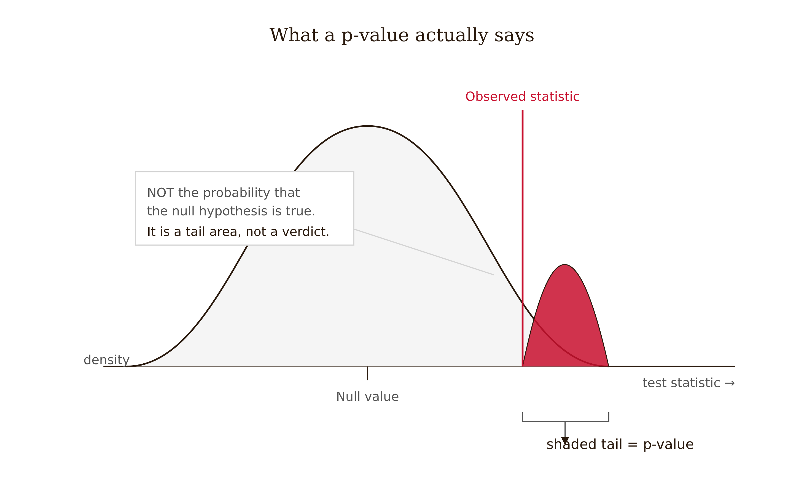
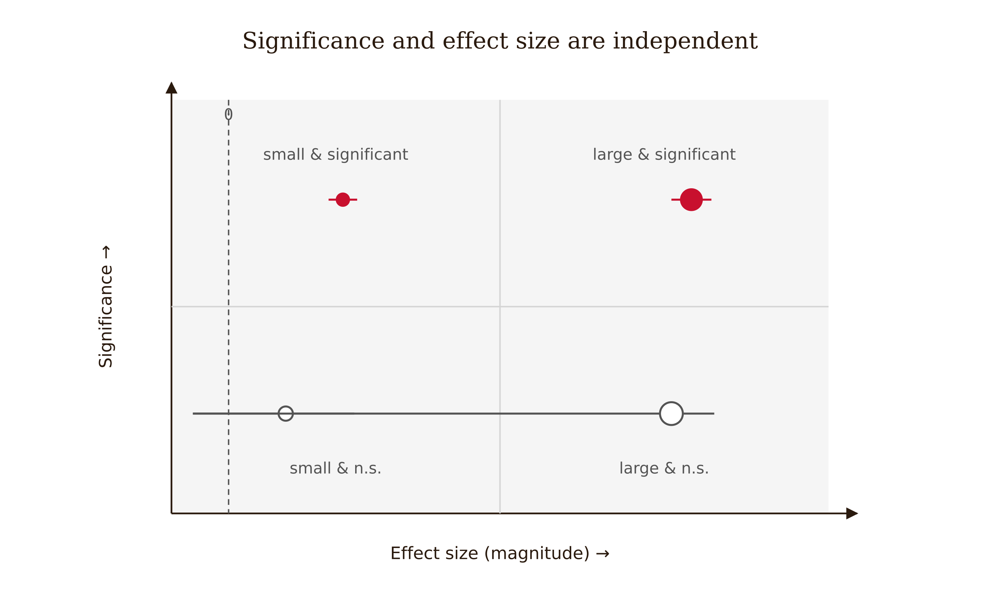
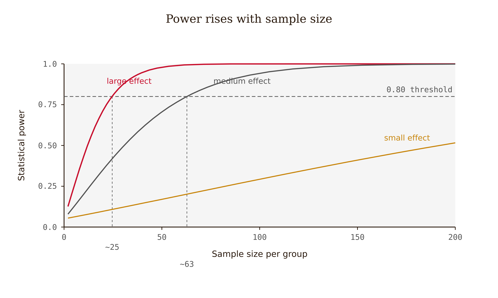
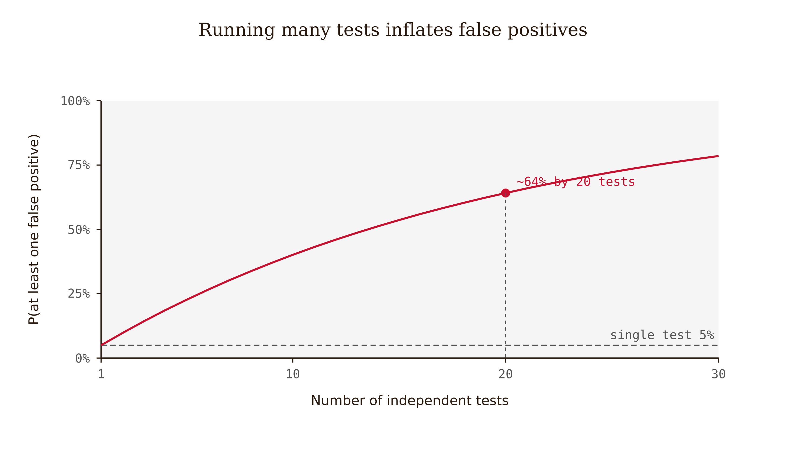

# Chapter 7 — Statistics
*A p-value tells you how surprising your data is under an assumption — not how right your hypothesis is.*

A Results section says: "The experimental group performed significantly better (p < .05)."

That sentence is doing almost no work. Better by how much? On what measure? With what test? How many degrees of freedom? How many other comparisons were run before this one crossed the threshold? Was the difference large enough to matter in practice, or was the study simply big enough to detect something negligible?

The number is there. But the number alone, without its context, without its accompanying uncertainty, without its relationship to the question the study was designed to answer — the number is not a result. It is the name of a result. The result itself requires more.

This chapter is about what a statistical result actually contains, what it doesn't contain, and how to report it in a way that gives a reader enough to make their own judgment.

---

Let me start with the one thing that trips up more writers than anything else in this chapter, because getting it right changes how you read every results section you will ever encounter.

A p-value is not the probability that the null hypothesis is true. It is almost exactly the opposite.

What a p-value tells you is this: *assuming* the null hypothesis were true — assuming there is no real effect, no real difference, nothing going on — how likely would it be to observe data at least as extreme as what you actually got? A p-value of 0.04 means that if the null were true, data this surprising would occur by chance about 4% of the time. That's evidence against the null — it's saying the data are inconsistent with a world where nothing is happening — but it is not a 96% probability that your hypothesis is correct. The probability that your hypothesis is correct is a different quantity, one that depends not just on the data but on how plausible your hypothesis was to begin with.

The American Statistical Association issued a formal statement in 2016 specifically because this confusion is so widespread and so consequential. The statement is worth reading in full, but the core message is this: a p-value below some threshold is not, by itself, proof of an effect, evidence of its importance, or a guarantee that the result will replicate. It is a measure of surprise under a model.



<!-- → [INFOGRAPHIC: What a p-value actually says — visual showing the null distribution, the observed test statistic, and the shaded tail representing the p-value — labeled clearly: "probability of data this extreme if null is true" vs. the common misconception "probability that null is true"] -->

---

If the p-value doesn't tell you how large the effect is, or whether it matters, what does?

The effect size does. And effect size is a separate number that answers a different question: not "is this effect detectable?" but "how large is this effect?"

The distinction is not academic. A study with a thousand participants can detect a difference so small it is invisible in practice and report it with p < 0.001 — highly statistically significant, essentially meaningless in the real world. A study with twenty participants may find a large, practically important effect and report it as p = 0.09 — not statistically significant at conventional thresholds, but pointing toward something real that a larger study might confirm.

Statistical significance is about signal-to-noise ratio and sample size. Effect size is about the actual magnitude of the relationship. Both matter. Neither is a substitute for the other.



The most common effect size measures depend on what you're comparing. For the difference between two group means, Cohen's d expresses the difference in units of standard deviation: a d of 0.5 means the groups differ by half a standard deviation. For correlations, r itself is the effect size. For proportions, odds ratios or risk ratios. For more complex models, partial eta-squared or omega-squared. Cohen proposed benchmarks — small (d ≈ 0.2), medium (d ≈ 0.5), and large (d ≈ 0.8) — that are widely used as rough orientation, but he intended them as conventions for a researcher who has no better reference, not as universal standards. The more informative comparison is: what effect sizes have prior studies in this field, with this population, on this outcome, typically found?

---

Here is the mechanism that explains why these two numbers diverge, and it is worth slowing down for, because it is the part most courses skip. The reason effect size matters is not a matter of taste or good reporting hygiene — it is built into the arithmetic. The test statistic behind a p-value, the *t* in a t-test, is a ratio. On top is the difference you care about: the gap between the means you're comparing — two groups, or the same group before and after. On the bottom is the *standard error*, written SE.

```
t = (mean difference) / SE
```

And the standard error is not the same thing as the standard deviation, even though the two are constantly confused and even though they are built from the same parts. The distinction is the whole game, so it is worth stating slowly.

The **standard deviation** (SD) measures how spread out the individual scores are. Give a stress questionnaire to a thousand people and the SD tells you how much people differ from one another. It is a fact about the world — about the variability of the thing you measured — and it does not shrink just because you collected more data.

The **standard error** (SE) measures something narrower: how precisely you have pinned down the *mean*. It is the standard deviation divided by the square root of the sample size:

```
SE = SD / √n
```

That little √n in the denominator is where the trouble starts. As n grows, √n grows, and SE shrinks. The spread of the people (SD) stays exactly where it was; your precision about the average (SE) keeps tightening. Collect enough data and you can locate the true mean to an arbitrarily fine point — and a vanishing SE sits in the denominator of the t-statistic, where shrinking it inflates t without limit.

So watch what large samples do. A trivially small difference — one no one would care about — produces a large t, and therefore a tiny p-value, provided n is big enough. Picture a wellness app measured before and after on ten thousand employees, where average stress scores fall by four-tenths of a point on a hundred-point scale (the scores themselves vary with a standard deviation of about ten points). The change is nothing; you could not feel it. But the standard error of that mean change is the SD over √n — ten divided by a hundred, or 0.1 — so the t-statistic is 0.4 / 0.1 = 4.0, and the result comes back at p ≈ .0001, wildly "significant." With a large enough sample, almost any nonzero difference clears the threshold. The p-value stops telling you whether something is happening and starts mostly telling you how big your sample was.

This is exactly where effect size refuses to be fooled. Cohen's d puts the same mean difference over the *standard deviation*, not the standard error:

```
d = (mean difference) / SD_pooled
```

There is no √n anywhere in that formula. Sample size cannot inflate it. Run the wellness study on thirty people or thirty thousand and you get roughly the same d — in this example about 0.04, which is to say nothing — even as t and p swing wildly between the two. Effect size measures the phenomenon itself. The p-value measures the phenomenon tangled up with how hard you looked. That is the whole reason effect size is the number to trust when the two disagree, and the whole reason a result can be at once "highly significant" and completely unimportant. (The same SD-versus-SE confusion reappears visually in Chapter 8, where an error bar showing one standard error looks reassuringly tight even when the individual scores are wide; report the effect size and a confidence interval so the reader cannot be misled by a denominator.)

It helps to know where the p-value came from, because its origins explain why it strains under modern data. Ronald Fisher worked out the machinery in the 1920s for agricultural experiments — plots of land, a few dozen observations, where every data point was expensive and hard-won. In that world the standard error was naturally large, clearing t ≈ 2 (about p = .05, roughly two standard errors from zero) was a genuine filter, and only substantial effects made it through. And Fisher was not alone in that constraint. The t-distribution itself was derived by William Gosset — publishing as "Student" in 1908 because his employer, the Guinness brewery, treated its statistical methods as a trade secret — precisely to handle the tiny samples a brewery could afford to test. The degrees-of-freedom corrections exist to stabilize small-sample estimates. Even Cohen's small-medium-large benchmarks were calibrated in the 1960s against the effect sizes typical of mid-century social science. Every piece of the standard toolkit was engineered for a world where thirty observations was a real expense — and then institutionalized into journals, textbooks, graduate training, and software defaults before anyone asked whether it still fit. It was never built for a clickstream log with fifty million rows, an electronic health record system with millions of patients, or a social dataset with billions of entries. In that regime p < .05 is not a filter; it is a formality, nearly automatic for any effect that is not exactly zero.

There is a second layer to this machinery worth understanding, because it shows how thoroughly the classical toolkit was engineered for scarcity. The test statistic is never read on its own — it is compared against a reference distribution whose shape is fixed by the **degrees of freedom**, roughly the sample size minus the number of quantities you had to estimate from the data along the way (df = n − constraints). Every time you estimate something — a mean, a variance — you spend a degree of freedom; what remains is the independent information actually doing the work in the test. When df is small, the reference distribution (Student's t) has fat tails, and you need a larger t to clear significance — a built-in penalty for not having much data. As df grows, those tails thin and the t-distribution slides toward the normal (Z) distribution. The transition is self-calibrating: you never decide by hand when to stop using t and start using Z, because the t-distribution makes the handoff for you. At df = 60 the critical value is about 2.00 against Z's 1.96 — roughly two percent apart; by a few hundred observations the gap is under half a percent; at df = ∞ they are equal by definition.

The thing the t-distribution exists to handle is whether you *know* the population's standard deviation or are *estimating* it. A Z-test assumes you know the population σ — which almost never happens, because if you knew the population that completely you could simply count rather than do statistics at all. A t-test estimates the spread from your own sample, which is the real situation in nearly every study. At small n that estimate is shaky, so the t-distribution widens to compensate. At large n the sample estimate becomes an extraordinarily reliable stand-in for the true value, the compensation shrinks to nothing, and t and Z converge — not because the assumption changed, but because the estimation error approached zero.

Stand back and you can watch the whole edifice quietly retire as data grows. The degrees-of-freedom correction stops doing real work by around n = 60. The t-versus-Z distinction stops mattering by around n = 120. The p-value's role as a filter stops mattering somewhere near n = 10,000, where it goes nearly automatic. And the standard error keeps shrinking until it is less an asset than a liability — a magnifying glass held to noise. What survives the move to scale is a short list: the effect size, which stays honest at any n; the confidence interval, which still reports magnitude; and the human judgment of whether that magnitude is worth acting on, which was never a statistical question in the first place.

And exactly zero is the catch. The null hypothesis asserts that the true difference is precisely nothing — not small, not negligible, but zero. With enough data you can resolve differences so fine that the assumption of an exact zero is essentially never true: you begin detecting the faint asymmetries of your own apparatus, the residue of slightly different conditions, gaps that are real but meaningless. The uncomfortable consequence is that the p-value is only well-behaved in a moderate middle range of sample sizes. Too small, and it is insensitive — it misses effects that are really there. Too large, and it is hypersensitive — it flags noise as signal. For the most widely used statistic in science, that is a striking admission. The tools did not scale with the data; the publication standards built around p < .05 did not either; and the fields now drowning in big data — medicine, public health, technology — are precisely the ones where the p-value misleads most. This is no small part of why so much published research has failed to replicate over the past fifteen years, and it is why the ASA's 2016 warning landed where it did. Report the effect size. It is the honest number.

One caveat keeps that rule from being oversold: effect size does not escape the normality assumption. Both the p-value and Cohen's d rest on the same picture of a roughly bell-shaped distribution, and badly skewed or heavy-tailed data can mislead either one. The difference is not that effect size assumes less — it is that effect size reports its answer in units a person can weigh against the world. "Is a four-tenths-of-a-point shift on a stress scale worth a corporate wellness program?" is a question a manager can actually answer. "Is p = .0001 enough?" is not: answering it honestly requires knowing whether n was large enough to make p trivially small, whether an exact-zero null was ever plausible, and what the base rate of true effects is in the field — a chain of reasoning most readers never perform. They see p < .05 and stop thinking. A clinician, a policymaker, or an analyst can look at d = 0.04 and d = 0.8 and rank them correctly without ever picturing a sampling distribution. That interpretability is the practical reason the reporting standard that follows insists on the effect size, not just the p-value.

A complete result includes the test statistic, the degrees of freedom where relevant, the exact p-value (not "p < .05" but the actual value like p = .023), the effect size, and a confidence interval. The confidence interval is particularly important because it shows the range of effect sizes consistent with the data — it is the uncertainty estimate that a single p-value hides.

There is even an order in which to read those components, and it is not the order significance-first habits suggest. The effect size and its confidence interval answer the question that usually matters first: does this difference matter, and how sure are we of its size? The test statistic and the p-value answer only the narrower one: could this be noise? Lead with the magnitude and its interval; let the p-value ride along for transparency rather than stand in as the verdict.

The revised result sentence from the chapter's opening case looks like this: "The intervention group scored higher than the control group on the delayed post-test, *t*(62) = 2.47, *p* = .016, *d* = 0.63, 95% CI [0.11, 1.14]." That sentence tells you the test used, the degrees of freedom (which tells you the effective sample size), the exact p-value, the effect size, and the uncertainty around the effect size. A reader can evaluate the result. A reader can compare it to other studies. A reader can judge whether the confidence interval is wide enough to be genuinely uncertain or narrow enough to be reasonably precise.

<!-- → [TABLE: Complete statistical reporting template — rows: t-test, ANOVA, correlation, regression, chi-square — columns: test statistic, degrees of freedom, p-value format, effect size measure, uncertainty measure, what the assumptions are] -->

---

Choosing the right test is a matter of matching the test's assumptions to your data and design. Getting this wrong is common, and the consequences range from mildly conservative estimates to seriously misleading ones.

The basic logic: different tests are built for different data structures. A t-test compares two group means and assumes the outcome is approximately normally distributed within each group and that the observations are independent. An ANOVA extends that logic to more than two groups. A chi-square test examines whether two categorical variables are independent. A correlation measures the linear relationship between two continuous variables. A regression predicts one variable from one or more others.

The word "assumes" matters. Every test has assumptions, and when those assumptions are substantially violated, the test's output — the p-value, the confidence interval — can be misleading. Independence is the assumption that is most often violated in educational research without anyone noticing: students in the same classroom are not independent observations, because they share a teacher, a curriculum, a room, a social dynamic. If you analyze students as if they were independent when they were nested in classrooms, your standard errors will be too small, your p-values will be too small, and you will find more "significant" results than you should.

The appropriate remedy for nested data is multilevel modeling — but the prerequisite is noticing that the data are nested. The question to ask before selecting any test is: are my observations actually independent, or do some of them share context in ways that make them more similar to each other than to the rest of the sample?

A related assumption is that the variance is approximately equal across groups — the homogeneity of variance assumption for t-tests and ANOVA. When groups have very different variances, Welch's correction (a modified t-test that doesn't assume equal variances) is more appropriate than the standard version, and most software offers it as an option that researchers frequently leave unchecked.

None of this requires becoming a statistician before you can write a paper. It requires knowing enough to check the assumptions that are most likely to be violated in your design, and to report what you found when you checked.

---

Now the problem that is most responsible for the replication crisis in many fields: underpowered studies and multiple comparisons.

Statistical power is the probability of detecting a real effect if one exists. It depends on three things: the size of the true effect, the sample size, and the alpha threshold you're using. A study with low power is like trying to hear a quiet conversation from the other end of a noisy room — you might catch it, but you might not, and the times you do catch something, you're not sure whether it was the conversation or the noise.

The particular danger of low power is not just that you miss real effects. It's what happens when underpowered studies do find significant results. An effect that barely reaches significance in an underpowered study is likely to be an overestimate of the true effect — the observed effect had to be unusually large just to cross the threshold given the noise level. This is called the winner's curse: the studies that "win" the significance lottery in low-power conditions show effects that are inflated relative to what the true effect actually is. This is one of the main reasons published effects in psychology and education often fail to replicate: the original study was underpowered, got lucky with an inflated estimate, and the replication, often better powered, finds a smaller or null effect.

Power analysis should happen before data collection, not after. The question is: given what I expect the true effect to be (based on prior literature), how many participants do I need to have an 80% (or 90%) chance of detecting it if it's real? The answer is usually larger than researchers expect, which is uncomfortable but important. A study that is underpowered by design is a study that will either miss real effects or report inflated ones.



<!-- → [CHART: Power curves — x-axis: sample size per group, y-axis: statistical power — three curves for small (d=0.2), medium (d=0.5), and large (d=0.8) effect sizes — horizontal line at 0.80 showing the conventional threshold — point where each curve crosses it showing required N] -->

---

Multiple comparisons are the other side of the same problem.

The alpha level — conventionally 0.05 — is the rate of false positives you're willing to accept when the null is true. If you run one test at alpha = 0.05, you have a 5% chance of a false positive. If you run twenty tests, each at alpha = 0.05, the probability that at least one will cross the threshold by chance alone is much higher — roughly 64% if the tests are independent. If you then report the one that crossed the threshold as your finding, you have done what researchers call p-hacking, even if you didn't intend to.



The honest accounting: when you run multiple tests, you need to either correct for the multiple comparisons, or report all tests, or distinguish pre-specified primary outcomes from exploratory analyses. The Benjamini-Hochberg procedure controls the false discovery rate — the expected proportion of significant results that are actually false — and is less conservative than Bonferroni correction while still providing meaningful protection.

The deeper fix, though, is not statistical. It is the pre-specification from Chapter 6: decide which test is the primary test, what the primary outcome is, and what the correction strategy will be, before looking at the data. Then report everything — including the tests that didn't reach significance. Selective reporting of the significant outcomes from a battery of tests is a form of data presentation that misleads readers about the actual false positive rate of the study.

---

There is one more thing that statistics cannot do, and it is worth naming explicitly because researchers sometimes speak as if a sophisticated enough analysis can overcome other problems in the study.

Statistics cannot repair a bad design. If the study has confounders that weren't controlled for, the regression model will give you a precise estimate of an effect that includes the confounder's contribution, and the precision will look like accuracy. If the outcome measure doesn't capture the construct (Chapter 5), the analysis will precisely quantify the wrong thing. If the data are missing in a pattern that biases the sample (Chapter 6), the standard errors will be correct for the remaining data and misleading for the claim the paper is making.

This is not a failure of statistics. Statistics is doing exactly what it should do: summarizing the data correctly and quantifying uncertainty appropriately. The problem is upstream — in the design, the measurement, the data quality. No amount of analytical sophistication closes a design gap. The better the analysis, the more clearly it illuminates the problem in the data. Precision in service of a biased estimate is not a virtue.

The statistics section of a paper is the last step in a chain. If the earlier steps were sound — the hypothesis was specific, the design supported the claim, the measures captured the constructs, the data were clean — the statistics are there to express the result with appropriate uncertainty. If the earlier steps were not sound, the statistics will report that faithfully too, to anyone who knows how to read them.

---

## Exercises

### Warm-up

**1.** Find a Results section in a published paper that reports only p < .05 for a primary finding. Identify what information is missing: the test statistic, degrees of freedom, exact p-value, effect size, confidence interval. Rewrite the sentence with all the components that should be there, using the paper's Methods section to infer what you can. Note what you cannot infer.

**2.** Without looking at any software output, write your best answer to: what does a p-value of 0.03 actually mean? What does it not mean? Then check your answer against the ASA's 2016 statement. Note specifically any interpretation you held before reading this chapter that the statement would correct.

### Application

**3.** For each of the following designs, identify the most appropriate test and name its two most important assumptions: (a) comparing mean post-test scores between two randomly assigned conditions with a continuous outcome; (b) examining whether feedback type and prior programming experience jointly predict retention scores; (c) testing whether the proportion of students who passed a threshold differs between conditions; (d) comparing mean scores across three conditions where students are nested in classrooms.

**4.** A study runs eight outcome measures across two conditions and reports three of them as significant at p < .05. Write the paragraph that should appear in the Results section explaining how the multiple comparisons should be interpreted, which outcomes were pre-specified as primary, and what correction was applied or why one was not.

### Synthesis

**5.** You plan to run the Socratic vs. direct-answer feedback study with a two-week delayed retention test as the primary outcome. Before collecting data, conduct a power analysis: (a) identify what effect size you would expect based on prior related work (use d = 0.5 as a placeholder if prior work isn't available), (b) calculate the sample size needed for 80% power at alpha = 0.05 for a two-group independent-samples t-test, (c) explain what would happen to your estimates if the true effect is d = 0.2 instead of d = 0.5 and your sample was sized for d = 0.5. State your assumptions explicitly.

**6.** Explain why a statistically significant result in an underpowered study is likely to overestimate the true effect size. Use the concept of the "winner's curse" from this chapter. Describe what happens to the estimated effect size in a well-powered replication of the same study, and why this pattern produces the appearance that published effects fail to replicate even when real effects exist.

### Challenge

**7.** You collect data and find that your primary outcome (two-week retention) shows a non-significant difference between conditions (p = .12, d = 0.28, 95% CI [−0.09, 0.65]), but a secondary outcome (immediate post-test) shows a significant difference (p = .03, d = 0.52). Write the Results and Discussion for this pattern, reporting both outcomes fully, characterizing what the non-significant primary result means and does not mean, explaining what the significant secondary result contributes given that it was not the pre-specified primary test, and stating what the study would need for you to draw stronger conclusions. Avoid both overclaiming the secondary result and dismissing it as worthless.

---

## LLM Exercises

### Exercise 1 — When to Use AI

**The judgment:** In this chapter's work, AI assistance is appropriate for the following tasks:

- Map design and variables to candidate tests — *Why AI works here:* This is a bounded support task: AI can generate options, detect patterns, or reformat material while you retain the chapter's judgment criteria.
- Generate assumption-checking code for review — *Why AI works here:* This is a bounded support task: AI can generate options, detect patterns, or reformat material while you retain the chapter's judgment criteria.
- Draft complete statistical reporting templates — *Why AI works here:* This is a bounded support task: AI can generate options, detect patterns, or reformat material while you retain the chapter's judgment criteria.

**The tell:** You know you are using AI appropriately when you can evaluate the output — when you have independent criteria to judge whether it is correct, complete, and fit for purpose.

---

### Exercise 2 — When NOT to Use AI

**The judgment:** In this chapter's work, the following tasks require human judgment. Delegating them to AI is not appropriate — not because AI cannot produce output, but because AI output in these cases cannot be trusted without verification that requires the same expertise as doing the task yourself.

- Letting AI choose the final model for complex designs — *Why AI fails here:* This requires human calibration, domain context, or accountability that the model cannot supply as ground truth.
- Accepting software defaults without inspection — *Why AI fails here:* This requires human calibration, domain context, or accountability that the model cannot supply as ground truth.
- Interpreting significance as proof or importance — *Why AI fails here:* This requires human calibration, domain context, or accountability that the model cannot supply as ground truth.

**The tell:** You know you have crossed the line when you are using AI output as your reason for a conclusion rather than as a tool for reaching one. If you could not explain the conclusion without the AI, the AI did the work that should have been yours.

**Series connection:** This exercise trains Tier 4 Metacognitive: the capacity to supervise machine output at the point where the project depends on p-value, effect size, confidence interval, power, assumptions, multiple comparisons.

---

### Exercise 3 — LLM Exercise

**What you're building this chapter:** a statistics plan with assumptions and reporting requirements.
**Tool:** Claude chat. It is the best fit here because the task is conceptual drafting and critique, not direct file manipulation.

**The Prompt:**

```
I am building a Research Paper Submission Dossier for a research paper I may write. The dossier is a working folder of decisions, audits, and evidence checks that should make the final paper harder to overclaim.

Current chapter: Statistics. Core vocabulary for this chapter: p-value, effect size, confidence interval, power, assumptions, multiple comparisons.

My working research topic is: AI tutoring and student learning in undergraduate programming courses. My current tentative claim is: Socratic AI feedback may improve delayed unassisted retention more than direct-answer AI feedback because it preserves retrieval effort.

Create a statistics plan with assumptions and reporting requirements. Use the chapter concepts explicitly. Do not decide the final research claim for me. Do not invent citations, data, or results. Where a decision requires domain judgment, write "AUTHOR DECISION REQUIRED" and explain what judgment is needed. End with three questions I should answer before moving to the next chapter.
```

**What this produces:** A draft artifact for the running dossier, suitable to save as project-dossier/07-statistics-plan.md.

**How to adapt this prompt:**
- *For your own project:* Replace the research topic and tentative claim with your own domain, data source, and intended contribution.
- *For ChatGPT / Gemini:* Keep the same constraints, and add "show your reasoning as bullet points, not hidden chain-of-thought."
- *For a Claude Project:* Put the project description and standing rule "do not decide my research claim for me" in the project instructions; paste the chapter-specific task as the message.

**Connection to previous chapters:** This adds the next decision layer to the same dossier rather than starting a new artifact.
**Preview of next chapter:** Next you will decide how the evidence should be shown visually.

---

### Exercise 4 — CLI Exercise

**What you're building this chapter:** The file `project-dossier/07-statistics-plan.md`.
**Tool:** Codex CLI or Cowork. Use a file-aware agent because the task reads prior dossier files and writes a new markdown artifact.
**Skill level:** Beginner. Comfort with a project folder helps, but no programming is required.

**Setup:**

Before running this exercise, confirm:
- [ ] A folder named `project-dossier/` exists in your workspace.
- [ ] Any earlier chapter dossier files are saved in that folder.
- [ ] Your `AGENTS.md` or `CLAUDE.md` says: "For this project, AI may draft and audit artifacts, but the human author owns the research question, evidence standard, interpretation, and disclosure."

**The Task:**

```
Read the existing files in project-dossier/. Then create or update project-dossier/07-statistics-plan.md.

This file should apply Chapter 7, "Statistics," to the running Research Paper Submission Dossier. Use these chapter concepts: p-value, effect size, confidence interval, power, assumptions, multiple comparisons.

Write the file with these sections:
1. Purpose of this dossier artifact
2. Inputs read from earlier dossier files
3. Chapter 7 analysis
4. Decisions the human author must make
5. Checks to run before moving on

Do not invent sources, data, results, or final conclusions. If information is missing, write "MISSING — author must supply" rather than filling the gap. After writing the file, report what changed and list any unresolved author decisions. Stop after writing this one file.
```

**Expected output:** `project-dossier/07-statistics-plan.md` exists and connects this chapter's concept to the cumulative dossier.

**What to inspect in the output:** Check whether the file uses p-value, effect size, confidence interval, power, assumptions, multiple comparisons correctly, preserves human decision points, and avoids unsupported conclusions.

**If it goes wrong:** If the agent invents facts or overwrites prior work, stop and inspect the diff. Restore the previous file version if needed, then rerun with the added instruction: "Use only facts already present in the dossier or explicitly mark them missing."

**CLAUDE.md / AGENTS.md note:** Add or keep this standing rule: "Never convert AI-generated suggestions into research conclusions without a human-authored rationale and source check."

---

### Exercise 5 — AI Validation Exercise

**What you're validating:** The AI-generated artifact from Exercise 3 or 4.
**Validation type:** Reasoning chain / Agentic output.
**Risk level:** Medium. The output is useful if it structures your thinking, but dangerous if it silently makes the judgment the chapter says must remain human.

**Setup:**

Use the output from Exercise 3 or the file produced in Exercise 4 as the artifact to validate.

**The Validation Task:**

Evaluate the AI output above using the following checklist. For each item, record: Pass / Fail / Cannot determine — and explain your reasoning.

```
Validation Checklist — Statistics

□ Correctness: Does the output accurately reflect the chapter's core concept?
  Does it use p-value, effect size, confidence interval, power, assumptions, multiple comparisons in a way this chapter would endorse?

□ Completeness: Is anything important missing?
  Would a domain expert need an additional source, measure, comparison, or limitation before trusting this artifact?

□ Scope: Did the AI stay within the task boundaries?
  Did it add claims, sources, data, results, or conclusions that were not provided?

□ Chapter-specific criterion 1: Does the output avoid p-value misinterpretation?

□ Chapter-specific criterion 2: Does it include effect size, uncertainty, assumptions, and multiplicity?

□ Failure mode check: Does this output exhibit any of the following?
  - Fluent but wrong
  - Schema-valid but semantically wrong
  - Missing ground truth
  - Automation bias trigger: a confident recommendation without evidence you can independently inspect
```

**What to do with your findings:**

- If the output passes all checks: proceed to use it in your project. Note what made it trustworthy.
- If the output fails one check: revise the prompt and re-run Exercise 3 or 4. Document what changed.
- If the output fails multiple checks or you cannot determine pass/fail: this is a "When NOT to Use AI" moment. Do this part of the task yourself.

**AI Use Disclosure prompt:**

After completing this validation, write a two-sentence AI Use Disclosure:

> *Sentence 1:* What AI produced in this exercise and how you used it.
> *Sentence 2:* One specific thing the AI could not determine that required your judgment.

**Series connection:** This exercise trains Tier 4 Metacognitive: the capacity to catch when machine output is fluent, useful, and still not sufficient for the human conclusion.
