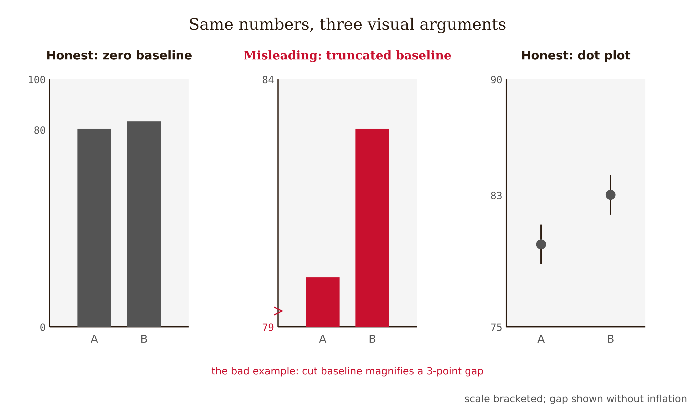
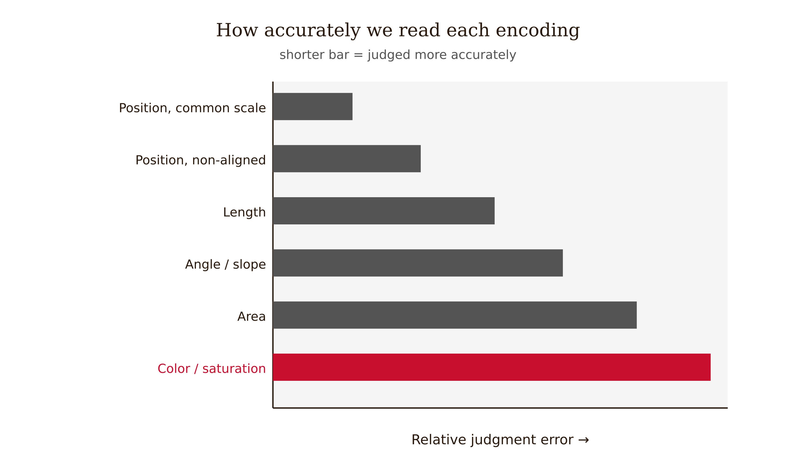
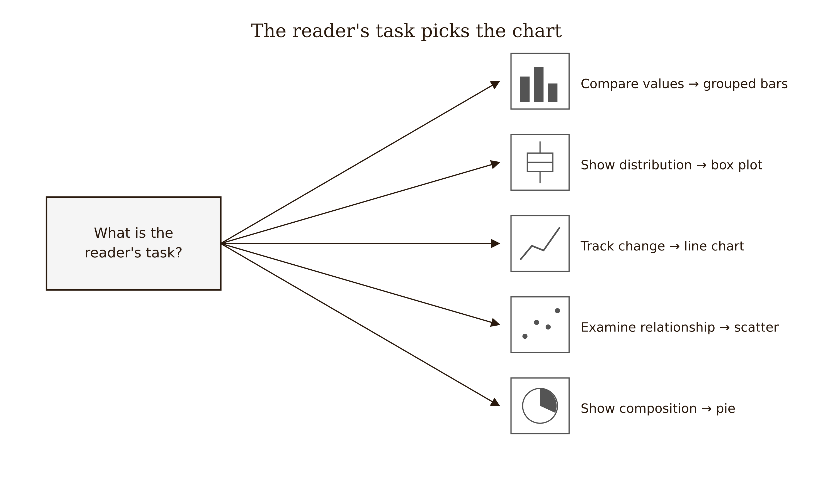
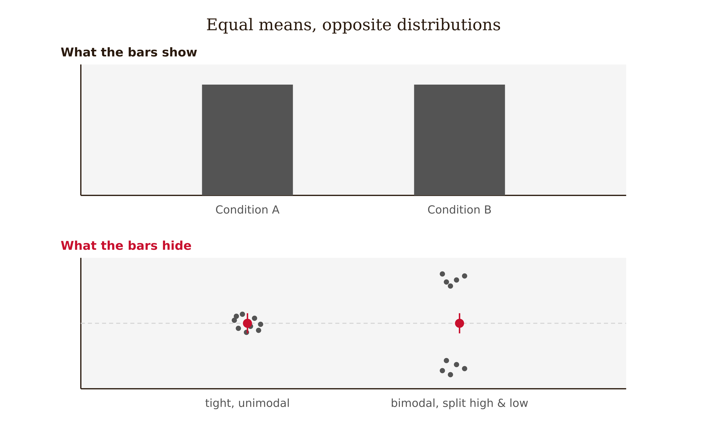
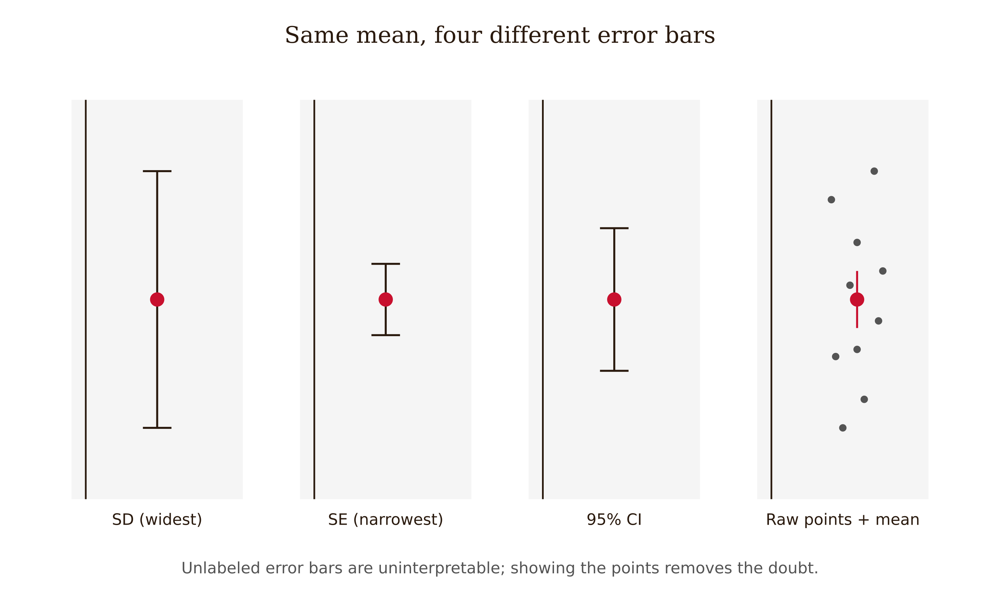

# Chapter 8 — How to Design a Graph
*A graph is not a picture of data — it is an argument encoded in position, length, color, and area.*

Two bar charts. Same numbers. Same data. Same study.

The first chart starts its y-axis at zero. The bars for the two conditions rise to 87 and 91. The difference is visible but modest — a small gap at the top of two tall bars.

The second chart starts its y-axis at 83. Now the bar for condition A barely clears the baseline and the bar for condition B towers over it. The gap looks enormous. A reader who glances at this chart and doesn't inspect the axis will come away believing the two conditions are dramatically different. A reader who only sees the first chart will think the difference is small.

No number has been changed. No data has been altered. The visual claim has changed entirely.

This is the thing worth understanding about graphs before anything else: a graph is not a neutral container for data. It is a representation — a set of design choices about how to encode values into visual properties. Those choices carry arguments. They can make a real difference look negligible or a trivial difference look decisive. Getting them right is not an aesthetic concern. It is an epistemic one.



---

William Cleveland and Robert McGill ran a series of experiments in the 1980s to answer a question that sounds simple but had never been properly tested: when people read a graph, how accurately do they judge the quantities it represents? The answer depends, and it depends specifically on which visual property the data is encoded in.

Their finding, replicated and extended by later researchers, is that visual encoding channels are not equal. People judge **position along a common scale** most accurately — which is what a well-designed bar chart or dot plot provides. They judge **length** (bars anchored at a common baseline) slightly less accurately. **Angle** is worse — which is why pie charts are poor at communicating precise differences. **Area** is worse still, which is why bubble charts require careful handling. **Color hue** and **shading** are the weakest channels for quantitative judgment — they are useful for distinguishing categories but unreliable for communicating magnitude.

This ordering has a practical consequence for chart design: use the most accurate encoding channel available for the comparison the reader needs to make. If you're asking the reader to compare quantities, position or length is almost always better than area or color. If you're encoding one variable as area (bubble size, for instance), the reader's judgment of relative values will be imprecise, and you need to decide whether that imprecision matters for your claim.



<!-- → [CHART: Cleveland-McGill accuracy ranking — horizontal bar chart of encoding channels ordered by judgment accuracy: position on common scale, position on non-aligned scales, length, direction/angle, area, color/saturation — each bar showing approximate error rate from their experiments] -->

---

Before choosing a chart type, there is a prior question: what is the reader supposed to do with this figure?

This sounds obvious, but it is the step that gets skipped when researchers reach for the default chart type — which in many fields is a bar chart of means, regardless of the question. The reader task determines the appropriate form.



If the task is **compare discrete values** — how does the mean score in condition A differ from condition B? — then bars or dot plots work well. Bars use length to encode the quantity; dot plots use position. Both are accurate. Dot plots are often cleaner for comparisons across several groups.

If the task is **understand a distribution** — what is the spread of individual scores? Are there outliers? Is the distribution skewed? — then bars of means are actively misleading. A bar showing a mean of 72 tells you nothing about whether everyone scored near 72, or whether half the students scored 50 and half scored 94. For distribution questions, you need histograms, box plots, violin plots, or — for modest sample sizes — raw data points with jittering. Weissgerber and colleagues demonstrated that bar graphs in biomedical research routinely hide distributional structure in ways that change the scientific interpretation; the same is true in educational research.



If the task is **track change over time** — how did scores evolve across weeks? — then lines are almost always right. Lines imply continuity and progression between measured points, which is exactly what a longitudinal trend shows.

If the task is **examine a relationship** — does more time on task predict higher scores? — then a scatterplot is the appropriate form. A scatterplot shows the joint distribution of two continuous variables and makes the shape and strength of their relationship visible in a way that a correlation coefficient alone cannot.

If the task is **understand composition** — what fraction of students fell into each feedback category? — then a pie chart is defensible, but only if there are few categories (ideally three or fewer) and the part-to-whole relationship is genuinely the question. Stacked bars or a simple frequency table are usually more readable alternatives.

<!-- → [TABLE: Reader task → chart type guide — rows: compare values, show distribution, show change over time, show relationship, show composition — columns: appropriate chart forms, inappropriate defaults, what the inappropriate form hides] -->

---

The zero-baseline rule for bar charts is not a style preference. It is a consequence of how bars encode information.

A bar chart uses length to represent quantity. The length of a bar is the distance from the baseline to the top of the bar. If the baseline is at zero, the length is proportional to the absolute value. If the baseline is at 83, the length of a bar reaching 91 is 8 units on the chart — but the bar is representing a value that is 91, not 8. The visual impression and the encoded quantity have decoupled.

This matters because human perception reads bar length, not bar-top position. When you look at a bar chart, you don't mentally subtract the baseline value from the bar height and compare residuals. You compare bar lengths. A chart with a truncated y-axis is exploiting that perceptual habit to make differences look larger than the underlying values justify.

The correction is simple: bar charts start at zero. If starting at zero makes small differences between large values hard to see — if two conditions both score in the high 80s and you want the reader to notice the three-point gap — then don't use a bar chart. Use a dot plot with a y-axis scaled to the relevant range, and label the axis honestly so the reader knows what they're looking at. The range restriction is visible and disclosed. It is not hidden inside the visual structure of the bars.

The same logic applies to area encodings. A bubble chart where one bubble is twice the area of another should represent a quantity twice as large, not a quantity that is sqrt(2) times as large because the radius was doubled. Area scales with the square of linear dimensions. This is a systematic error in many auto-generated charts where bubble radius is set proportional to value. The rule: area should be proportional to value, which means radius proportional to the square root of value.

<!-- → [IMAGE: Side-by-side comparison — same two-condition data, once as bar chart starting at zero (modest gap visible), once as bar chart starting at 83 (dramatic gap), once as dot plot with honest axis (gap visible, magnitude clear) — captions showing exactly what changes and what doesn't] -->

---

Error bars are a case where the visual form looks precise but the meaning is completely underspecified unless labeled.

A bar chart with error bars could be showing any of three different things: the standard deviation of the individual scores, the standard error of the mean, or a confidence interval. These represent fundamentally different quantities.

The **standard deviation** shows how spread out the individual observations are. Error bars representing one standard deviation above and below the mean capture approximately 68% of observations if the distribution is normal.

The **standard error of the mean** shows how uncertain the estimate of the mean is. It equals the standard deviation divided by the square root of the sample size (SE = SD / √n). For large samples, the standard error is small even when individual scores are widely dispersed. An error bar showing one standard error looks tight and precise even when the distribution of individual scores is wide. This is the same √n in the denominator that lets a large sample manufacture a tiny p-value out of a trivial effect — the mechanism Chapter 7 works through. A standard-error bar is the visual form of that trap: it narrows with sample size, so it can make a negligible difference look decisive.

A **confidence interval** shows the range of values consistent with the data at a specified confidence level — typically 95%. It is wider than one standard error (approximately 1.96 standard errors for 95%) and is the most interpretable form for research communication, because it directly answers: what effect sizes are consistent with what we observed?

When error bars aren't labeled, readers cannot distinguish between these three quantities. A figure showing narrow standard-error bars around two group means, presented without labeling, can look like strong evidence of difference when the individual score distributions substantially overlap. The caption needs to say, at minimum: "Error bars represent 95% confidence intervals" (or standard deviations, or standard errors).

The more informative solution: for modest sample sizes, show the individual data points. This makes the distribution visible and allows the reader to see both the central tendency and the spread simultaneously. The mean and its confidence interval can be overlaid as a point and line. Nothing is hidden.



<!-- → [IMAGE: Same data shown four ways — bar with SD error bars, bar with SE error bars, bar with 95% CI error bars, dot plot with individual points and mean — captions noting what each shows and hides] -->

---

Color deserves its own discussion because it is simultaneously overused and misunderstood.

Color hue — the actual color, as distinguished from its intensity — is excellent for distinguishing categories that have no natural order: condition A versus condition B, treatment versus control, three different schools. It is not reliable for encoding ordered quantities. People's ability to judge which color is "more" than another is weak and idiosyncratic. A heatmap where intensity encodes a continuous quantity is using lightness rather than hue, which is the right choice — lightness perception is more ordered than hue perception.

The second reason to be careful with color is accessibility. Approximately 8% of men and 0.5% of women have some form of color vision deficiency. Red-green combinations — the most common pairing in research figures — are the most common form of deficiency. A figure that depends on red-green distinction to communicate its finding is unreadable by a meaningful fraction of readers. Colorblind-safe palettes (viridis, cividis, ColorBrewer palettes for categorical data) are easy to implement in any plotting library and should be the default choice.

The third reason: color in printed papers may render as gray, losing the distinction entirely. Any figure where the argument depends on color should also be legible in grayscale.

---

A caption is part of the figure. It is not an afterthought.

The caption should do two things that the visual cannot do alone: name what the figure shows, and name what the reader should notice. "Figure 2. Test scores by condition." is not a caption — it is a label. "Figure 2. Mean delayed retention scores were higher in the Socratic feedback condition than in the direct-answer condition (Socratic: M = 74.3, SD = 12.1; Direct: M = 66.8, SD = 13.4), though individual score distributions overlapped substantially. Error bars represent 95% confidence intervals." is a caption.

The good caption states the visual claim and provides the information needed to evaluate it. It does not repeat the statistical result verbatim from the text — the reader will see both — but it provides enough context that someone reading only the figure and caption understands what was measured and what was found.

---

One last principle, because it connects graph design to everything in the preceding chapters.

A graph can be technically correct and still make a false claim. The bars can start at zero, the error bars can be labeled, the color can be accessible — and still, if the measure doesn't capture the construct, or the design doesn't support the causal claim, the figure is presenting evidence for something it doesn't actually show. Visual honesty and methodological honesty are not the same thing, and having one doesn't give you the other.

The graph is the last step in a chain that runs from hypothesis to design to measurement to data quality to statistics to visualization. At every step, choices were made that determine what the figure can honestly represent. The visualization makes those choices visible — or hides them. A good graph makes the argument as clear as the evidence warrants. It does not add a visual claim that the evidence doesn't support.

No chart can compensate for weak measurement. But a poorly designed chart can make strong measurement look weaker, or make weak measurement look stronger, than it is. The design choices are not decorative. They are part of the argument.

---

## Exercises

### Warm-up

**1.** Find a figure in a published paper in your field. Write one sentence naming the reader task: what should the reader be able to do with this figure? Then evaluate whether the chart type matches that task. If it doesn't, name the chart type that would better serve the task and explain specifically what the mismatch hides or distorts.

**2.** Find a bar chart in a published paper where the y-axis does not start at zero. Write the correction note you would include in a peer review: what is wrong, what visual impression it creates, and what the author should do instead.

### Application

**3.** You have two-condition data: mean delayed retention scores of 74.3 (SD = 12.1) and 66.8 (SD = 13.4) for Socratic and direct-answer feedback groups, with n = 35 per group. Design two versions of a figure showing these results: (a) a bar chart of means with appropriate error bars, following all the rules in this chapter; (b) a dot plot showing individual data points with the mean and 95% CI overlaid. Write a caption for each that names the visual claim and provides the information a reader needs to evaluate it. Explain what each version shows that the other doesn't.

**4.** A figure in a draft paper uses error bars but the caption says only "error bars indicate variability." Write the request you would make to the authors: what information is missing, what the three possibilities mean, and which is appropriate for the comparison they're making.

### Synthesis

**5.** You have four figures planned for your study: (a) mean scores by condition at two time points, (b) the distribution of individual scores in each condition at the delayed post-test, (c) the relationship between pre-test score and delayed retention, (d) the proportion of students in each condition who crossed a pre-defined mastery threshold. For each, specify: the reader task, the chart type, the encoding channels, the axis decisions, and what the caption must include. Explain one way each figure could mislead if a default chart type were used instead.

**6.** Explain why bar charts of means are commonly criticized as hiding distributional structure. Use the concept of encoding channels from this chapter. Describe a realistic scenario in your field where a bar chart of means would show two conditions as similar while a dot plot of individual scores would show they are actually distributed very differently, and explain what scientific conclusion would differ between the two representations.

### Challenge

**7.** Find a published figure that you believe violates at least two of the principles in this chapter — zero baseline, proportional area, appropriate encoding channel, labeled error bars, or colorblind accessibility. Write a redesign brief: describe the current violations, explain what visual claim each violation creates or obscures, specify the corrected design including axis decisions, chart type, encoding channels, error bar labeling, and color palette, and write the caption the redesigned figure would carry. If you have access to plotting software, produce the redesigned figure.

---

## LLM Exercises

### Exercise 1 — When to Use AI

**The judgment:** In this chapter's work, AI assistance is appropriate for the following tasks:

- Recommend chart types from a reader task — *Why AI works here:* This is a bounded support task: AI can generate options, detect patterns, or reformat material while you retain the chapter's judgment criteria.
- Generate plotting code after the visual claim is specified — *Why AI works here:* This is a bounded support task: AI can generate options, detect patterns, or reformat material while you retain the chapter's judgment criteria.
- Audit chart defaults and accessibility — *Why AI works here:* This is a bounded support task: AI can generate options, detect patterns, or reformat material while you retain the chapter's judgment criteria.

**The tell:** You know you are using AI appropriately when you can evaluate the output — when you have independent criteria to judge whether it is correct, complete, and fit for purpose.

---

### Exercise 2 — When NOT to Use AI

**The judgment:** In this chapter's work, the following tasks require human judgment. Delegating them to AI is not appropriate — not because AI cannot produce output, but because AI output in these cases cannot be trusted without verification that requires the same expertise as doing the task yourself.

- Letting AI decide the visual claim — *Why AI fails here:* This requires human calibration, domain context, or accountability that the model cannot supply as ground truth.
- Accepting invented data or labels in generated figures — *Why AI fails here:* This requires human calibration, domain context, or accountability that the model cannot supply as ground truth.
- Using decorative chart forms that distort the evidence — *Why AI fails here:* This requires human calibration, domain context, or accountability that the model cannot supply as ground truth.

**The tell:** You know you have crossed the line when you are using AI output as your reason for a conclusion rather than as a tool for reaching one. If you could not explain the conclusion without the AI, the AI did the work that should have been yours.

**Series connection:** This exercise trains Tier 4 Metacognitive: the capacity to supervise machine output at the point where the project depends on visual encoding, zero baseline, proportional ink, chart type, distribution, annotation.

---

### Exercise 3 — LLM Exercise

**What you're building this chapter:** a figure-design brief.
**Tool:** Claude chat. It is the best fit here because the task is conceptual drafting and critique, not direct file manipulation.

**The Prompt:**

```
I am building a Research Paper Submission Dossier for a research paper I may write. The dossier is a working folder of decisions, audits, and evidence checks that should make the final paper harder to overclaim.

Current chapter: How to Design a Graph. Core vocabulary for this chapter: visual encoding, zero baseline, proportional ink, chart type, distribution, annotation.

My working research topic is: AI tutoring and student learning in undergraduate programming courses. My current tentative claim is: Socratic AI feedback may improve delayed unassisted retention more than direct-answer AI feedback because it preserves retrieval effort.

Create a figure-design brief. Use the chapter concepts explicitly. Do not decide the final research claim for me. Do not invent citations, data, or results. Where a decision requires domain judgment, write "AUTHOR DECISION REQUIRED" and explain what judgment is needed. End with three questions I should answer before moving to the next chapter.
```

**What this produces:** A draft artifact for the running dossier, suitable to save as project-dossier/08-figure-plan.md.

**How to adapt this prompt:**
- *For your own project:* Replace the research topic and tentative claim with your own domain, data source, and intended contribution.
- *For ChatGPT / Gemini:* Keep the same constraints, and add "show your reasoning as bullet points, not hidden chain-of-thought."
- *For a Claude Project:* Put the project description and standing rule "do not decide my research claim for me" in the project instructions; paste the chapter-specific task as the message.

**Connection to previous chapters:** This adds the next decision layer to the same dossier rather than starting a new artifact.
**Preview of next chapter:** Next you will synthesize sources into the literature review.

---

### Exercise 4 — CLI Exercise

**What you're building this chapter:** The file `project-dossier/08-figure-plan.md`.
**Tool:** Codex CLI or Cowork. Use a file-aware agent because the task reads prior dossier files and writes a new markdown artifact.
**Skill level:** Beginner. Comfort with a project folder helps, but no programming is required.

**Setup:**

Before running this exercise, confirm:
- [ ] A folder named `project-dossier/` exists in your workspace.
- [ ] Any earlier chapter dossier files are saved in that folder.
- [ ] Your `AGENTS.md` or `CLAUDE.md` says: "For this project, AI may draft and audit artifacts, but the human author owns the research question, evidence standard, interpretation, and disclosure."

**The Task:**

```
Read the existing files in project-dossier/. Then create or update project-dossier/08-figure-plan.md.

This file should apply Chapter 8, "How to Design a Graph," to the running Research Paper Submission Dossier. Use these chapter concepts: visual encoding, zero baseline, proportional ink, chart type, distribution, annotation.

Write the file with these sections:
1. Purpose of this dossier artifact
2. Inputs read from earlier dossier files
3. Chapter 8 analysis
4. Decisions the human author must make
5. Checks to run before moving on

Do not invent sources, data, results, or final conclusions. If information is missing, write "MISSING — author must supply" rather than filling the gap. After writing the file, report what changed and list any unresolved author decisions. Stop after writing this one file.
```

**Expected output:** `project-dossier/08-figure-plan.md` exists and connects this chapter's concept to the cumulative dossier.

**What to inspect in the output:** Check whether the file uses visual encoding, zero baseline, proportional ink, chart type, distribution, annotation correctly, preserves human decision points, and avoids unsupported conclusions.

**If it goes wrong:** If the agent invents facts or overwrites prior work, stop and inspect the diff. Restore the previous file version if needed, then rerun with the added instruction: "Use only facts already present in the dossier or explicitly mark them missing."

**CLAUDE.md / AGENTS.md note:** Add or keep this standing rule: "Never convert AI-generated suggestions into research conclusions without a human-authored rationale and source check."

---

### Exercise 5 — AI Validation Exercise

**What you're validating:** The AI-generated artifact from Exercise 3 or 4.
**Validation type:** Reasoning chain / Agentic output.
**Risk level:** Medium. The output is useful if it structures your thinking, but dangerous if it silently makes the judgment the chapter says must remain human.

**Setup:**

Use the output from Exercise 3 or the file produced in Exercise 4 as the artifact to validate.

**The Validation Task:**

Evaluate the AI output above using the following checklist. For each item, record: Pass / Fail / Cannot determine — and explain your reasoning.

```
Validation Checklist — How to Design a Graph

□ Correctness: Does the output accurately reflect the chapter's core concept?
  Does it use visual encoding, zero baseline, proportional ink, chart type, distribution, annotation in a way this chapter would endorse?

□ Completeness: Is anything important missing?
  Would a domain expert need an additional source, measure, comparison, or limitation before trusting this artifact?

□ Scope: Did the AI stay within the task boundaries?
  Did it add claims, sources, data, results, or conclusions that were not provided?

□ Chapter-specific criterion 1: Does the output match chart type to reader task?

□ Chapter-specific criterion 2: Does it respect zero-baseline, proportional-ink, distribution, and accessibility rules?

□ Failure mode check: Does this output exhibit any of the following?
  - Fluent but wrong
  - Schema-valid but semantically wrong
  - Missing ground truth
  - Automation bias trigger: a confident recommendation without evidence you can independently inspect
```

**What to do with your findings:**

- If the output passes all checks: proceed to use it in your project. Note what made it trustworthy.
- If the output fails one check: revise the prompt and re-run Exercise 3 or 4. Document what changed.
- If the output fails multiple checks or you cannot determine pass/fail: this is a "When NOT to Use AI" moment. Do this part of the task yourself.

**AI Use Disclosure prompt:**

After completing this validation, write a two-sentence AI Use Disclosure:

> *Sentence 1:* What AI produced in this exercise and how you used it.
> *Sentence 2:* One specific thing the AI could not determine that required your judgment.

**Series connection:** This exercise trains Tier 4 Metacognitive: the capacity to catch when machine output is fluent, useful, and still not sufficient for the human conclusion.
