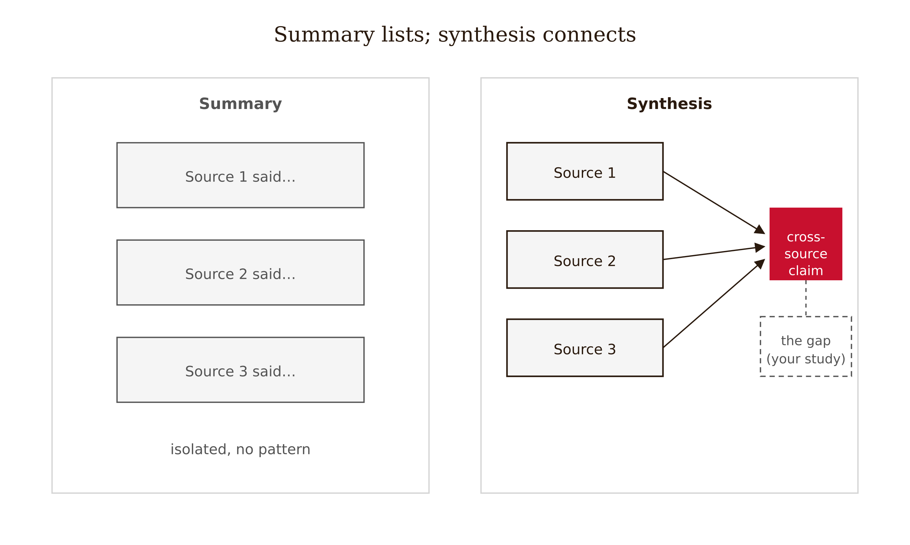
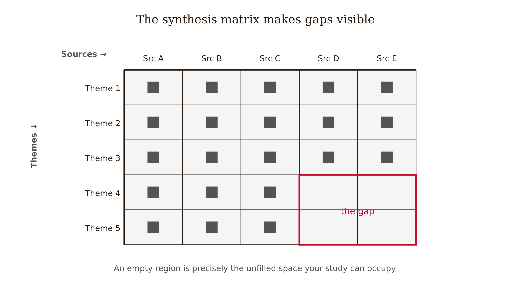
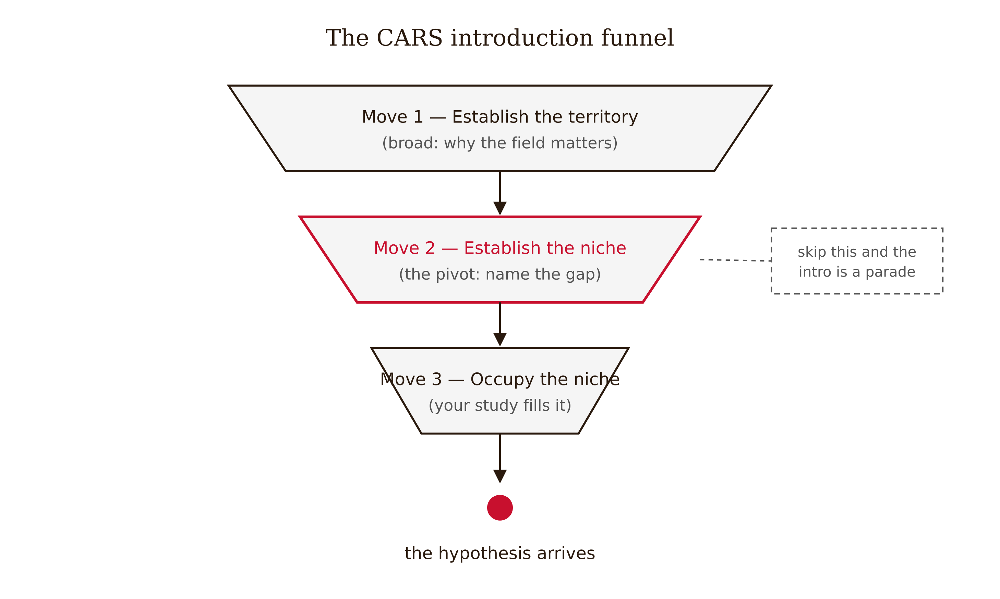
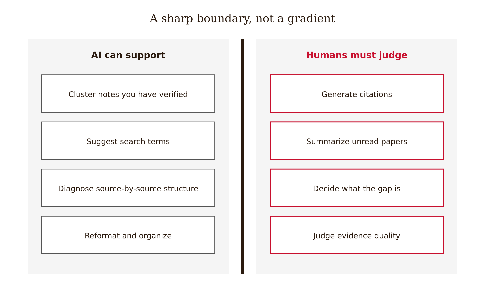

# Chapter 9 — Literature Review
*The literature review should make the research question feel inevitable — not merely possible.*

Here is a paragraph from a draft literature review:

"Smith found that AI feedback improved test scores. Garcia found that students preferred immediate feedback over delayed feedback. Chen found that programming performance was related to prior experience."

Every sentence is true. Every citation is real. The paragraph is useless.

The reader now knows what three studies found. They do not know how those findings relate to each other, whether they agree or contradict, what question they collectively leave unanswered, or why the paper you are about to read needs to exist. The paragraph has given the reader a list where it should have given them a map.

This is the central failure mode of literature reviews written by people who learned that "you need to cite sources." Citing sources is necessary. It is nowhere near sufficient. The literature review is not evidence that you read. It is an argument about what the field knows, what it disputes, and why the gap your study occupies is real and worth filling.

---

Let me make the distinction between summary and synthesis concrete, because the words are used interchangeably in ways that obscure a real difference.

**Summary** reports what a source said. "Smith found that AI feedback improved test scores on an immediate aligned post-test in an undergraduate programming course." That's a summary. It tells you the finding, the measure, the context, and nothing else.

**Synthesis** makes a claim about what multiple sources, taken together, reveal. "Studies consistently find short-term performance gains from AI feedback, but the evidence is concentrated on immediate aligned assessments — almost no work has tested whether those gains persist two weeks later under unassisted conditions." That sentence draws on several sources, extracts a pattern, and identifies a gap. It is doing work that no individual source can do.

The synthesis is what the literature review is for. Not the display of individual sources, but the argument that emerges when you hold them against each other and ask what they collectively say, where they agree, where they conflict, and where they stop.



The practical problem is that synthesis requires a structure. You need a way of organizing the sources that is not "source 1, then source 2, then source 3." The structure that works is thematic: organize around problems, methods, populations, mechanisms, or debates — not around the authors who studied them.

---

The tool I find most useful for building synthesis is a matrix.

Rows are themes or dimensions: feedback type, population, outcome measure, design, retention timescale, limitation. Columns are sources. Each cell contains a brief note about what that source does on that dimension.

The matrix forces you to read actively — you have to decide, for each source, which cell its content belongs in. More importantly, the matrix makes patterns visible that source-by-source reading hides. You can see that six of your eight sources measured only immediate performance and two measured delayed. You can see that all of the randomized designs are in a single subfield and the rest are observational. You can see that nobody has isolated the specific comparison you're planning to make.

Those patterns are your gap. The gap is not something you find by reading all the sources and then waiting for inspiration. It is something that emerges from the structure of what exists — the combination of what has been done and what hasn't.



<!-- → [TABLE: Sample synthesis matrix — rows: feedback type, study design, outcome measure, retention timescale, sample population, key limitation — columns: five hypothetical sources — cells showing variation across studies — gap visible where certain row-column combinations are empty] -->

---

John Swales developed a model for how research introductions establish their territory that has proven remarkably durable because it describes what the best introductions actually do rather than prescribing a format. He called it the Create a Research Space model — CARS — and it identifies three moves that introductions make in sequence.

**Move 1: Establish the territory.** Claim that the topic is important, review previous research, define key concepts. This is the "here is what the field has been doing" section. Its job is to establish that the domain matters and that prior work exists. Crucially, this move is not the whole introduction — it is the first step, and spending too long in Move 1 is a common way that introductions become literature parades rather than arguments.

**Move 2: Establish the niche.** This is the pivot. It marks the gap, contradiction, limitation, or unresolved question in the existing work. Swales describes several ways to establish a niche: counter-claiming (prior work has a specific weakness), gap-indicating (a specific question has not been addressed), question-raising (prior results are incomplete or puzzling), or continuing a tradition (building explicitly on a prior approach). The niche is what makes your study necessary. If Move 2 is absent or vague — "more research is needed" is not a niche — the reader has no reason to believe the study you're about to describe needed to be done.

**Move 3: Occupy the niche.** Announce your purposes, state your hypothesis or research question, describe your method, announce your findings. This is the "here is what this paper does" section. It closes the argument that the first two moves built.

The power of the CARS model is that it shows the logical relationship between the literature review and the hypothesis. The literature review is not a credential display — it is a setup. It establishes the territory, identifies the gap, and then the study occupies the gap. The hypothesis at the end of the introduction should feel like the only natural response to the gap the literature revealed.



<!-- → [INFOGRAPHIC: CARS three-move structure — three stacked segments of an introduction: Move 1 (establish territory, "the field has done..."), Move 2 (establish niche, "but no one has..."), Move 3 (occupy niche, "this study...") — with annotations showing what each move does and what happens when Move 2 is missing or weak] -->

---

When you sit down to write the literature review, the question to keep in front of you is not "have I cited enough sources?" It is "does this review make the reader feel that my research question had to be asked?"

That feeling — inevitability — comes from the structure of the argument, not from the number of citations. A literature review that builds carefully through territory and niche, that shows the reader exactly where the evidence runs out and exactly why that matters, will feel inevitable at five pages. A literature review that summarizes thirty sources one by one will feel like homework at two.

Here is a diagnostic: read your literature review and ask, at each paragraph, "what cross-source claim is this paragraph making?" If the answer is "this paragraph summarizes what Smith found," you are in source-summary mode. The paragraph needs to be rewritten as a thematic claim that Smith's study (and others) provide evidence for. If you cannot identify a cross-source claim, the paragraph doesn't belong in the synthesis.

---

There is a pathology in literature reviews that is less obvious than source-by-source summary, and it is worth naming explicitly: citation monoculture.

Citation monoculture happens when a literature review draws on a narrow, homogeneous set of sources — often the same handful of highly cited papers, often from a single methodological tradition, often from a single geographic or institutional context. The review looks comprehensive because it has many citations. But the citations all come from the same part of the field, which means the review may be silently inheriting the assumptions, blind spots, and limitations of that part of the field.

The practical symptoms: every study used the same measure, because that measure is standard in this subfield, even though other measures exist. Every study used undergraduate students at selective universities, because that is the convenient population. Every study found positive effects, because the literature on this intervention has a publication bias toward positive results. The review presents these as "what the field shows" when what the field shows is better described as "what the part of the field that published in these journals and used these methods found in these populations."

The antidote is not to cite every adjacent study that exists. It is to actively look for methodological diversity, population diversity, and findings that don't fit the dominant narrative. A literature review that acknowledges the limitations of the evidence it cites — "most studies to date used immediate aligned assessments, which may overestimate long-term effects" — is more honest and more useful than one that presents convergent evidence without noting that the convergence may be partly methodological.

---

Now a hard rule, because it matters and AI tools make it easy to violate: every citation in a literature review belongs to a source the author has located, opened, and verified.

AI language models generate plausible-sounding citations. They produce author names, journal names, volume numbers, page ranges. Many of these citations are invented — the authors may be real, the journals may be real, the papers do not exist. This is not a hallucination in the colloquial sense. It is a provenance failure. The citation exists in the text without corresponding to a real document in the world.

A citation hallucination is not a formatting error. It is a false claim about the state of knowledge. It tells readers that something was demonstrated, argued, or shown in a specific paper — a paper that cannot be read, because it doesn't exist. The reader who trusts the citation and builds on it is building on air.

The verification requirement is non-negotiable: locate the source (in a database, in a library, in an author's repository), open the source, confirm that it says what you are attributing to it, and record the correct bibliographic details from the actual document. This takes time. There is no shortcut. AI can help you find directions to look — adjacent terms to search, authors whose work is adjacent to yours, themes you may have missed — but every citation that appears in your paper must be traceable to a source you have personally verified.



<!-- → [TABLE: What AI can and cannot do in literature review preparation — two-column table: AI-appropriate tasks (clustering verified notes, suggesting search terms, identifying thematic gaps in your existing sources, diagnosing source-by-source organization) vs. human-required tasks (generating citations, summarizing unread papers, deciding what the gap is, evaluating evidence quality)] -->

---

Let me close with the full logic of what a literature review accomplishes, because seeing the complete arc makes each piece fall into place.

You are writing a paper that will claim something. The claim is specific, falsifiable, and connected to a mechanism (Chapter 1). The evidence plan you've built is suited to the assertion type (Chapter 3). The design can support the causal language you'll use (Chapter 4). The measures will capture the construct (Chapter 5).

But you still need to answer one question: *why does this claim need testing?* The reader who has never encountered your research question needs to understand, before reading your results, why the field would benefit from knowing the answer. Not in the abstract — not "more research is always useful" — but specifically: what is known, what is contested, what is missing, and why the thing that is missing matters.

That is what the literature review builds. It establishes that the field is real and active (Move 1). It identifies precisely where the existing knowledge runs out — not just that it runs out, but where, and for what reason (Move 2). And then it shows that your study is positioned to fill exactly that gap (Move 3).

The hypothesis should arrive at the end of the literature review as the natural conclusion of that argument. Not as a claim you're asserting despite what the field knows, but as a claim the field's own structure makes necessary. The reader who has followed the review should arrive at the hypothesis thinking: yes, that's the question to ask.

That is the standard. It's harder to meet than "I cited eight sources." It is the right standard.

---

## Exercises

### Warm-up

**1.** Take a three-paragraph section of a literature review you have written or found. Identify each paragraph as either source-summary mode (reports what one source said) or synthesis mode (makes a cross-source claim with sources as evidence). For each source-summary paragraph, identify what cross-source claim it could be rewritten around, and rewrite the first sentence to reflect that claim.

**2.** Find a published introduction in your field. Annotate it for CARS moves: mark where Move 1 begins and ends, where Move 2 establishes the niche (note whether it counter-claims, gap-indicates, raises a question, or continues a tradition), and where Move 3 occupies the niche. If you cannot locate Move 2, explain what the introduction does instead and what effect that has on the reader's sense of why the study exists.

### Application

**3.** Build a synthesis matrix for five sources in your area. Rows should include: study design, outcome measure, retention timescale, sample population, feedback type or intervention, and key limitation. Fill each cell from the actual source. Then write one paragraph that makes a cross-source claim supported by the pattern visible in your matrix — a claim that no single source in the matrix makes on its own.

**4.** Write the three CARS moves for your own study: (a) a 100-word territory statement naming the field, its importance, and the major threads of prior work; (b) a 75-word niche statement identifying the specific gap, contradiction, or limitation that your study addresses; (c) a 50-word occupation statement announcing your research question, method, and what you expect to show. Read all three in sequence. Does the hypothesis in Move 3 feel like the inevitable response to the gap in Move 2?

### Synthesis

**5.** Your eight sources on AI tutoring include: two studies using immediate aligned post-tests with no control group, three randomized experiments measuring immediate post-test performance, two observational studies of clickstream data, and one study using a delayed unassisted test. Write the literature review paragraph that synthesizes this body of work — not by summarizing each study, but by characterizing what the body of work collectively shows, where it converges, and where it falls short. The paragraph should make the gap (no randomized study has used a delayed unassisted test to compare feedback types) visible without asserting it as the final sentence of a summary list.

**6.** A classmate's literature review contains twelve citations, all from the same research group's lab, all using the same outcome measure, all finding positive effects. Explain the citation monoculture problem using this chapter's framework. What specific steps would you recommend to diagnose whether the convergence reflects genuine field consensus or methodological homogeneity? What would a more epistemically responsible literature review do with this evidence?

### Challenge

**7.** Find a published literature review that you believe does not adequately establish its niche — one where Move 2 is either absent, too vague ("more research is needed"), or hidden inside Move 1. Write a revised version of the niche establishment (Move 2) that is specific enough to make the study's contribution legible. Your revised Move 2 should identify a specific gap, limitation, or contradiction in the evidence, explain why it matters, and set up the study's hypothesis as the natural response. Then write a sentence explaining what change in the study design or framing, if any, would be required if the niche were stated as specifically as you've written it.

---

## LLM Exercises

### Exercise 1 — When to Use AI

**The judgment:** In this chapter's work, AI assistance is appropriate for the following tasks:

- Cluster verified notes into themes — *Why AI works here:* This is a bounded support task: AI can generate options, detect patterns, or reformat material while you retain the chapter's judgment criteria.
- Suggest adjacent literatures to verify — *Why AI works here:* This is a bounded support task: AI can generate options, detect patterns, or reformat material while you retain the chapter's judgment criteria.
- Diagnose source-by-source organization — *Why AI works here:* This is a bounded support task: AI can generate options, detect patterns, or reformat material while you retain the chapter's judgment criteria.

**The tell:** You know you are using AI appropriately when you can evaluate the output — when you have independent criteria to judge whether it is correct, complete, and fit for purpose.

---

### Exercise 2 — When NOT to Use AI

**The judgment:** In this chapter's work, the following tasks require human judgment. Delegating them to AI is not appropriate — not because AI cannot produce output, but because AI output in these cases cannot be trusted without verification that requires the same expertise as doing the task yourself.

- Generating citations or claims about unread papers — *Why AI fails here:* This requires human calibration, domain context, or accountability that the model cannot supply as ground truth.
- Replacing source reading with AI summaries — *Why AI fails here:* This requires human calibration, domain context, or accountability that the model cannot supply as ground truth.
- Smoothing away disagreement into fake consensus — *Why AI fails here:* This requires human calibration, domain context, or accountability that the model cannot supply as ground truth.

**The tell:** You know you have crossed the line when you are using AI output as your reason for a conclusion rather than as a tool for reaching one. If you could not explain the conclusion without the AI, the AI did the work that should have been yours.

**Series connection:** This exercise trains Tier 4 Metacognitive and Tier 6 Collective: the capacity to supervise machine output at the point where the project depends on synthesis, CARS, territory, niche, occupation, citation monoculture.

---

### Exercise 3 — LLM Exercise

**What you're building this chapter:** a literature synthesis and CARS niche memo.
**Tool:** Claude chat. It is the best fit here because the task is conceptual drafting and critique, not direct file manipulation.

**The Prompt:**

```
I am building a Research Paper Submission Dossier for a research paper I may write. The dossier is a working folder of decisions, audits, and evidence checks that should make the final paper harder to overclaim.

Current chapter: Literature Review. Core vocabulary for this chapter: synthesis, CARS, territory, niche, occupation, citation monoculture.

My working research topic is: AI tutoring and student learning in undergraduate programming courses. My current tentative claim is: Socratic AI feedback may improve delayed unassisted retention more than direct-answer AI feedback because it preserves retrieval effort.

Create a literature synthesis and CARS niche memo. Use the chapter concepts explicitly. Do not decide the final research claim for me. Do not invent citations, data, or results. Where a decision requires domain judgment, write "AUTHOR DECISION REQUIRED" and explain what judgment is needed. End with three questions I should answer before moving to the next chapter.
```

**What this produces:** A draft artifact for the running dossier, suitable to save as project-dossier/09-literature-synthesis.md.

**How to adapt this prompt:**
- *For your own project:* Replace the research topic and tentative claim with your own domain, data source, and intended contribution.
- *For ChatGPT / Gemini:* Keep the same constraints, and add "show your reasoning as bullet points, not hidden chain-of-thought."
- *For a Claude Project:* Put the project description and standing rule "do not decide my research claim for me" in the project instructions; paste the chapter-specific task as the message.

**Connection to previous chapters:** This adds the next decision layer to the same dossier rather than starting a new artifact.
**Preview of next chapter:** Next you will draft sections in an order that protects the claim.

---

### Exercise 4 — CLI Exercise

**What you're building this chapter:** The file `project-dossier/09-literature-synthesis.md`.
**Tool:** Codex CLI or Cowork. Use a file-aware agent because the task reads prior dossier files and writes a new markdown artifact.
**Skill level:** Beginner. Comfort with a project folder helps, but no programming is required.

**Setup:**

Before running this exercise, confirm:
- [ ] A folder named `project-dossier/` exists in your workspace.
- [ ] Any earlier chapter dossier files are saved in that folder.
- [ ] Your `AGENTS.md` or `CLAUDE.md` says: "For this project, AI may draft and audit artifacts, but the human author owns the research question, evidence standard, interpretation, and disclosure."

**The Task:**

```
Read the existing files in project-dossier/. Then create or update project-dossier/09-literature-synthesis.md.

This file should apply Chapter 9, "Literature Review," to the running Research Paper Submission Dossier. Use these chapter concepts: synthesis, CARS, territory, niche, occupation, citation monoculture.

Write the file with these sections:
1. Purpose of this dossier artifact
2. Inputs read from earlier dossier files
3. Chapter 9 analysis
4. Decisions the human author must make
5. Checks to run before moving on

Do not invent sources, data, results, or final conclusions. If information is missing, write "MISSING — author must supply" rather than filling the gap. After writing the file, report what changed and list any unresolved author decisions. Stop after writing this one file.
```

**Expected output:** `project-dossier/09-literature-synthesis.md` exists and connects this chapter's concept to the cumulative dossier.

**What to inspect in the output:** Check whether the file uses synthesis, CARS, territory, niche, occupation, citation monoculture correctly, preserves human decision points, and avoids unsupported conclusions.

**If it goes wrong:** If the agent invents facts or overwrites prior work, stop and inspect the diff. Restore the previous file version if needed, then rerun with the added instruction: "Use only facts already present in the dossier or explicitly mark them missing."

**CLAUDE.md / AGENTS.md note:** Add or keep this standing rule: "Never convert AI-generated suggestions into research conclusions without a human-authored rationale and source check."

---

### Exercise 5 — AI Validation Exercise

**What you're validating:** The AI-generated artifact from Exercise 3 or 4.
**Validation type:** Reasoning chain / Agentic output.
**Risk level:** Medium. The output is useful if it structures your thinking, but dangerous if it silently makes the judgment the chapter says must remain human.

**Setup:**

Use the output from Exercise 3 or the file produced in Exercise 4 as the artifact to validate.

**The Validation Task:**

Evaluate the AI output above using the following checklist. For each item, record: Pass / Fail / Cannot determine — and explain your reasoning.

```
Validation Checklist — Literature Review

□ Correctness: Does the output accurately reflect the chapter's core concept?
  Does it use synthesis, CARS, territory, niche, occupation, citation monoculture in a way this chapter would endorse?

□ Completeness: Is anything important missing?
  Would a domain expert need an additional source, measure, comparison, or limitation before trusting this artifact?

□ Scope: Did the AI stay within the task boundaries?
  Did it add claims, sources, data, results, or conclusions that were not provided?

□ Chapter-specific criterion 1: Does the output synthesize across sources rather than summarize one by one?

□ Chapter-specific criterion 2: Does it preserve disagreement, method differences, and citation diversity concerns?

□ Failure mode check: Does this output exhibit any of the following?
  - Fluent but wrong
  - Schema-valid but semantically wrong
  - Missing ground truth
  - Automation bias trigger: a confident recommendation without evidence you can independently inspect
```

**What to do with your findings:**

- If the output passes all checks: proceed to use it in your project. Note what made it trustworthy.
- If the output fails one check: revise the prompt and re-run Exercise 3 or 4. Document what changed.
- If the output fails multiple checks or you cannot determine pass/fail: this is a "When NOT to Use AI" moment. Do this part of the task yourself.

**AI Use Disclosure prompt:**

After completing this validation, write a two-sentence AI Use Disclosure:

> *Sentence 1:* What AI produced in this exercise and how you used it.
> *Sentence 2:* One specific thing the AI could not determine that required your judgment.

**Series connection:** This exercise trains Tier 4 Metacognitive and Tier 6 Collective: the capacity to catch when machine output is fluent, useful, and still not sufficient for the human conclusion.
