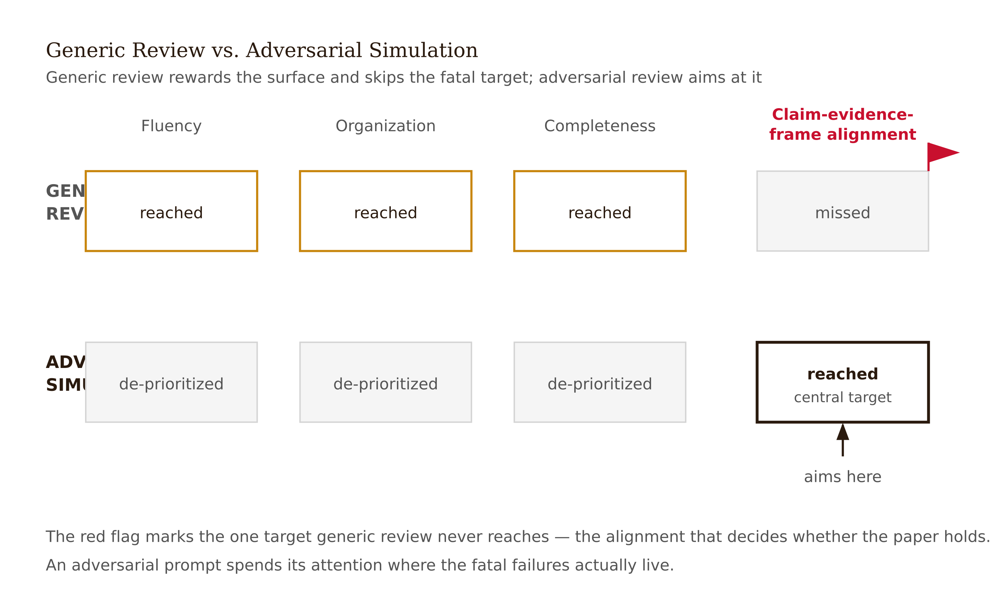
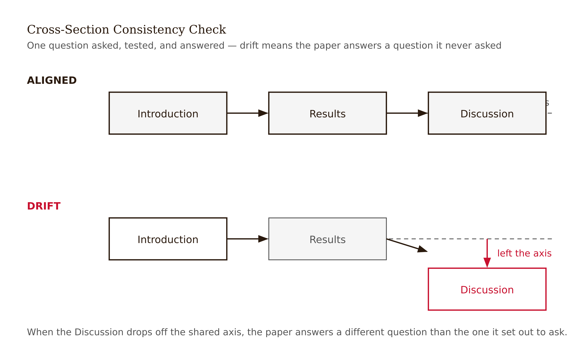
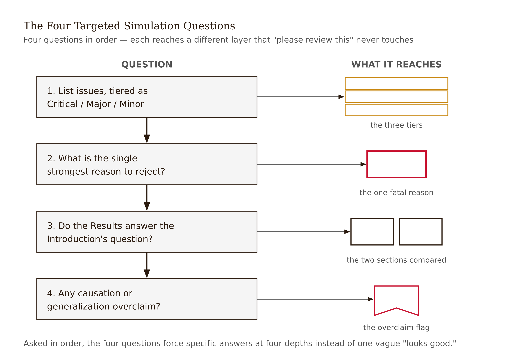
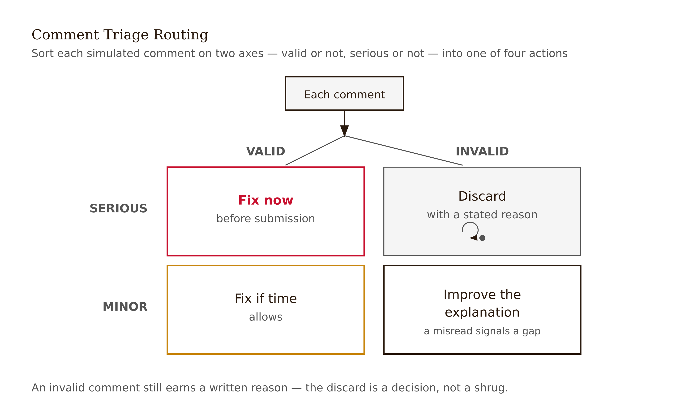

# Chapter 12 — Peer-Review Simulation
*A review that only tells you what's working is not a review — it's reassurance.*

Lina asks an AI tool to review her paper before submission. The tool tells her the paper is clear, timely, and well organized. She is relieved. The paper goes out.

Then a human colleague reads it and asks one question: "Why does your Discussion answer a different research question than your Introduction asks?"

The polite review missed the fatal mismatch. And the mismatch was fatal — not because the writing was poor, not because the statistics were wrong, but because the paper's framing and its findings had drifted apart somewhere in the drafting process, and no one had looked specifically for that.

The problem with Lina's AI review is not that it was an AI review. The problem is that it was a generic review. Generic review rewards what is easy to detect: fluency, organization, apparent completeness. It misses what requires targeted attention: whether the study's central claim, the evidence that supports it, and the framing around it are actually aligned.



A useful peer-review simulation is adversarial and specific. It is not a reassurance mechanism. It is an attempt to find the strongest reasons the paper should not be published, before a real reviewer finds them for you.

---

Before designing the simulation, it helps to understand what peer reviewers are actually doing — what the process is asking them to evaluate, and where it typically fails.

A peer reviewer is being asked to make a judgment about several things simultaneously: whether the paper's contribution is real and significant enough to warrant publication, whether the methods are appropriate and executed well enough to support the claims, whether the evidence actually supports the conclusions, whether the paper communicates clearly enough for its intended audience, whether it fits the venue's scope and standards, and whether it meets ethical requirements for research conduct and reporting.

That is a large and heterogeneous set of judgments, and the peer review literature documents extensively that reviewers vary widely in which of these they prioritize, how consistently they apply standards, and how much their assessments reflect the paper's actual quality versus factors like the authors' institutional affiliation, the favorability of the results, or the reviewer's own theoretical commitments. A landmark analysis documented that reviewer agreement is often not much better than chance. This is not a scandal — it is a description of what expert judgment under uncertainty looks like — but it does mean that peer review is not a proof of anything. Acceptance does not mean the paper is right. Rejection does not mean the paper is wrong.

What peer review provides, at its best, is informed external perspective from someone who has read the paper carefully and is accountable for their assessment. What simulation can approximate is the careful reading and the structured critique — not the domain expertise, the venue knowledge, or the accountability.

---

The key design principle for a useful simulation is that the questions must be specific enough to require a specific answer.

"Please review this paper" is not a useful prompt. It will produce a response that covers everything generally and nothing specifically — the equivalent of Lina's polite review. The simulation becomes useful when you ask targeted questions that force engagement with the paper's actual structure and evidence.

Here is a set of questions that consistently surfaces the problems worth knowing about before submission.

**What are the Critical, Major, and Minor issues?**

The three-tier distinction is standard in peer review and useful in simulation because it forces prioritization. A Critical issue is one that, if unresolved, prevents the paper from being publishable — fatal methodological flaws, claims that directly contradict the evidence, missing essential information. A Major issue is one that requires significant revision but doesn't necessarily preclude publication if addressed — evidence that's weaker than claimed, missing comparisons, scope claims that need qualification. A Minor issue is one that improves quality but isn't essential — phrasing, citation formatting, minor presentation choices.

The value of asking for all three tiers, labeled by tier, is that it prevents the common pattern where everything is treated as roughly equivalent. If a simulation produces ten comments and all of them are labeled equally, the author has no way to know which of those comments represents a paper-killing problem and which represents a preference the reviewer happens to have. The tier labels force a triage.

**What is the strongest reason to reject?**

This question asks the simulation to take a position rather than a list. The strongest reason to reject is a single argument — the most compelling case that the paper should not be published as is. It might be a design flaw, a missing control, a scope overclaim, or a fundamental mismatch between claim and evidence. Asking for it explicitly ensures that the simulation does not bury a fatal problem inside a list of mostly minor concerns.

The answer to this question is the one you most need to evaluate carefully. If the simulation names a problem you recognize — if you know it's real and were hoping it would go unnoticed — you have two choices: address it or withdraw. If the simulation names a problem you believe is invalid — if the method it criticizes is standard in your field, or if the concern reflects a misunderstanding of your approach — you have learned something about how the paper communicates, and you need to explain the choice more clearly.

**Does the Discussion answer the research question the Introduction asks?**

This is the question Lina's colleague asked. It is the cross-section consistency check that generic review most reliably misses. The Introduction establishes a specific question or hypothesis. The Results tests something. The Discussion interprets the Results. In a well-constructed paper, these three things refer to the same question. In a paper where drafting order was not carefully managed, or where the scope shifted during writing, they may have drifted apart.

The simulation is asked to compare the Introduction's stated question or hypothesis against the tests reported in Results, and to flag any gap. A gap here is a Critical issue. It means the paper is answering a question it didn't ask, or not answering the question it did ask, or both.



**Does the Discussion claim causation or generalization that the design does not support?**

This is the assertion-type audit from Chapter 3 applied to the finished paper. The simulation is specifically asked to look for causal verbs in observational designs, scope claims broader than the sample, certainty language for uncertain findings. These are the claims that are most likely to have drifted in during the discussion-writing process and least likely to be caught by prose editing.



<!-- → [TABLE: Simulation prompt structure — four rows: Critical/Major/Minor categories, strongest rejection reason, Introduction-to-Results alignment check, Discussion overclaim audit — columns: what the prompt asks, what a good response looks like, what a bad response looks like, how to triage the output] -->

---

The output of a simulated review needs to be triaged — evaluated, not just followed.

Not every comment from a simulated review is valid. Some will reflect the simulation's tendency to hedge everything as uncertain, or to apply standards from a different methodological tradition, or to note omissions that are standard practice in your field. Your job is to evaluate each comment using the same criteria you'd apply to a real reviewer's comment: is this a legitimate concern about my specific paper, does it reflect a genuine weakness I should address, or is it a generic preference that doesn't apply here?

A useful triage framework: for each simulated comment, decide whether it is valid and serious (fix before submission), valid but minor (fix if time allows), invalid but pointing to a communication gap (improve the explanation), or invalid and irrelevant (discard, but note why you disagree). Writing the reason you're discarding a comment is not optional. If you cannot articulate why a comment is wrong, you haven't established that it is wrong — you've established that you don't want it to be right.



The cross-section mismatches and the overclaim flags are the comments to take most seriously, because they are the ones generic review is least likely to catch and real reviewers are most likely to find. The word choice and paragraph structure comments are the ones to take least seriously in the first pass — they are real but not fatal, and addressing them before the structural issues are resolved wastes time.

<!-- → [TABLE: Comment triage categories — four rows: valid and serious, valid but minor, invalid but revealing, invalid and irrelevant — columns: definition, what to do, example, why you must articulate the reason for discarding] -->

---

There is a constraint that must be stated clearly, because it varies by venue and has legal and professional implications.

Some journals explicitly prohibit uploading unpublished manuscripts to third-party AI systems for peer-review simulation, on the grounds that this exposes confidential pre-publication work to systems whose data handling practices are not covered by the journal's confidentiality expectations. Before running any simulation that involves uploading your full manuscript to an external tool, check your target journal's author guidelines and your institution's policies. "I ran the paper through an AI tool" may need to be disclosed in the submission, depending on the venue.

The practical alternative for venues with restrictive policies: run the simulation on individual sections rather than the full manuscript, or on synthetic versions of your arguments rather than the actual text. You can describe your study design and claim to a simulation tool without submitting the manuscript, and ask the targeted questions about logical consistency and overclaiming on that description. This is less thorough but still useful, and it stays within appropriate boundaries.

The ICMJE (International Committee of Medical Journal Editors) has addressed AI use in research writing, and editorial guidance across fields has been evolving toward treating authors as accountable for AI-assisted work and requiring disclosure when AI played a role in manuscript preparation. Check the current guidance for your specific venue rather than assuming a uniform policy.

---

Peer review is adversarial in the right way. A good peer reviewer is not trying to be kind. They are trying to make the paper publishable — which means finding every reason it might not be, so the author has the chance to fix those things. The simulation is useful when it adopts that stance.

The failure mode Lina experienced — polite, reassuring, superficial — is the failure mode that characterizes generic review in any form, human or AI. A human reviewer who is friends with the author, or who doesn't want to deliver bad news, or who is reviewing quickly and running out of time will produce a review that looks like a review and functions like a pass. A simulation that is prompted generically will do the same.

The difference between a useful review and a reassuring one is whether the review can find the strongest case against the paper. Not whether it is harsh. Whether it is specific. A harsh review that criticizes stylistic choices while missing a design flaw is not a useful review. A precise review that identifies the one thing most likely to cause rejection — even if it is uncomfortable to hear — is the one worth having before submission.

"The strongest reason to reject" is the question that makes a simulation useful. If the answer to that question is something you can genuinely address, you have saved yourself a rejection. If the answer is something the simulation got wrong, explaining why it's wrong is part of understanding your own paper well enough to defend it.

---

## Exercises

### Warm-up

**1.** Take one section of a draft you are working on and run the following targeted simulation with an AI tool: "Give me Critical, Major, and Minor issues with this section, labeled by tier, with specific references to the text. For each Critical issue, explain what would need to change for the issue to be resolved." Triage the output: which comments are valid and serious, which are valid but minor, which reveal a communication gap, and which are invalid? Write one sentence of justification for each comment you are discarding.

**2.** Without looking at your Results section, write out your research question as it appears in the Introduction. Then write out the test you actually ran — the comparison, the outcome measure, the timing. Compare the two. Is the question and the test referring to the same thing? If there is any gap, describe it.

### Application

**3.** Ask an AI tool: "What is the single strongest reason to reject a study that [describes your study in 100 words or less]?" Evaluate the response. If the identified weakness is real, write a plan for addressing it before submission. If the identified weakness is invalid, write the explanation you would give a real reviewer who raised it — not a dismissal, but a specific argument for why the concern doesn't apply to this design or this field.

**4.** Run the cross-section consistency check on your paper. Ask an AI tool to compare your Introduction's stated hypothesis or research question with the statistical tests in your Results section and the conclusions in your Discussion. Report any mismatches the simulation identifies, triage them (valid/invalid, serious/minor), and write the revision required to close each valid mismatch.

### Synthesis

**5.** Design a complete pre-submission simulation protocol for the AI tutoring study: specify the four targeted questions you would ask, in what order, and what you would do with the output at each step. Then explain what the simulation cannot tell you — what kinds of weaknesses require a human domain expert to detect, and what you would ask that human expert to look for specifically.

**6.** Lina's AI tool reviewed her paper and called it clear, timely, and well organized. Using this chapter's framework, explain what the tool was optimizing for when it produced that response, why that optimization missed the Introduction-Discussion mismatch, and what prompt Lina should have used to surface the problem. Write the specific prompt.

### Challenge

**7.** Find a published paper that you believe has a mismatch between its Introduction's stated research question and its Discussion's conclusions — a paper where the Discussion answers a somewhat different question than the Introduction asked. Write the peer-review comment you would have submitted as a reviewer: name the mismatch specifically, explain why it is a Critical rather than a Minor issue, and describe what revision would be required to resolve it. Then write the author's response to your comment — the explanation or revision the authors could plausibly offer. Evaluate whether the author's response resolves the issue or deflects it.

---

## LLM Exercises

### Exercise 1 — When to Use AI

**The judgment:** In this chapter's work, AI assistance is appropriate for the following tasks:

- Generate Critical, Major, and Minor review comments — *Why AI works here:* This is a bounded support task: AI can generate options, detect patterns, or reformat material while you retain the chapter's judgment criteria.
- Cross-check Abstract against Results — *Why AI works here:* This is a bounded support task: AI can generate options, detect patterns, or reformat material while you retain the chapter's judgment criteria.
- Turn critique into revision tasks — *Why AI works here:* This is a bounded support task: AI can generate options, detect patterns, or reformat material while you retain the chapter's judgment criteria.

**The tell:** You know you are using AI appropriately when you can evaluate the output — when you have independent criteria to judge whether it is correct, complete, and fit for purpose.

---

### Exercise 2 — When NOT to Use AI

**The judgment:** In this chapter's work, the following tasks require human judgment. Delegating them to AI is not appropriate — not because AI cannot produce output, but because AI output in these cases cannot be trusted without verification that requires the same expertise as doing the task yourself.

- Uploading confidential material to prohibited tools — *Why AI fails here:* This requires human calibration, domain context, or accountability that the model cannot supply as ground truth.
- Replacing human domain review — *Why AI fails here:* This requires human calibration, domain context, or accountability that the model cannot supply as ground truth.
- Following every generic AI reviewer preference — *Why AI fails here:* This requires human calibration, domain context, or accountability that the model cannot supply as ground truth.

**The tell:** You know you have crossed the line when you are using AI output as your reason for a conclusion rather than as a tool for reaching one. If you could not explain the conclusion without the AI, the AI did the work that should have been yours.

**Series connection:** This exercise trains Tier 4 Metacognitive and Tier 6 Collective: the capacity to supervise machine output at the point where the project depends on peer review, Critical, Major, Minor, venue fit, cross-section consistency.

---

### Exercise 3 — LLM Exercise

**What you're building this chapter:** a structured simulated peer review.
**Tool:** Claude chat. It is the best fit here because the task is conceptual drafting and critique, not direct file manipulation.

**The Prompt:**

```
I am building a Research Paper Submission Dossier for a research paper I may write. The dossier is a working folder of decisions, audits, and evidence checks that should make the final paper harder to overclaim.

Current chapter: Peer-Review Simulation. Core vocabulary for this chapter: peer review, Critical, Major, Minor, venue fit, cross-section consistency.

My working research topic is: AI tutoring and student learning in undergraduate programming courses. My current tentative claim is: Socratic AI feedback may improve delayed unassisted retention more than direct-answer AI feedback because it preserves retrieval effort.

Create a structured simulated peer review. Use the chapter concepts explicitly. Do not decide the final research claim for me. Do not invent citations, data, or results. Where a decision requires domain judgment, write "AUTHOR DECISION REQUIRED" and explain what judgment is needed. End with three questions I should answer before moving to the next chapter.
```

**What this produces:** A draft artifact for the running dossier, suitable to save as project-dossier/12-peer-review-plan.md.

**How to adapt this prompt:**
- *For your own project:* Replace the research topic and tentative claim with your own domain, data source, and intended contribution.
- *For ChatGPT / Gemini:* Keep the same constraints, and add "show your reasoning as bullet points, not hidden chain-of-thought."
- *For a Claude Project:* Put the project description and standing rule "do not decide my research claim for me" in the project instructions; paste the chapter-specific task as the message.

**Connection to previous chapters:** This adds the next decision layer to the same dossier rather than starting a new artifact.
**Preview of next chapter:** Next you will screen ethics, bias, and disclosure.

---

### Exercise 4 — CLI Exercise

**What you're building this chapter:** The file `project-dossier/12-peer-review-plan.md`.
**Tool:** Codex CLI or Cowork. Use a file-aware agent because the task reads prior dossier files and writes a new markdown artifact.
**Skill level:** Beginner. Comfort with a project folder helps, but no programming is required.

**Setup:**

Before running this exercise, confirm:
- [ ] A folder named `project-dossier/` exists in your workspace.
- [ ] Any earlier chapter dossier files are saved in that folder.
- [ ] Your `AGENTS.md` or `CLAUDE.md` says: "For this project, AI may draft and audit artifacts, but the human author owns the research question, evidence standard, interpretation, and disclosure."

**The Task:**

```
Read the existing files in project-dossier/. Then create or update project-dossier/12-peer-review-plan.md.

This file should apply Chapter 12, "Peer-Review Simulation," to the running Research Paper Submission Dossier. Use these chapter concepts: peer review, Critical, Major, Minor, venue fit, cross-section consistency.

Write the file with these sections:
1. Purpose of this dossier artifact
2. Inputs read from earlier dossier files
3. Chapter 12 analysis
4. Decisions the human author must make
5. Checks to run before moving on

Do not invent sources, data, results, or final conclusions. If information is missing, write "MISSING — author must supply" rather than filling the gap. After writing the file, report what changed and list any unresolved author decisions. Stop after writing this one file.
```

**Expected output:** `project-dossier/12-peer-review-plan.md` exists and connects this chapter's concept to the cumulative dossier.

**What to inspect in the output:** Check whether the file uses peer review, Critical, Major, Minor, venue fit, cross-section consistency correctly, preserves human decision points, and avoids unsupported conclusions.

**If it goes wrong:** If the agent invents facts or overwrites prior work, stop and inspect the diff. Restore the previous file version if needed, then rerun with the added instruction: "Use only facts already present in the dossier or explicitly mark them missing."

**CLAUDE.md / AGENTS.md note:** Add or keep this standing rule: "Never convert AI-generated suggestions into research conclusions without a human-authored rationale and source check."

---

### Exercise 5 — AI Validation Exercise

**What you're validating:** The AI-generated artifact from Exercise 3 or 4.
**Validation type:** Reasoning chain / Agentic output.
**Risk level:** Medium. The output is useful if it structures your thinking, but dangerous if it silently makes the judgment the chapter says must remain human.

**Setup:**

Use the output from Exercise 3 or the file produced in Exercise 4 as the artifact to validate.

**The Validation Task:**

Evaluate the AI output above using the following checklist. For each item, record: Pass / Fail / Cannot determine — and explain your reasoning.

```
Validation Checklist — Peer-Review Simulation

□ Correctness: Does the output accurately reflect the chapter's core concept?
  Does it use peer review, Critical, Major, Minor, venue fit, cross-section consistency in a way this chapter would endorse?

□ Completeness: Is anything important missing?
  Would a domain expert need an additional source, measure, comparison, or limitation before trusting this artifact?

□ Scope: Did the AI stay within the task boundaries?
  Did it add claims, sources, data, results, or conclusions that were not provided?

□ Chapter-specific criterion 1: Does the output identify evidence-level issues rather than only prose polish?

□ Chapter-specific criterion 2: Does it distinguish valid reviewer concerns from generic or venue-misaligned advice?

□ Failure mode check: Does this output exhibit any of the following?
  - Fluent but wrong
  - Schema-valid but semantically wrong
  - Missing ground truth
  - Automation bias trigger: a confident recommendation without evidence you can independently inspect
```

**What to do with your findings:**

- If the output passes all checks: proceed to use it in your project. Note what made it trustworthy.
- If the output fails one check: revise the prompt and re-run Exercise 3 or 4. Document what changed.
- If the output fails multiple checks or you cannot determine pass/fail: this is a "When NOT to Use AI" moment. Do this part of the task yourself.

**AI Use Disclosure prompt:**

After completing this validation, write a two-sentence AI Use Disclosure:

> *Sentence 1:* What AI produced in this exercise and how you used it.
> *Sentence 2:* One specific thing the AI could not determine that required your judgment.

**Series connection:** This exercise trains Tier 4 Metacognitive and Tier 6 Collective: the capacity to catch when machine output is fluent, useful, and still not sufficient for the human conclusion.
