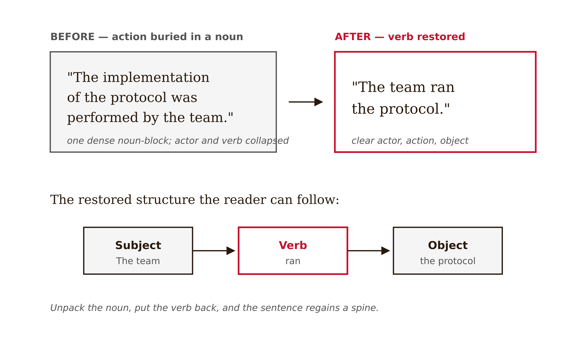
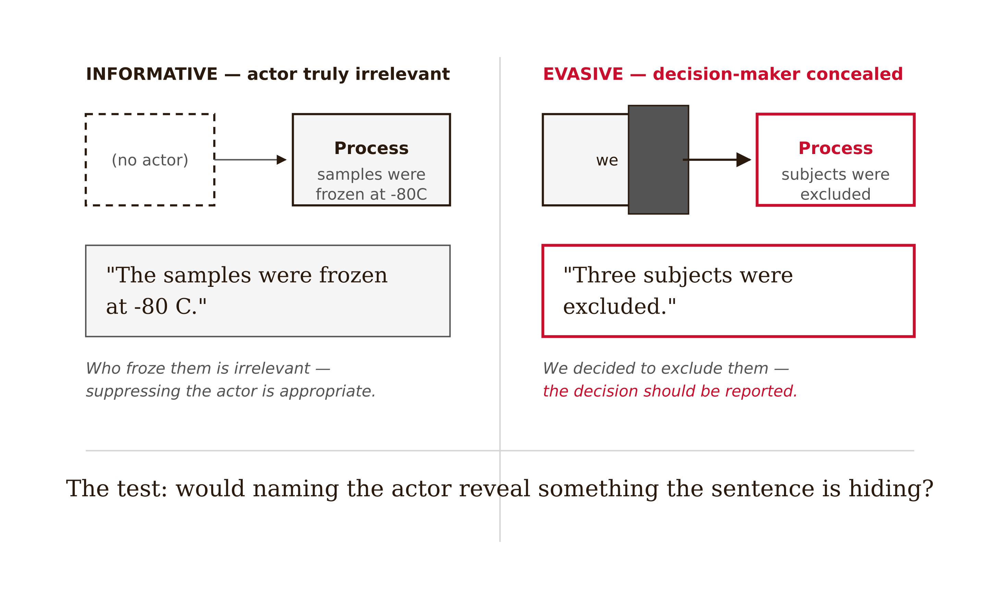
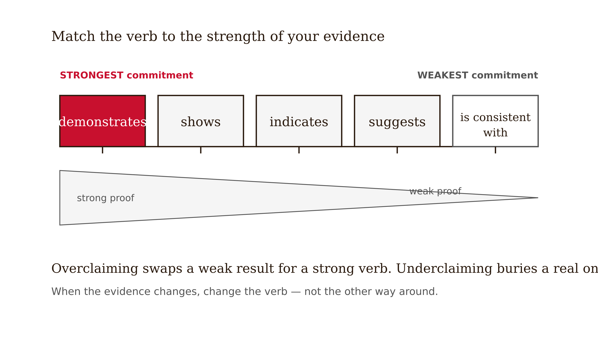
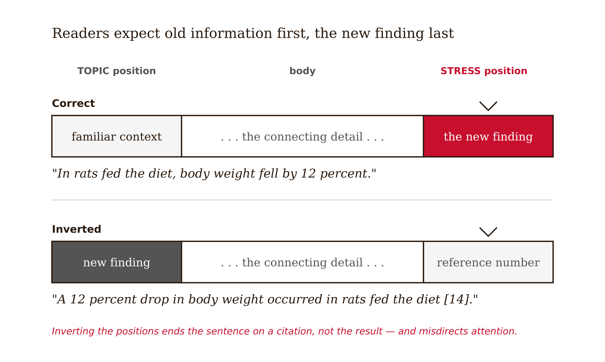

# Chapter 14 — Writing Well: Prose for Scientific Papers
*Clear prose is claim discipline at the scale of the sentence.*

Here is a sentence from a draft Discussion section:

"An improvement in performance was observed following implementation of the intervention."

The sentence is grammatical. It follows the conventions of scientific register. A first reading produces no alarm. And it contains almost no information.

Who improved? On what measure? Compared to what? How much? By whose observation? These are not pedantic questions. They are the questions that determine whether the sentence is actually saying anything. Stripped of the nominalization and the passive voice, the sentence might become: "Students in the Socratic feedback group scored four points higher on the delayed post-test than students in the direct-answer group." That version says something. It names the actor, the comparison, the measure, and the direction. A reader can evaluate it. A reader can use it.

The original sentence wears a lab coat. It sounds like science. It performs the register of scientific writing without doing its job, which is to move a specific claim from the writer to the reader with as little distortion as possible.

This is the problem that prose quality addresses — not whether the writing is elegant, but whether it is precise enough for the claims it is carrying. And precision in scientific prose is not a stylistic virtue. It is an epistemic one.

---

Nominalization is the most common source of fog in scientific writing, and it is worth understanding specifically because it is so easy to produce and so hard to notice in your own prose.

A nominalization is a verb or adjective that has been converted into a noun. "Improve" becomes "improvement." "Analyze" becomes "analysis." "Measure" becomes "measurement." "Intervene" becomes "intervention." Each of these conversions moves the action from the verb position — where it carries the sentence's energy and makes actors visible — to the noun position, where it sits passively and hides who did what to whom.

The test for a nominalization: find any noun ending in -tion, -ment, -ance, -ence, -ity, or -al, and ask whether it was once a verb or adjective. If it was, ask whether restoring it to its original form would make the sentence clearer. Often it would. "The observation of improvement in performance" restores to "Students in the Socratic group improved their performance" — and that version has a subject (students), a verb (improved), and an object (performance), which gives the sentence a structure the reader can follow.



Not all nominalizations are problems. "The randomization was stratified by prior programming experience" uses a nominalization appropriately — "randomization" is the right term for this concept, and the sentence is clear. The problem is when nominalizations stack: "The implementation of the intervention resulted in the observation of significant improvement in student learning outcomes." Every meaningful action in that sentence is hidden inside a noun. The sentence is impenetrable not because the ideas are hard but because the prose has removed all the structure that would make them accessible.

<!-- → [TABLE: Nominalization audit — six example sentences with stacked nominalizations — columns: original sentence, nominalizations identified, restored actor-action version, what changed in clarity] -->

---

Vague quantifiers are the second major source of fog, and they are particularly problematic in scientific writing because scientific claims require precision.

"Some students improved." How many? "A significant improvement." Statistical or practical significance? "Most participants reported..." What percentage? "Performance increased substantially." By how much? Each of these vague quantifiers creates the appearance of a specific claim while withholding the information that would make it specific.

The remedy is almost always to replace the vague quantifier with an actual number, percentage, or scoped phrase. "Some students improved" becomes "14 of 35 students in the Socratic group improved by more than one standard deviation." "A significant improvement" becomes "a statistically significant improvement, *p* = .016, *d* = 0.63, 95% CI [0.11, 1.14]." "Most participants reported" becomes "73% of participants (n = 51 of 70) reported."

The vague quantifier often appears because the writer doesn't have the number — they haven't looked it up, or they've summarized loosely. This is a different problem from the nominalization, which is usually a stylistic habit. The vague quantifier is often a knowledge gap masquerading as a stylistic choice. When you find one, check whether you have the number. If you do, use it. If you don't, go find it. If you genuinely can't find it because the data wasn't collected, the sentence may be overclaiming.

---

Passive voice is the element of scientific prose that generates the most categorical advice and the least nuanced guidance. "Never use passive" is wrong. "Passive voice hides important information" is right as a caution but wrong as a rule. The distinction is between informative passive and evasive passive.

**Informative passive** makes the actor irrelevant or suppresses the actor appropriately. "Samples were analyzed using a high-performance liquid chromatography method." The actor — whoever ran the machine — is genuinely irrelevant to what the reader needs to know. Passive is correct here. "Participants were randomly assigned to conditions using a computer-generated sequence." The procedure is what matters, not who ran the randomization software. Passive is correct.

**Evasive passive** hides a decision-maker in order to avoid accountability. "Outliers were removed." Who removed them? By what rule? When? If the rule was pre-specified and applies equally to all conditions, that belongs in the Methods section with the rule named. If the rule was not pre-specified, the passive voice is concealing a researcher degree of freedom. "Three participants were excluded due to incomplete data." Were they excluded before or after the outcomes were examined? Did excluding them change the result? The passive hides these questions. The active voice — "We excluded three participants whose post-test data were missing before conducting any outcome analyses" — makes the accountability explicit.

The test: when you find a passive, ask whether the actor is genuinely irrelevant or whether naming the actor would require saying something the sentence is currently hiding. If naming the actor would reveal a decision that should be disclosed, the passive is evasive and the decision should be reported.



<!-- → [TABLE: Passive voice audit — four example sentences — columns: passive version, actor identified, whether actor is relevant, revised version (active or informative passive), what became visible in the revision] -->

---

The most consequential prose choice in a scientific paper is the epistemic verb — the word that characterizes the relationship between your evidence and your claim.

"Demonstrates" is a strong verb. It implies that the evidence is sufficient to establish the claim with high confidence. It is appropriate when the design is strong, the effect is large and robust, and the alternative explanations have been ruled out. It is often used when the evidence is much weaker than it implies.

"Shows" is slightly softer but still implies substantial evidence. "Indicates" is moderate — the evidence points in this direction. "Suggests" is weaker — the evidence is consistent with this interpretation but does not establish it. "Is consistent with" is weaker still — the evidence doesn't contradict this interpretation, but it doesn't particularly support it either.

The calibration between verb and evidence is not a matter of tone. It is a matter of accuracy. A study with observational data and a modest effect size that "demonstrates" a causal relationship has overstated its evidence. A study with a well-powered randomized trial and a replicated effect that "is consistent with" an association has understated its evidence. Both are errors. Both mislead readers about how much the finding should update their beliefs.

Here is the practical rule: for each epistemic verb in your Discussion, ask what kind of evidence would justify that verb. Then ask whether your study provides that kind of evidence. If the answer is no, change the verb.



A related issue: excessive hedging. A paper that uses "appears to suggest" and "may perhaps indicate" throughout its Discussion has been hedged into incoherence. Some of this hedging is genuine epistemic humility — the evidence is uncertain and the writer is being honest. But some of it is defensive writing — the writer is protecting against every possible objection by refusing to commit to any claim. Defensive hedging does not produce a safer claim. It produces an unreadable one. Calibrated hedging names the actual uncertainty. Defensive hedging names no uncertainty at all, because it is hiding, not disclosing.

<!-- → [TABLE: Epistemic verb calibration — rows: demonstrates, shows, indicates, suggests, is consistent with — columns: what strength of evidence it implies, what design would justify it, example in context] -->

---

The sentence structure principle that runs through all of this comes from a paper by George Gopen and Judith Swan that argued for a model of reading as expectation-based. Readers, they argued, expect certain kinds of information in certain positions. The subject position sets up what the sentence is about. The stress position — usually the end of the sentence — is where new, important information lands.

The implication for scientific prose: the sentence should open on what the reader already knows (topic position) and close on the new information that the sentence is adding (stress position). A sentence that buries its finding in a subordinate clause at the beginning and ends on a reference number has put its information in the wrong positions. The reader's cognitive machinery reads the reference number as the sentence's most important element.



This is a subtle principle and it does not need to be followed mechanically. But it is useful for diagnosing why a paragraph that seems clear on re-reading was confusing on first reading. Often the culprit is information in the wrong position — the new claim buried where the familiar context should be, the qualification at the end where the finding should be.

The Williams and Bizup principle complements this: when a sentence is hard to follow, look for the central actor and the central action. Make the actor the grammatical subject. Make the action the main verb. Everything else is secondary. "The intervention, which was implemented over six weeks in an introductory programming course, resulted in outcomes that were significantly better in the treatment group" has an actor (the intervention) in subject position, but the action is buried in "resulted in outcomes that were significantly better." Restored: "Students who received the intervention for six weeks scored significantly higher on the post-test than control students." Actor clear. Action clear. Information in the right positions.

---

One last thing, because prose quality occupies a specific position in the book's sequence that is worth naming.

This chapter comes after the claim audit, the peer-review simulation, and the ethics screen. That sequence is intentional. Prose quality is the last thing to address, not the first, because improving the prose before the claims are correct can make the wrong thing more convincing. An elegant sentence that overstates the evidence is more dangerous than an awkward sentence that overstates the evidence, because elegance suppresses critical reading. Clean it last.

But clean it. A correct claim expressed in fog is harder to evaluate than a correct claim expressed clearly. The reader who cannot find the actor, the comparison, the measure, and the scope in your sentence cannot tell whether the claim is supported. Opacity protects nothing. It just makes the reader's job harder and creates the impression — usually wrong — that you are hiding something.

Scientific prose is a precision instrument. Its job is not to sound scientific. Its job is to deliver a specific claim, scoped accurately, hedged appropriately, with the actor and evidence visible, in a form that allows evaluation. That is a high standard. It is the right standard.

---

## Exercises

### Warm-up

**1.** Take one paragraph from a Methods or Results section. Find every noun ending in -tion, -ment, -ance, -ence, -ity, or -al. For each, ask whether it was once a verb or adjective, and whether restoring it would make the sentence clearer. Convert at least three nominalizations back into the actor-action structure. Read the original and revised paragraphs aloud. Note which version requires less re-reading.

**2.** Find five vague quantifiers in a draft — "some," "most," "many," "significantly," "substantial," or similar. For each, find the specific number, percentage, or statistical value that would replace it. If you cannot find the number, note why and decide whether the sentence should be revised or the data retrieved.

### Application

**3.** Take the following sentence and run it through all four analyses in this chapter: (a) identify nominalizations and restore them; (b) replace vague quantifiers with specific values; (c) identify whether the passive is informative or evasive, and revise if evasive; (d) calibrate the epistemic verb to appropriate evidence strength. Original sentence: "A significant improvement in learning outcomes was observed following implementation of the feedback intervention, suggesting that the provision of hints promotes the development of understanding."

**4.** Read through the Discussion section of a paper you are working on. Highlight every epistemic verb. For each, ask: what strength of evidence would justify this verb, and does my study provide that evidence? List any verbs that need to be strengthened (understated evidence) or weakened (overstated evidence), and write the revised sentence for each.

### Synthesis

**5.** Take a paragraph from your Discussion that you believe summarizes your main finding. Apply the Gopen-Swan principle: for each sentence, identify where the topic information is (what the reader already knows) and where the stress information is (the new claim). Is the new information at the end? Is the topic information at the beginning? Revise any sentence where important information is in the wrong position. Compare the original and revised paragraph for first-reading clarity.

**6.** A colleague asks an AI tool to "clean up" their Discussion section before running a claim audit. The AI produces a more fluent version that changes "was associated with" to "demonstrates" in two sentences and removes several hedges. Explain the specific problem this creates, using the epistemic verb calibration principle from this chapter. Write the rule your colleague should follow for sequencing AI prose editing and claim audit.

### Challenge

**7.** Find a paragraph in a published paper that you believe has at least three of the following problems: stacked nominalizations, vague quantifiers, evasive passive, miscalibrated epistemic verb, and information in the wrong sentence position. Rewrite the paragraph applying all four analyses from this chapter. For each change, write one sentence explaining what the problem was and what the revision corrects. Then check that the rewritten version has not changed the paper's actual scientific claim — that clarity improvement has not silently altered the scope, causal force, or hedge level of the original finding.

---

## LLM Exercises

### Exercise 1 — When to Use AI

**The judgment:** In this chapter's work, AI assistance is appropriate for the following tasks:

- Find foggy prose and nominalizations — *Why AI works here:* This is a bounded support task: AI can generate options, detect patterns, or reformat material while you retain the chapter's judgment criteria.
- Offer contrastive rewrites for author review — *Why AI works here:* This is a bounded support task: AI can generate options, detect patterns, or reformat material while you retain the chapter's judgment criteria.
- Calibrate hedging when evidence is supplied — *Why AI works here:* This is a bounded support task: AI can generate options, detect patterns, or reformat material while you retain the chapter's judgment criteria.

**The tell:** You know you are using AI appropriately when you can evaluate the output — when you have independent criteria to judge whether it is correct, complete, and fit for purpose.

---

### Exercise 2 — When NOT to Use AI

**The judgment:** In this chapter's work, the following tasks require human judgment. Delegating them to AI is not appropriate — not because AI cannot produce output, but because AI output in these cases cannot be trusted without verification that requires the same expertise as doing the task yourself.

- Smoothing prose before claim accuracy is checked — *Why AI fails here:* This requires human calibration, domain context, or accountability that the model cannot supply as ground truth.
- Accepting rewrites that change causal force or scope — *Why AI fails here:* This requires human calibration, domain context, or accountability that the model cannot supply as ground truth.
- Letting AI erase disciplinary voice and accountability — *Why AI fails here:* This requires human calibration, domain context, or accountability that the model cannot supply as ground truth.

**The tell:** You know you have crossed the line when you are using AI output as your reason for a conclusion rather than as a tool for reaching one. If you could not explain the conclusion without the AI, the AI did the work that should have been yours.

**Series connection:** This exercise trains Tier 4 Metacognitive and Tier 7 Wisdom: the capacity to supervise machine output at the point where the project depends on nominalization, hedging, passive voice, claim drift, precision, economy.

---

### Exercise 3 — LLM Exercise

**What you're building this chapter:** a final prose revision with claim-drift notes.
**Tool:** Claude chat. It is the best fit here because the task is conceptual drafting and critique, not direct file manipulation.

**The Prompt:**

```
I am building a Research Paper Submission Dossier for a research paper I may write. The dossier is a working folder of decisions, audits, and evidence checks that should make the final paper harder to overclaim.

Current chapter: Writing Well: Prose for Scientific Papers. Core vocabulary for this chapter: nominalization, hedging, passive voice, claim drift, precision, economy.

My working research topic is: AI tutoring and student learning in undergraduate programming courses. My current tentative claim is: Socratic AI feedback may improve delayed unassisted retention more than direct-answer AI feedback because it preserves retrieval effort.

Create a final prose revision with claim-drift notes. Use the chapter concepts explicitly. Do not decide the final research claim for me. Do not invent citations, data, or results. Where a decision requires domain judgment, write "AUTHOR DECISION REQUIRED" and explain what judgment is needed. End with three questions I should answer before moving to the next chapter.
```

**What this produces:** A draft artifact for the running dossier, suitable to save as project-dossier/14-final-prose-review.md.

**How to adapt this prompt:**
- *For your own project:* Replace the research topic and tentative claim with your own domain, data source, and intended contribution.
- *For ChatGPT / Gemini:* Keep the same constraints, and add "show your reasoning as bullet points, not hidden chain-of-thought."
- *For a Claude Project:* Put the project description and standing rule "do not decide my research claim for me" in the project instructions; paste the chapter-specific task as the message.

**Connection to previous chapters:** This adds the next decision layer to the same dossier rather than starting a new artifact.
**Preview of next chapter:** The dossier is ready for author review before any submission.

---

### Exercise 4 — CLI Exercise

**What you're building this chapter:** The file `project-dossier/14-final-prose-review.md`.
**Tool:** Codex CLI or Cowork. Use a file-aware agent because the task reads prior dossier files and writes a new markdown artifact.
**Skill level:** Beginner. Comfort with a project folder helps, but no programming is required.

**Setup:**

Before running this exercise, confirm:
- [ ] A folder named `project-dossier/` exists in your workspace.
- [ ] Any earlier chapter dossier files are saved in that folder.
- [ ] Your `AGENTS.md` or `CLAUDE.md` says: "For this project, AI may draft and audit artifacts, but the human author owns the research question, evidence standard, interpretation, and disclosure."

**The Task:**

```
Read the existing files in project-dossier/. Then create or update project-dossier/14-final-prose-review.md.

This file should apply Chapter 14, "Writing Well: Prose for Scientific Papers," to the running Research Paper Submission Dossier. Use these chapter concepts: nominalization, hedging, passive voice, claim drift, precision, economy.

Write the file with these sections:
1. Purpose of this dossier artifact
2. Inputs read from earlier dossier files
3. Chapter 14 analysis
4. Decisions the human author must make
5. Checks to run before moving on

Do not invent sources, data, results, or final conclusions. If information is missing, write "MISSING — author must supply" rather than filling the gap. After writing the file, report what changed and list any unresolved author decisions. Stop after writing this one file.
```

**Expected output:** `project-dossier/14-final-prose-review.md` exists and connects this chapter's concept to the cumulative dossier.

**What to inspect in the output:** Check whether the file uses nominalization, hedging, passive voice, claim drift, precision, economy correctly, preserves human decision points, and avoids unsupported conclusions.

**If it goes wrong:** If the agent invents facts or overwrites prior work, stop and inspect the diff. Restore the previous file version if needed, then rerun with the added instruction: "Use only facts already present in the dossier or explicitly mark them missing."

**CLAUDE.md / AGENTS.md note:** Add or keep this standing rule: "Never convert AI-generated suggestions into research conclusions without a human-authored rationale and source check."

---

### Exercise 5 — AI Validation Exercise

**What you're validating:** The AI-generated artifact from Exercise 3 or 4.
**Validation type:** Reasoning chain / Agentic output.
**Risk level:** Medium. The output is useful if it structures your thinking, but dangerous if it silently makes the judgment the chapter says must remain human.

**Setup:**

Use the output from Exercise 3 or the file produced in Exercise 4 as the artifact to validate.

**The Validation Task:**

Evaluate the AI output above using the following checklist. For each item, record: Pass / Fail / Cannot determine — and explain your reasoning.

```
Validation Checklist — Writing Well: Prose for Scientific Papers

□ Correctness: Does the output accurately reflect the chapter's core concept?
  Does it use nominalization, hedging, passive voice, claim drift, precision, economy in a way this chapter would endorse?

□ Completeness: Is anything important missing?
  Would a domain expert need an additional source, measure, comparison, or limitation before trusting this artifact?

□ Scope: Did the AI stay within the task boundaries?
  Did it add claims, sources, data, results, or conclusions that were not provided?

□ Chapter-specific criterion 1: Does the output improve clarity without changing meaning?

□ Chapter-specific criterion 2: Does it preserve causal force, scope limits, statistics, and hedges?

□ Failure mode check: Does this output exhibit any of the following?
  - Fluent but wrong
  - Schema-valid but semantically wrong
  - Missing ground truth
  - Automation bias trigger: a confident recommendation without evidence you can independently inspect
```

**What to do with your findings:**

- If the output passes all checks: proceed to use it in your project. Note what made it trustworthy.
- If the output fails one check: revise the prompt and re-run Exercise 3 or 4. Document what changed.
- If the output fails multiple checks or you cannot determine pass/fail: this is a "When NOT to Use AI" moment. Do this part of the task yourself.

**AI Use Disclosure prompt:**

After completing this validation, write a two-sentence AI Use Disclosure:

> *Sentence 1:* What AI produced in this exercise and how you used it.
> *Sentence 2:* One specific thing the AI could not determine that required your judgment.

**Series connection:** This exercise trains Tier 4 Metacognitive and Tier 7 Wisdom: the capacity to catch when machine output is fluent, useful, and still not sufficient for the human conclusion.
