# The Research Paper Recipe — Wayback Sections

> Extracted from `chapters/`. Each entry corresponds to one chapter file.
> Sections are instructor-authored. Missing sections show a placeholder only.
> Do not edit this file directly — edit the source chapter file, then re-run extraction.

---

## Chapter 00: The Research Paper Recipe
*Source: `chapters/00-frontmatter.md`*

> **Section not yet authored.** No `## AI Wayback Machine` block found in this chapter file.
> To add this section, edit the source chapter file directly.

---

## Chapter 00: Introduction
*Source: `chapters/00-introduction.md`*

> **Section not yet authored.** No `## AI Wayback Machine` block found in this chapter file.
> To add this section, edit the source chapter file directly.

---

## Chapter 01: Chapter 1 — Before You Write Anything
*Source: `chapters/01-before-you-write-anything.md`*

##  AI Wayback Machine

The ideas in this chapter didn't appear from nowhere. **Ludwik Fleck** was studying how scientific facts get built — and unbuilt — by communities of researchers, decades before "falsifiability" and "paradigms" entered the vocabulary. Here's a prompt to find out more — and then make it better.

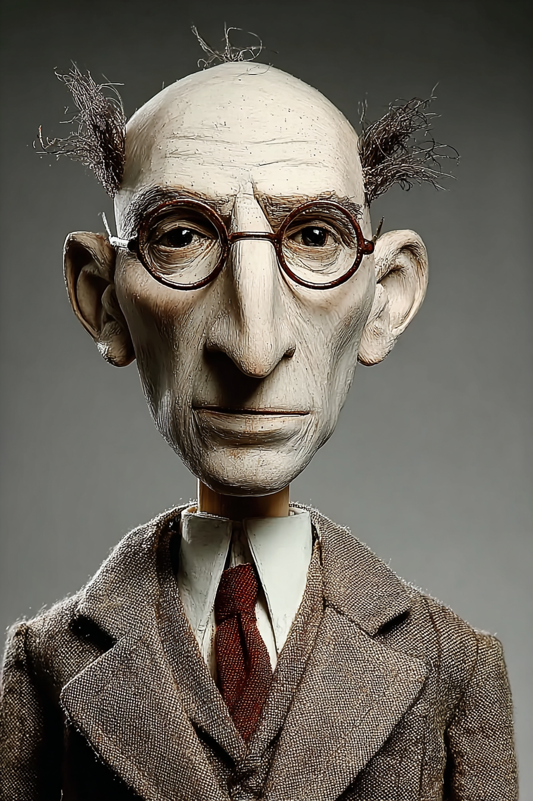

*Puppet Art by [Nik Bear Brown](https://www.nikbearbrown.com/).*

**Run this:**

```text
Who was Ludwik Fleck, and how does his idea of the "thought collective" and the social construction of scientific facts connect to the way a research hypothesis becomes accepted knowledge? Keep it to three paragraphs. End with the single most surprising thing about his career or ideas.
```

→ Search **"Ludwik Fleck"** on Wikipedia after you run this. See what the model got right, got wrong, or left out.

**Now make the prompt better.** Try one of these:

- Ask it to explain a "thought collective" in plain language, as if you've never taken a philosophy-of-science course
- Ask how Fleck's 1935 account compares to how you'd decide today whether a hypothesis is actually testable
- Add a constraint: "Answer as a cautionary note to a first-year researcher about to fall in love with their own hypothesis"

What changes? What gets better? What gets worse?

---

## Chapter 02: Chapter 2 — Foundation
*Source: `chapters/02-foundation.md`*

##  AI Wayback Machine

The ideas in this chapter didn't appear from nowhere. **Archie Cochrane** spent his career arguing that medicine should rest only on evidence that could survive a fair test — the conviction beneath every reporting standard you will cite. Here's a prompt to find out more — and then make it better.

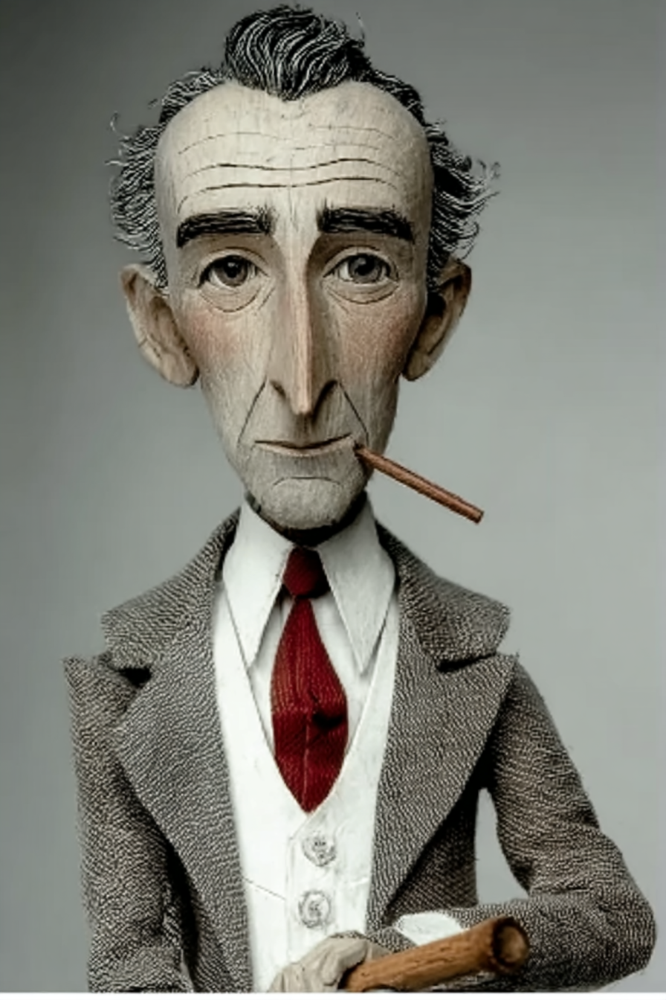

*Puppet Art by [Nik Bear Brown](https://www.nikbearbrown.com/).*

**Run this:**

```text
Who was Archie Cochrane, and how does his case for randomized evidence and systematic reviews connect to the idea that a research claim is only as strong as the evidence plan behind it? Keep it to three paragraphs. End with the single most surprising thing about his career or ideas.
```

→ Search **"Archie Cochrane"** on Wikipedia after you run this. See what the model got right, got wrong, or left out.

**Now make the prompt better.** Try one of these:

- Ask it to explain what a "systematic review" is in plain language, as if you've never read a methods section
- Ask how Cochrane's wartime prisoner-of-war experiments compare to the reporting standards (CONSORT, STROBE) you'd use today
- Add a constraint: "Answer as the opening text of a museum placard titled 'Why we count'"

What changes? What gets better? What gets worse?

---

## Chapter 03: Chapter 3 — The Scientific Method: Assertions and How to Test Them
*Source: `chapters/03-the-scientific-method-assertions-and-how-to-test-them.md`*

##  AI Wayback Machine

The ideas in this chapter didn't appear from nowhere. **Mary Hesse** worked out how scientific models, analogies, and evidence actually confirm or undermine a theory — the machinery beneath the words "test" and "falsify." Here's a prompt to find out more — and then make it better.

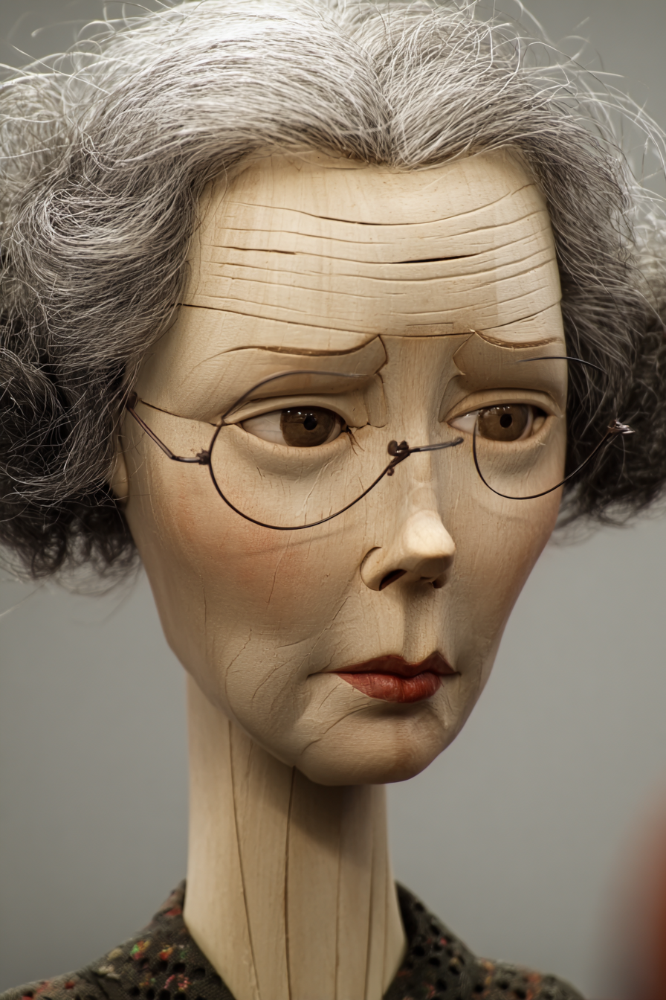

*Puppet Art by [Nik Bear Brown](https://www.nikbearbrown.com/).*

**Run this:**

```text
Who was Mary Hesse, and how does her work on models, analogies, and confirmation in science connect to what it means to test a hypothesis? Keep it to three paragraphs. End with the single most surprising thing about her career or ideas.
```

→ Search **"Mary Hesse"** on Wikipedia after you run this. See what the model got right, got wrong, or left out.

**Now make the prompt better.** Try one of these:

- Ask it to explain how an analogy can count as "evidence" in plain language, with one concrete example
- Ask how Hesse's view of confirmation compares to the falsifiability test this chapter uses
- Add a constraint: "Answer as a footnote in a philosophy-of-science textbook"

What changes? What gets better? What gets worse?

---

## Chapter 04: Chapter 4 — What Does Causal Mean, Exactly?
*Source: `chapters/04-what-does-causal-mean-exactly.md`*

##  AI Wayback Machine

The ideas in this chapter didn't appear from nowhere. **Sewall Wright** drew the first causal path diagrams in the 1920s — the direct ancestors of the arrows-and-nodes graphs researchers use to reason about cause today. Here's a prompt to find out more — and then make it better.

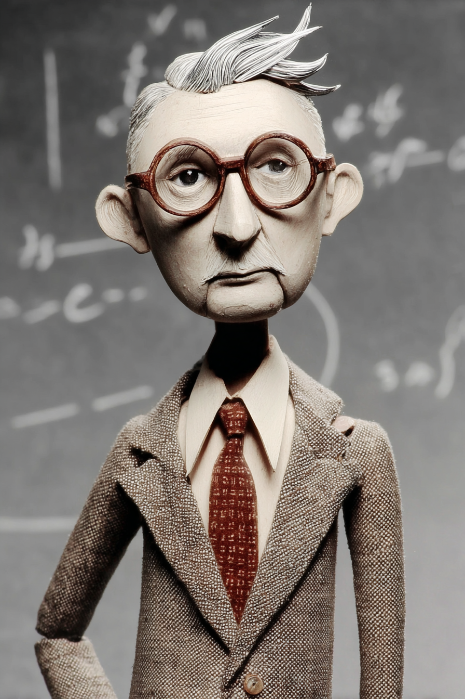

*Puppet Art by [Nik Bear Brown](https://www.nikbearbrown.com/).*

**Run this:**

```text
Who was Sewall Wright, and how does his invention of path analysis connect to modern causal diagrams and the problem of separating correlation from causation? Keep it to three paragraphs. End with the single most surprising thing about his career or ideas.
```

→ Search **"Sewall Wright"** on Wikipedia after you run this. See what the model got right, got wrong, or left out.

**Now make the prompt better.** Try one of these:

- Ask it to explain a "path coefficient" in plain language, as if you've never seen a causal diagram
- Ask how Wright's 1920s path diagrams compare to the DAGs and the do-operator you'd use today
- Add a constraint: "Answer as a museum placard explaining where the arrows in a causal graph came from"

What changes? What gets better? What gets worse?

---

## Chapter 05: Chapter 5 — Measurement
*Source: `chapters/05-measurement.md`*

##  AI Wayback Machine

The ideas in this chapter didn't appear from nowhere. **Jane Loevinger** built the theory of how a test earns the right to claim it measures something real — the foundation of construct validity. Here's a prompt to find out more — and then make it better.


*Puppet Art by [Nik Bear Brown](https://www.nikbearbrown.com/).*

**Run this:**

```text
Who was Jane Loevinger, and how does her work on construct validity and measurement theory connect to the gap between what a test scores and what it claims to measure? Keep it to three paragraphs. End with the single most surprising thing about her career or ideas.
```

→ Search **"Jane Loevinger"** on Wikipedia after you run this. See what the model got right, got wrong, or left out.

**Now make the prompt better.** Try one of these:

- Ask it to explain "construct validity" in plain language, using a school-test example
- Ask how Loevinger's measurement principles would judge an outcome measure in a study you've read
- Add a constraint: "Answer as advice to a researcher who just treated a quiz score as if it were 'learning'"

What changes? What gets better? What gets worse?

---

## Chapter 06: Chapter 6 — GIGO: Garbage In, Garbage Out
*Source: `chapters/06-gigo-garbage-in-garbage-out.md`*

##  AI Wayback Machine

The ideas in this chapter didn't appear from nowhere. **Prasanta Chandra Mahalanobis** built the science of large-scale surveys and a famous way to spot the data points that don't belong — long before anyone said "garbage in, garbage out." Here's a prompt to find out more — and then make it better.


*Puppet Art by [Nik Bear Brown](https://www.nikbearbrown.com/).*

**Run this:**

```text
Who was Prasanta Chandra Mahalanobis, and how does his work on sample surveys and the Mahalanobis distance connect to data quality, outliers, and sampling bias? Keep it to three paragraphs. End with the single most surprising thing about his career or ideas.
```

→ Search **"Prasanta Chandra Mahalanobis"** on Wikipedia after you run this. See what the model got right, got wrong, or left out.

**Now make the prompt better.** Try one of these:

- Ask it to explain what "Mahalanobis distance" detects in plain language, with one example
- Ask how his approach to flawed survey data compares to how you'd screen a dataset before analysis today
- Add a constraint: "Answer as a checklist a data-cleaning analyst would pin above their desk"

What changes? What gets better? What gets worse?

---

## Chapter 07: Chapter 7 — Statistics
*Source: `chapters/07-statistics.md`*

##  AI Wayback Machine

The ideas in this chapter didn't appear from nowhere. **Florence Nightingale David** computed statistical tables by hand and helped build the theory of significance testing — then spent decades watching it get misused. Here's a prompt to find out more — and then make it better.

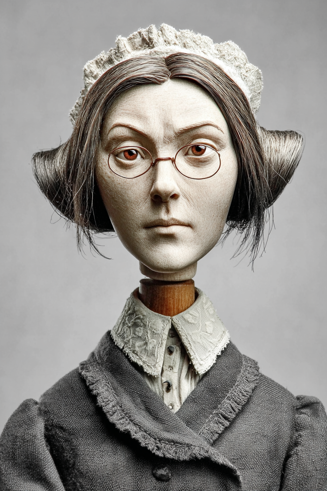

*Puppet Art by [Nik Bear Brown](https://www.nikbearbrown.com/).*

**Run this:**

```text
Who was Florence Nightingale David, and how does her work in statistical theory and significance testing connect to the difference between a p-value and an effect size? Keep it to three paragraphs. End with the single most surprising thing about her career or ideas.
```

→ Search **"Florence Nightingale David"** on Wikipedia after you run this. See what the model got right, got wrong, or left out.

**Now make the prompt better.** Try one of these:

- Ask it to explain what a p-value does and does not tell you, in plain language
- Ask how the small-sample world David worked in compares to running the same test on a million rows
- Add a constraint: "Answer as a warning label printed beside every reported p-value"

What changes? What gets better? What gets worse?

---

## Chapter 08: Chapter 8 — How to Design a Graph
*Source: `chapters/08-how-to-design-a-graph.md`*

##  AI Wayback Machine

The ideas in this chapter didn't appear from nowhere. **Mary Eleanor Spear** spent a career inside U.S. government agencies turning numbers into honest charts, and wrote down the rules for it before "data visualization" had a name. Here's a prompt to find out more — and then make it better.

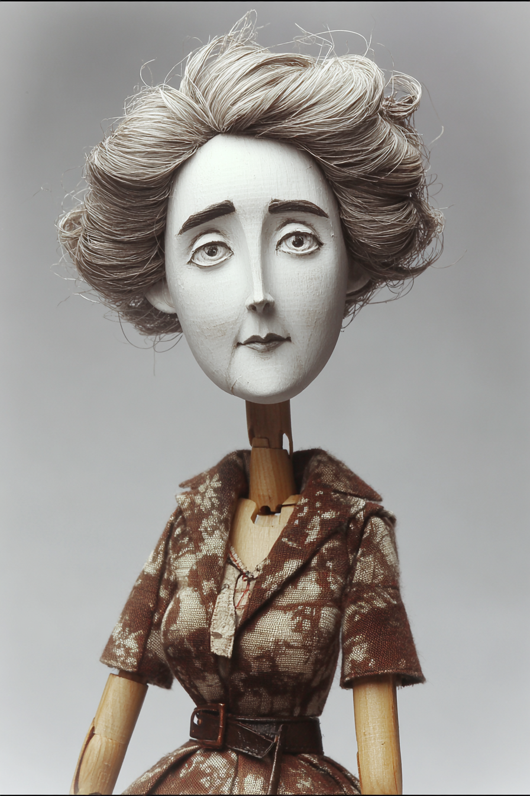

*Puppet Art by [Nik Bear Brown](https://www.nikbearbrown.com/).*

**Run this:**

```text
Who was Mary Eleanor Spear, and how does her work on charting and data presentation connect to designing a graph that reveals rather than hides the data? Keep it to three paragraphs. End with the single most surprising thing about her career or ideas.
```

→ Search **"Mary Eleanor Spear"** on Wikipedia after you run this. See what the model got right, got wrong, or left out.

**Now make the prompt better.** Try one of these:

- Ask it to explain why a bar chart can mislead, in plain language, with one example
- Ask how Spear's hand-drawn charting rules compare to the data-visualization guidance you'd follow today
- Add a constraint: "Answer as a one-paragraph style guide for someone's first scientific figure"

What changes? What gets better? What gets worse?

---

## Chapter 09: Chapter 9 — Literature Review
*Source: `chapters/09-literature-review.md`*

##  AI Wayback Machine

The ideas in this chapter didn't appear from nowhere. **Henriette Avram** invented the format that let computers catalog and search the world's libraries — the reason a literature search is possible at all. Here's a prompt to find out more — and then make it better.

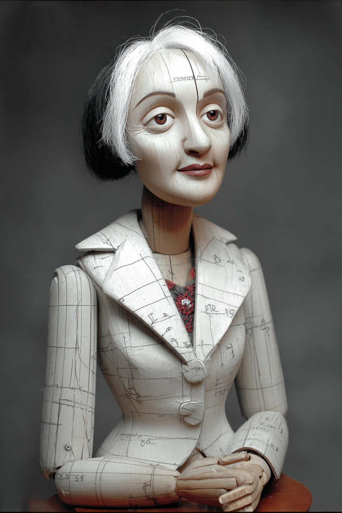

*Puppet Art by [Nik Bear Brown](https://www.nikbearbrown.com/).*

**Run this:**

```text
Who was Henriette Avram, and how does her creation of the MARC machine-readable cataloging standard connect to how researchers find and organize prior literature? Keep it to three paragraphs. End with the single most surprising thing about her career or ideas.
```

→ Search **"Henriette Avram"** on Wikipedia after you run this. See what the model got right, got wrong, or left out.

**Now make the prompt better.** Try one of these:

- Ask it to explain what "machine-readable cataloging" made possible, in plain language
- Ask how Avram's cataloging logic compares to how you'd build a synthesis matrix for your own review
- Add a constraint: "Answer as a thank-you note from a researcher who just finished a database search"

What changes? What gets better? What gets worse?

---

## Chapter 10: Chapter 10 — Drafting (Section by Section)
*Source: `chapters/10-drafting-section-by-section.md`*

##  AI Wayback Machine

The ideas in this chapter didn't appear from nowhere. **Janet Emig** showed that writing is not the transcription of finished thoughts but a process of discovery — the reason this chapter tells you to draft in the order your findings actually arrived. Here's a prompt to find out more — and then make it better.

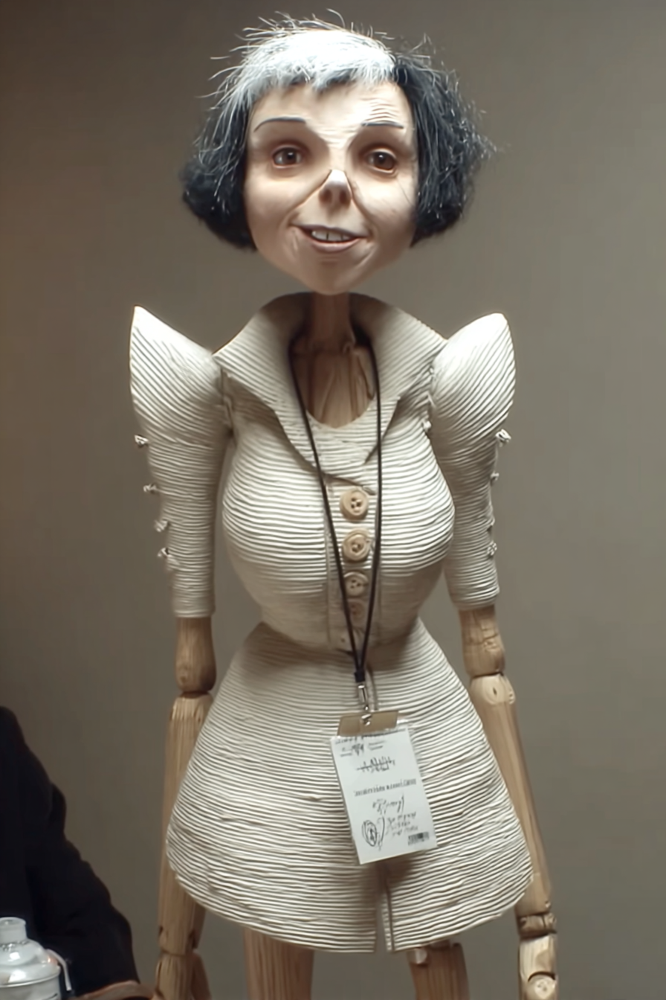

*Puppet Art by [Nik Bear Brown](https://www.nikbearbrown.com/).*

**Run this:**

```text
Who was Janet Emig, and how does her research on writing as a process of discovery connect to drafting a paper's sections in the order the work happened rather than the order they're read? Keep it to three paragraphs. End with the single most surprising thing about her career or ideas.
```

→ Search **"Janet Emig"** on Wikipedia after you run this. See what the model got right, got wrong, or left out.

**Now make the prompt better.** Try one of these:

- Ask it to explain "writing as a process, not a product" in plain language
- Ask how Emig's findings support writing the Methods and Results before the Introduction
- Add a constraint: "Answer as a note taped to the laptop of someone who keeps writing the introduction first"

What changes? What gets better? What gets worse?

---

## Chapter 11: Chapter 11 — Quality Control
*Source: `chapters/11-quality-control.md`*

##  AI Wayback Machine

The ideas in this chapter didn't appear from nowhere. **Frank Benford** noticed that the leading digits of real-world numbers follow a strange, predictable pattern — now a frontline tool for catching numbers that were faked or fumbled. Here's a prompt to find out more — and then make it better.

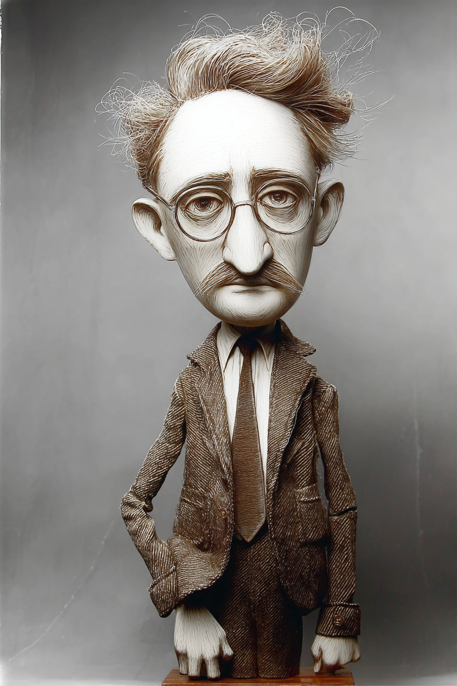

*Puppet Art by [Nik Bear Brown](https://www.nikbearbrown.com/).*

**Run this:**

```text
Who was Frank Benford, and how does Benford's Law connect to detecting errors, fabrication, or anomalies in a dataset or a results table? Keep it to three paragraphs. End with the single most surprising thing about his career or ideas.
```

→ Search **"Frank Benford"** on Wikipedia after you run this. See what the model got right, got wrong, or left out.

**Now make the prompt better.** Try one of these:

- Ask it to explain why first digits aren't evenly distributed, in plain language, with one example
- Ask how a Benford check compares to the GRIM test or a recomputation audit you'd run on a paper
- Add a constraint: "Answer as a forensic accountant explaining the trick to a jury"

What changes? What gets better? What gets worse?

---

## Chapter 12: Chapter 12 — Peer-Review Simulation
*Source: `chapters/12-peer-review-simulation.md`*

##  AI Wayback Machine

The ideas in this chapter didn't appear from nowhere. **Henry Oldenburg** invented scientific peer review in the 1660s, when he began sending submitted manuscripts to knowledgeable readers before printing them. Here's a prompt to find out more — and then make it better.

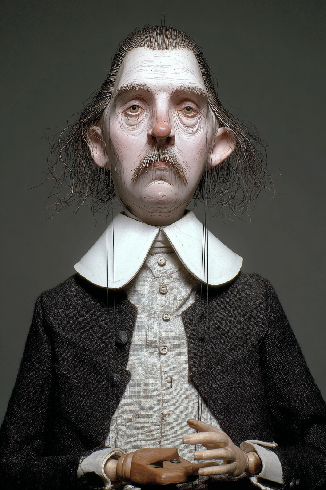

*Puppet Art by [Nik Bear Brown](https://www.nikbearbrown.com/).*

**Run this:**

```text
Who was Henry Oldenburg, and how does his creation of editorial refereeing for the Philosophical Transactions connect to how peer review works — and fails — today? Keep it to three paragraphs. End with the single most surprising thing about his career or ideas.
```

→ Search **"Henry Oldenburg"** on Wikipedia after you run this. See what the model got right, got wrong, or left out.

**Now make the prompt better.** Try one of these:

- Ask it to explain what problem peer review was invented to solve, in plain language
- Ask how Oldenburg's 1660s refereeing compares to the reviewer disagreement and reform debates of today
- Add a constraint: "Answer as a letter from Oldenburg advising a modern journal editor"

What changes? What gets better? What gets worse?

---

## Chapter 13: Chapter 13 — Ethics and Bias Screen
*Source: `chapters/13-ethics-and-bias-screen.md`*

##  AI Wayback Machine

The ideas in this chapter didn't appear from nowhere. **Alice Stewart** found that X-raying pregnant women raised childhood-cancer risk — then spent decades fighting an establishment that did not want the finding to be true. Here's a prompt to find out more — and then make it better.

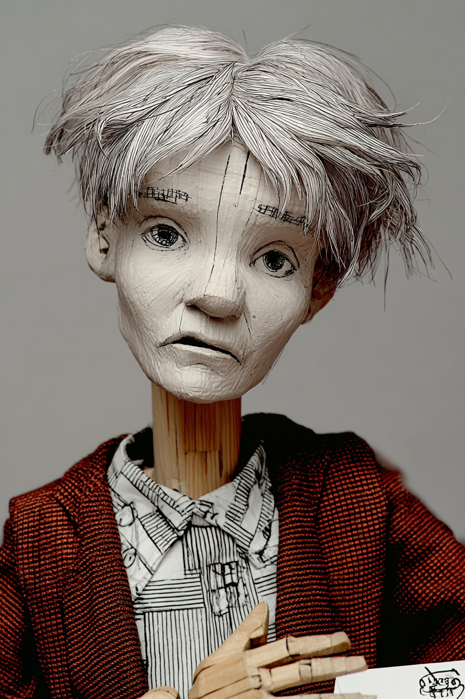

*Puppet Art by [Nik Bear Brown](https://www.nikbearbrown.com/).*

**Run this:**

```text
Who was Alice Stewart, and how does her struggle to publish and defend an unwelcome finding connect to research ethics, publication bias, and the duty to report disconfirming evidence? Keep it to three paragraphs. End with the single most surprising thing about her career or ideas.
```

→ Search **"Alice Stewart"** on Wikipedia after you run this. See what the model got right, got wrong, or left out.

**Now make the prompt better.** Try one of these:

- Ask it to explain "publication bias" in plain language, using her story
- Ask how Stewart's experience argues for pre-registration and reporting all results
- Add a constraint: "Answer as a case study written for a research-ethics syllabus"

What changes? What gets better? What gets worse?

---

## Chapter 14: Chapter 14 — Writing Well: Prose for Scientific Papers
*Source: `chapters/14-writing-well-prose-for-scientific-papers.md`*

##  AI Wayback Machine

The ideas in this chapter didn't appear from nowhere. **Rudolf Flesch** turned "is this sentence clear?" into a number, launching a century-long campaign against foggy, self-important prose. Here's a prompt to find out more — and then make it better.

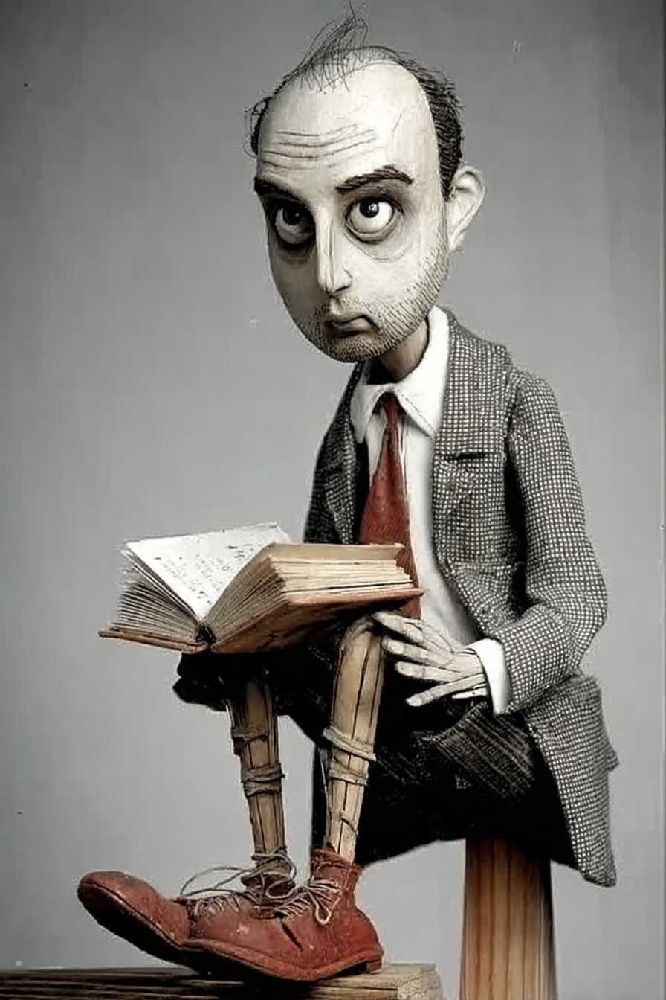

*Puppet Art by [Nik Bear Brown](https://www.nikbearbrown.com/).*

**Run this:**

```text
Who was Rudolf Flesch, and how does his work on readability and plain language connect to writing scientific prose that is clear rather than foggy? Keep it to three paragraphs. End with the single most surprising thing about his career or ideas.
```

→ Search **"Rudolf Flesch"** on Wikipedia after you run this. See what the model got right, got wrong, or left out.

**Now make the prompt better.** Try one of these:

- Ask it to explain what a readability score actually measures, in plain language
- Ask how Flesch's plain-language rules would rewrite a nominalization-heavy methods sentence
- Add a constraint: "Answer in the plainest possible English, then point out what it cut"

What changes? What gets better? What gets worse?

---

## Chapter 91: 91 Critiq
*Source: `chapters/91-critiq.md`*

> **Section not yet authored.** No `## AI Wayback Machine` block found in this chapter file.
> To add this section, edit the source chapter file directly.

---

## Chapter 99: 99 Back Matter
*Source: `chapters/99-back-matter.md`*

> **Section not yet authored.** No `## AI Wayback Machine` block found in this chapter file.
> To add this section, edit the source chapter file directly.

---
